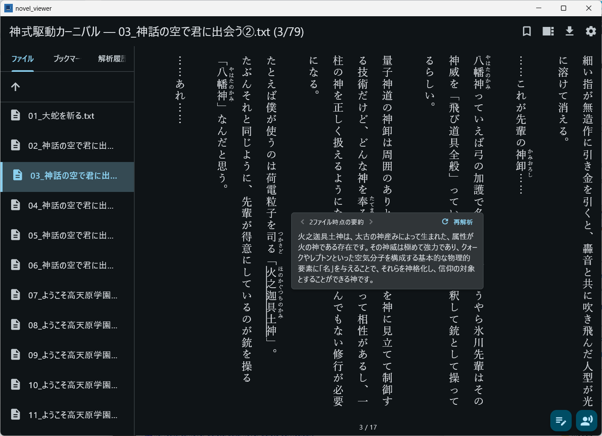
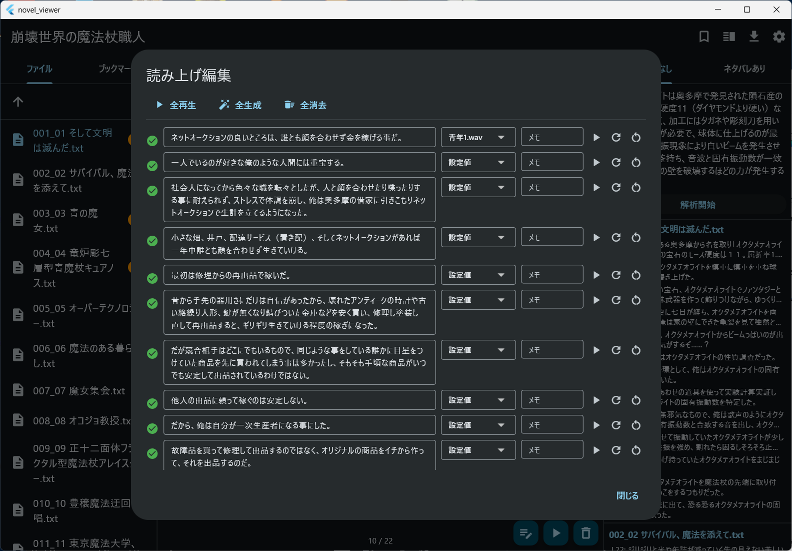

#  NovelViewer

**日本語** | [English](README_en.md) | [中文](README_zh.md)

Web小説サイトから小説をダウンロードし、ローカルで閲覧するためのノベルビューア

## 対応プラットフォーム

- macOS
- Windows
- Linux(未確認)

## 機能

- **横書き/縦書き表示切り替え**: 設定から表示モードを切り替え可能
- **テキスト検索**: ライブラリ内の全テキストを横断検索
- **ブックマーク**: ブックマークの登録・解除 
- **LLM要約**: 指定した単語をネタばれあり/なしを指定して確認可能  
(Ollama / OpenAI互換APIに対応)
- **音声読み上げ**: 指定したリファレンス音声を使った読み上げ/読み上げテキストの編集





### LLM(Ollama)設定

1. Ollamaをダウンロード
2. 以下のように、使用したいモデルをダウンロード
```bash
ollama pull gemma4:e4b
```
3. NovelVeiwerの設定画面にてLLMプロバイダを`Ollama`、エンドポイントURLに`http://localhost:11434`、モデル名にダウンロードしたモデル名(上記の場合、`gemma4:e4b`)を設定

## 開発

### 前提条件

- [FVM](https://fvm.app/) (Flutter Version Management)
- Flutter stable channel（FVM経由で管理）
- Visual Studio 2022 (Windows)
- Vulkan SDK (Windows)

### セットアップ

```bash
# リポジトリをクローン
git clone --recursive git@github.com:endo5501/NovelViewer.git
cd NovelViewer

# Flutter SDKのセットアップ（FVM経由）
fvm install

# 依存パッケージの取得
fvm flutter pub get
```

### セットアップ:AI

Claude Code/Codex等コーディングエージェントを準備してください

```bash
# OpenSpec
npm install -g @fission-ai/openspec@latest
openspec init
openspec config profile
# Codex CLI
npm i -g @openai/codex

# superpowers (in Claude Code)
/plugin marketplace add obra/superpowers-marketplace
/plugin install superpowers@superpowers-marketplace

# Codex plugin for Claude Code
/plugin marketplace add openai/codex-plugin-cc
/plugin install codex@openai-codex
/reload-plugins
/codex:setup
```

### ビルド・実行

```bash
# macOSで実行
fvm flutter run -d macos

# macOS向けReleaseビルド
# libompはbuild_irodori_macos.shが使用（AppleClangはOpenMPを同梱しないため）
brew install libomp
scripts/build_tts_macos.sh
scripts/build_lame_macos.sh
scripts/build_piper_macos.sh
scripts/build_irodori_macos.sh
fvm flutter build macos

# Windows向けReleaseビルド
scripts/build_tts_windows.bat
scripts/build_lame_windows.bat
scripts/build_piper_windows.bat
scripts/build_irodori_windows.bat
fvm flutter build windows

# iPad向けビルド（ビューア機能のみ。TTS / LLM は非対応）
fvm flutter build ios --release
xcrun devicectl device install app --device <デバイスUDID> build/ios/iphoneos/Runner.app
```

#### iPad ビルドの前提

iPad 版は小説ビューアとしての機能のみを対象とします。デスクトップ版にある次の機能は UI ごと表示されません。

| 機能 | iPad で提供しない理由 |
| --- | --- |
| 読み上げ（TTS） | 音声合成エンジンはデスクトップ向けにのみビルドしたネイティブライブラリで、iOS 版が無い。読み上げ辞書も同時に非表示 |
| LLM 要約 | 解析には自分で立てた LLM サーバーが要るが、既定の接続先は平文 HTTP で、iOS の App Transport Security が遮断する。左カラムの「解析履歴」タブも同時に非表示 |
| アプリ内の更新確認 | 配布経路が無く、更新は下記の手順でビルドし直して入れ替える |

デスクトップで作成した解析結果は小説フォルダ内のデータベースに残りますが、「解析履歴」タブごと非表示になるため iPad で一覧することはできません。トラックパッド（Magic Keyboard など）を接続している場合に限り、本文中の解析済みの語にポインタを合わせるとポップアップで内容を読めます。

外付けキーボードを接続した場合、ショートカットの既定修飾キーは macOS と同じ ⌘ です。

#### 狭い画面でのレイアウト

表示幅が 800pt 未満のときは、左カラム（ファイル・ブックマーク）と検索結果が画面内に並ばず、それぞれ Drawer として本文に重なる形で開きます。本文は画面幅いっぱいを使います。iPad mini の縦向き（744pt）が該当し、横向き（1133pt）やデスクトップは従来どおりの 3 カラムです。デスクトップの最小ウィンドウ幅は 800pt なので、デスクトップでこの表示になることはありません。

| 操作 | 開くもの |
| --- | --- |
| AppBar 左端の ≡ | ファイル・ブックマーク |
| AppBar の 🔍 | 検索（キーボードがあれば ⌘F も同じ） |

Drawer は **AppBar のボタンからのみ**開きます。画面端からのスワイプで開く動作は無効にしてあります——縦書き表示では画面端の水平スワイプがページ送りだからです。Drawer を閉じるには本文側をタップするか、ファイルを選んでください（選ぶと自動で閉じます）。

**1. Xcode の iOS platform component**

`xcodebuild -showsdks` が iOS SDK を表示していても、platform component が未導入だとビルドは `iOS ... is not installed` で失敗します。Xcode > Settings > Components から導入するか、以下を実行してください（数 GB のダウンロードが発生します）。

```bash
xcodebuild -downloadPlatform iOS
xcrun simctl list runtimes   # iOS のランタイムが列挙されれば導入済み
```

**2. 署名設定**

Team ID をリポジトリに含めないため、`ios/Flutter/Local.xcconfig`（Git 管理外）を各自で作成します。

```
DEVELOPMENT_TEAM = XXXXXXXXXX
```

Team ID は Xcode > Settings > Accounts、または `security find-identity -v -p codesigning` で確認できます。このファイルが無い状態でもビルド構成は壊れず、署名時にのみ失敗します。

無料プロビジョニング（Apple ID のみ、有料の Developer Program に未加入）でインストールしたアプリは **7 日で失効**します。失効後は Xcode から再インストールしてください。

**3. debug ビルドは実機のホーム画面から起動できない**

iOS 14 以降、debug ビルドは JIT を必要とするため Flutter ツール経由でしか起動できません。ホーム画面のアイコンから起動すると次のメッセージだけが表示されます。

```
In iOS 14+, debug mode Flutter apps can only be launched from Flutter tooling,
IDEs with Flutter plugins or from Xcode.
```

常用する場合は上記のとおり `--release` でビルドしてインストールしてください。開発中にホットリロードを使いたい場合は `fvm flutter run -d <デバイスUDID>` で、ツールに接続したまま起動します。

デバイスの UDID は `xcrun devicectl list devices` の Identifier 列で確認できます。

**4. 依存の管理方式**

iOS は Swift Package Manager 単独構成です（CocoaPods は使用しません）。`ios/Podfile` は存在せず、依存のピンは 2 つの `xcshareddata/swiftpm/Package.resolved` が保持します。macOS は従来どおり CocoaPods です。

**5. ライブラリの場所**

小説は端末内の `Documents/NovelViewer/` に保存され、Files アプリの「このiPad内 > NovelViewer」から参照・追加・削除できます。

蔵書全体のメタデータ（`novel_metadata.db`）は Files アプリに露出しない `Library/Application Support/` に置かれます。一方、各小説フォルダの中にある `novel_data.db` / `episode_cache.db` / `tts_audio.db` は、小説フォルダごと持ち運ぶ設計のため Files アプリからも見えます。

> **注意:** `novel_data.db` にはブックマークと LLM 要約が入っており、破損時に自動復旧しません（意図的な設計です）。Files アプリで小説フォルダを整理する際は、`.txt` 以外のファイルを消したり、`-wal` / `-shm` を欠いた状態でコピーし直したりしないでください。フォルダごと丸ごと移動・コピーするのは安全です。

### テスト

```bash
# 全テストを実行
fvm flutter test

# 特定のテストファイルを実行
fvm flutter test test/features/text_download/narou_site_test.dart

# qwen3-tts.cppのベンチマーク実行(結果はbenchmarks/に保存)
scripts/benchmark_tts.sh --model-dir <dir> --max-tokens 200

# ビルド成果物とリポジトリ root の flutter_*.log を一括削除
scripts/clean.sh   # macOS/Linux
scripts\clean.bat  # Windows
```

### フォーマッタ

Dart 標準の `dart format` に統一しています。コード修正後はフォーマットを実行してください。

```bash
# リポジトリ全体を整形（対象は lib/ と test/ の .dart のみ）
fvm dart format .

# 整形せずに差分の有無だけ確認（未整形なら終了コード 1）
fvm dart format --output=none --set-exit-if-changed .
```

設定ファイルはありません。行長などは `dart format` の既定に従います。

リポジトリ全体を整形したコミットは `.git-blame-ignore-revs` に登録してあります。
`git blame` から除外するには一度だけ次を設定してください（GitHub 上では自動で適用されます）。

```bash
git config blame.ignoreRevsFile .git-blame-ignore-revs
```

`dart format` は 1 行に収まっていた `if` 文を折り返すことがあり、その結果
`curly_braces_in_flow_control_structures` に該当する場合があります。整形後は
リンターも実行してください。

### リンター

`flutter_lints` パッケージによる静的解析を導入しています。コード修正後はリンターを実行して問題がないことを確認してください。

```bash
# 静的解析を実行
fvm flutter analyze
```

リントルールは `analysis_options.yaml` で設定されています。

### リリース

リリースは付属のスクリプトで行います。`pubspec.yaml` の version 更新・commit・タグ付け・push を一括で実行し、更新忘れを防ぎます。

```powershell
# Windows (PowerShell)
scripts\release.ps1 1.2.0
```

```bash
# macOS / Linux / Git Bash
scripts/release.sh 1.2.0
```

スクリプトは実行前に「引数が `X.Y.Z` 形式 / 作業ツリーがclean / `main` ブランチ / タグ `v1.2.0` が未使用 / バージョンが後退していない」ことを検証し、すべて満たす場合のみ `pubspec.yaml` を `1.2.0+(ビルド番号+1)` に更新してから commit・`v1.2.0` タグ付け・push します。タグが push されると GitHub ActionsがWindows版を自動ビルドし、Releaseを作成します。

> **バージョン不一致の二段防御:** リリースのバージョンは「git タグ」と「`pubspec.yaml` の version」の双方から決まります。`pubspec.yaml` の更新を忘れてタグだけ付けると、アプリが旧バージョンを名乗り更新通知が壊れます。これを防ぐため、(1) 上記スクリプトが push 前に両者を揃え、(2) GitHub Actions 側でもビルド前に `scripts/verify_release_version.sh` でタグと `pubspec.yaml` の一致を検証し、不一致なら Release を作成せず失敗します。手動で `git tag` する運用は避けてください。

各リリースには以下4ファイルが添付されます。

- `novel_viewer-setup-v*.exe` — Windowsインストーラ（推奨、長期運用向け）
- `novel_viewer-setup-v*.exe.sha256` — インストーラのSHA256ハッシュ
- `novel_viewer-windows-x64-v*.zip` — ポータブル版（解凍してそのまま実行）
- `novel_viewer-windows-x64-v*.zip.sha256` — ZIPのSHA256ハッシュ

#### リリースノートと更新通知

- タグは必ず `v<major>.<minor>.<patch>`（例: `v1.2.3`）形式にしてください。pre-release サフィックス（`v1.2.3-rc1` 等）が付いたタグはアプリの更新通知に表示されません（stable のみ対象）。
- GitHub Release の本文（body）は、アプリ内の更新ダイアログにそのまま表示されます。ユーザ向けの変更点を簡潔に記載してください。
- アプリは起動時に GitHub Releases の最新版を確認し、新しい stable バージョンがあればAppBarに更新バッジを表示します（自動チェックは24時間に1回、設定画面でOFFにできます）。
  - **インストーラ版**: 更新ダイアログから「更新する」を押すと、アプリ内でインストーラをダウンロード→SHA256検証→サイレント実行→新バージョンで再起動します。
  - **ポータブル版（ZIP）**: 「リリースページを開く」のみ提示されます（自動ダウンロードは行いません）。

> **注意（v1.0.0 からの初回更新）:** アプリ内自動更新は v1.0.0 では未搭載です。v1.0.0 を使っている場合、最初の1回は手動でインストーラ版をダウンロードしてアップデートしてください。それ以降のバージョンからは自動更新が有効になります。

## Windowsインストール

### インストーラ版（推奨）

「腰を据えて長期運用する」用途にはインストーラ版を推奨します。

1. GitHub Releasesから `novel_viewer-setup-v*.exe` をダウンロード
2. 実行（インストール先は `%LOCALAPPDATA%\Programs\NovelViewer\`、UAC不要）
3. スタートメニューから起動

**SmartScreen警告について:** 現状はインストーラに署名していないため、初回起動時に「WindowsによってPCが保護されました」と表示されます。「詳細情報」→「実行」を押して進めてください（コード署名は将来対応予定）。

**ユーザデータの保存場所:** ユーザが作成するデータは以下のパス（いずれもインストール先 = `%LOCALAPPDATA%\Programs\NovelViewer\` の直下）に保存されます。

- `NovelViewer\` — 小説テキスト・ブックマーク・読書進捗
- `novel_metadata.db` — 小説メタデータDB
- `models\` — TTSモデル（音声合成用、大容量）
- `voices\` — リファレンス音声

インストーラは Flutter のビルド成果物（`novel_viewer.exe`、各種DLL、`data\` サブツリー、ライセンス類）のみを配置し、上記ユーザデータには一切触りません。

- 上書きインストール（バージョンアップ）: ユーザデータは保持されます
- アンインストール: ユーザデータは残ります（明示的に消したい場合は上記の各パスを手動削除してください）

### ポータブル版（ZIP）

動作確認・特定用途・複数環境の並行運用には ZIP 版を使用してください。

1. GitHub Releasesから `novel_viewer-windows-x64-v*.zip` をダウンロード
2. 任意のフォルダに解凍
3. `novel_viewer.exe` を実行

データはZIPを展開したフォルダの直下（上記4箇所と同じ構造で `NovelViewer\`、`novel_metadata.db`、`models\`、`voices\`）に保存されます。フォルダごと別の場所にコピーすれば、データ込みで複製可能です。

## トラブルシューティング

### Piper TTS で音声が再生されない（合成に失敗する）

以前に Piper モデルをダウンロード済みの場合、古い（推論エンジンと非互換な）モデルが端末に残っていると合成に失敗することがあります（ログに `Missing Input: speaker_embedding_mask` 等が出る）。Piper モデルは同梱の推論エンジンと互換なリビジョンに固定して配布されますが、既にダウンロード済みのモデルは自動では入れ替わりません。

次の手順で互換モデルへ入れ替えてください:

1. `models/piper/` 内のモデルファイルを手動削除する（`*.onnx` / `*.onnx.json` / `.piper_models_complete`）。`open_jtalk_dic/` は削除不要です。
2. アプリの設定画面から Piper モデルを再ダウンロードする。

## 技術スタック

- **フレームワーク**: Flutter (Dart)
- **状態管理**: Riverpod
- **データベース**: SQLite (sqflite / sqflite_common_ffi)
- **設定永続化**: SharedPreferences
- **HTTP通信**: http パッケージ
- **HTMLパース**: html パッケージ
- **音声読み上げ**: qwen3-tts.cpp / piper-plus / audio.cpp
- **MP3出力**: lame
