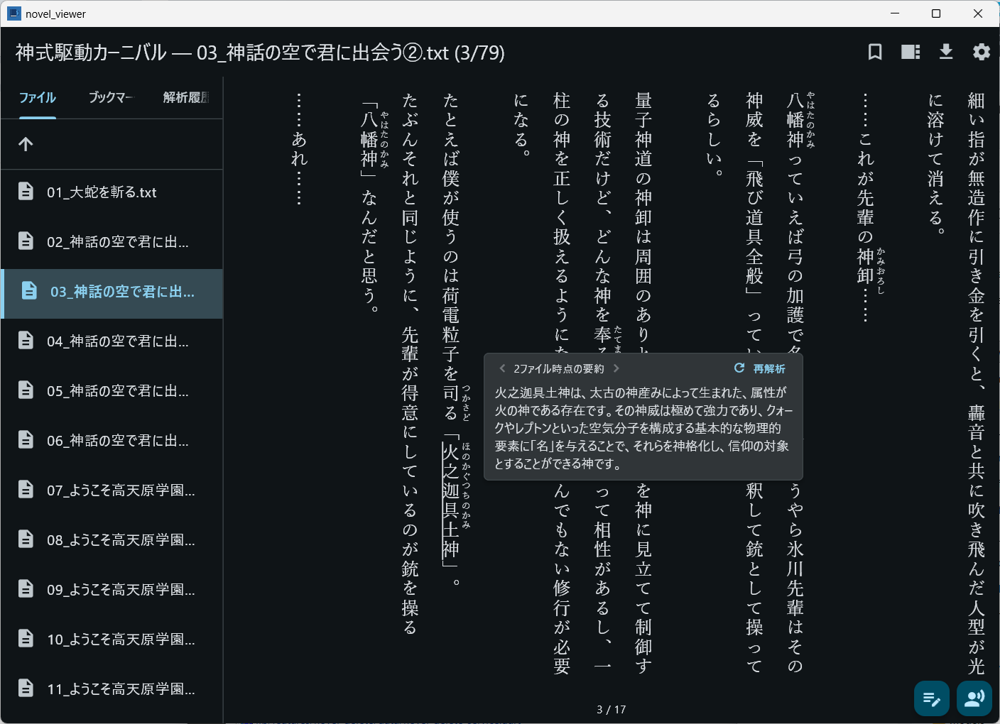

#  NovelViewer

[日本語](README.md) | **English** | [中文](README_zh.md)

A novel viewer for downloading and reading web novels locally from web novel sites.

## Supported Platforms

- macOS
- Windows
- Linux (untested)

## Features

- **Horizontal/Vertical text layout**: Switch between display modes in settings
- **Text search**: Full-text search across all novels in your library
- **Bookmarks**: Add and remove bookmarks
- **LLM Summarization**: Look up specified terms with spoiler/no-spoiler options
(Supports Ollama / OpenAI-compatible APIs)
- **Text-to-Speech**: Read aloud using a specified reference voice / edit read-aloud text




### LLM (Ollama) Setup

1. Download Ollama
2. Download your desired model:
```bash
ollama pull qwen3:8b
```
3. In NovelViewer's settings, set the LLM provider to `Ollama`, the endpoint URL to `http://localhost:11434`, and the model name to the downloaded model (e.g., `qwen3:8b`)

## Development

### Prerequisites

- [FVM](https://fvm.app/) (Flutter Version Management)
- Flutter stable channel (managed via FVM)
- Visual Studio 2022 (Windows)
- Vulkan SDK (Windows)

### Setup

```bash
# Clone the repository
git clone --recursive git@github.com:endo5501/NovelViewer.git
cd NovelViewer

# Set up Flutter SDK (via FVM)
fvm install

# Get dependencies
fvm flutter pub get
```

### Setup: AI

Prepare a coding agent such as Claude Code / Codex.

```bash
# OpenSpec
npm install -g @fission-ai/openspec@latest

# Codex CLI
npm i -g @openai/codex

# superpowers (in Claude Code)
/plugin marketplace add obra/superpowers-marketplace
/plugin install superpowers@superpowers-marketplace
```

### Build & Run

```bash
# Run on macOS
fvm flutter run -d macos

# Release build for macOS
scripts/build_tts_macos.sh
scripts/build_lame_macos.sh
fvm flutter build macos

# Release build for Windows
scripts/build_tts_windows.bat
scripts/build_lame_windows.bat
fvm flutter build windows
```

### Testing

```bash
# Run all tests
fvm flutter test

# Run a specific test file
fvm flutter test test/features/text_download/narou_site_test.dart
```

### Linter

Static analysis is configured using the `flutter_lints` package. Run the linter after code changes to ensure there are no issues.

```bash
# Run static analysis
fvm flutter analyze
```

Lint rules are configured in `analysis_options.yaml`.

### Release

Releases are cut with the bundled script, which updates the `pubspec.yaml` version, commits, tags, and pushes in one step so the version bump is never forgotten.

```powershell
# Windows (PowerShell)
scripts\release.ps1 1.2.0
```

```bash
# macOS / Linux / Git Bash
scripts/release.sh 1.2.0
```

Before doing anything, the script verifies that the argument is in `X.Y.Z` form, the working tree is clean, you are on `main`, the tag `v1.2.0` is unused, and the version is not going backwards. Only then does it bump `pubspec.yaml` to `1.2.0+(build+1)`, commit, tag `v1.2.0`, and push. Pushing the tag triggers the automatic Windows build and release via GitHub Actions.

> **Two-layer guard against version mismatch:** A release's version comes from both the git tag and `pubspec.yaml`. If you tag without bumping `pubspec.yaml`, the app reports the old version and update notifications break. To prevent this, (1) the script above keeps the two in sync before pushing, and (2) GitHub Actions also runs `scripts/verify_release_version.sh` before building and fails the release if the tag and `pubspec.yaml` disagree. Avoid tagging manually with `git tag`.

Each release attaches the following four files:

- `novel_viewer-setup-v*.exe` — Windows installer (recommended for long-term use)
- `novel_viewer-setup-v*.exe.sha256` — SHA256 of the installer
- `novel_viewer-windows-x64-v*.zip` — Portable build (extract and run)
- `novel_viewer-windows-x64-v*.zip.sha256` — SHA256 of the ZIP

## Windows Installation

### Installer (Recommended)

Use the installer for long-term, "settled" usage.

1. Download `novel_viewer-setup-v*.exe` from GitHub Releases
2. Run it (installs to `%LOCALAPPDATA%\Programs\NovelViewer\`, no UAC required)
3. Launch from the Start Menu

**About the SmartScreen warning:** The installer is currently unsigned, so Windows shows "Windows protected your PC" on first run. Click "More info" → "Run anyway" to proceed. Code signing is planned for the future.

**User data location:** User-created data lives at these paths (all directly under the install root `%LOCALAPPDATA%\Programs\NovelViewer\`):

- `NovelViewer\` — novel text, bookmarks, reading progress
- `novel_metadata.db` — novel metadata database
- `models\` — TTS models (can be large)
- `voices\` — voice reference audio

The installer only places Flutter build artifacts (`novel_viewer.exe`, DLLs, the `data\` subtree, license files) and never touches the paths listed above.

- Reinstall / upgrade: user data is preserved
- Uninstall: user data is left behind (delete each path manually if you want to remove it)

### Portable (ZIP)

Use the ZIP build for compatibility testing, ad-hoc environments, or running multiple independent setups in parallel.

1. Download `novel_viewer-windows-x64-v*.zip` from GitHub Releases
2. Extract anywhere
3. Run `novel_viewer.exe`

Data is stored directly beside the extracted executable with the same layout as the installer version (`NovelViewer\`, `novel_metadata.db`, `models\`, `voices\`). Copying the whole folder elsewhere clones the environment along with the data.

## Troubleshooting

### Piper TTS produces no audio (synthesis fails)

If you downloaded a Piper model previously, an older model (incompatible with the bundled inference engine) may remain on disk and cause synthesis to fail (the log shows e.g. `Missing Input: speaker_embedding_mask`). Piper models are distributed pinned to a revision compatible with the bundled engine, but an already-downloaded model is not replaced automatically.

To switch to the compatible model:

1. Manually delete the model files under `models/piper/` (`*.onnx` / `*.onnx.json` / `.piper_models_complete`). You do **not** need to delete `open_jtalk_dic/`.
2. Re-download the Piper model from the app's settings screen.

## Tech Stack

- **Framework**: Flutter (Dart)
- **State Management**: Riverpod
- **Database**: SQLite (sqflite / sqflite_common_ffi)
- **Settings Persistence**: SharedPreferences
- **HTTP**: http package
- **HTML Parsing**: html package
- **Text-to-Speech**: qwen3-tts.cpp
- **MP3 Output**: lame
