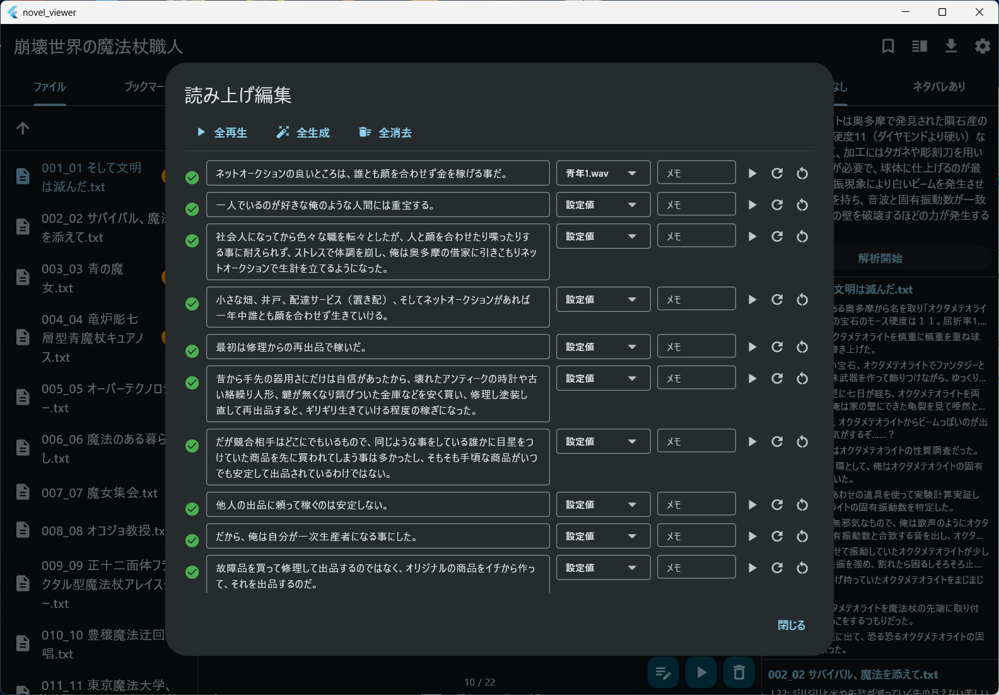

#  NovelViewer

[日本語](README.md) | [English](README_en.md) | **中文**

从网络小说网站下载小说并在本地阅读的小说阅读器。

## 支持平台

- macOS
- Windows
- Linux（未测试）

## 功能

- **横排/竖排切换**：可在设置中切换显示模式
- **文本搜索**：在书库中跨作品全文搜索
- **书签**：添加和删除书签
- **LLM摘要**：指定关键词并选择是否包含剧透进行查询
（支持 Ollama / OpenAI 兼容 API）
- **语音朗读**：使用指定的参考音色进行朗读 / 编辑朗读文本




### LLM（Ollama）设置

1. 下载 Ollama
2. 下载所需模型：
```bash
ollama pull qwen3:8b
```
3. 在 NovelViewer 的设置界面中，将 LLM 提供者设为 `Ollama`，端点 URL 设为 `http://localhost:11334`，模型名称设为已下载的模型名（如 `qwen3:8b`）

## 开发

### 前提条件

- [FVM](https://fvm.app/)（Flutter 版本管理）
- Flutter stable 频道（通过 FVM 管理）
- Visual Studio 2022（Windows）
- Vulkan SDK（Windows）

### 环境搭建

```bash
# 克隆仓库
git clone --recursive git@github.com:endo5501/NovelViewer.git
cd NovelViewer

# 设置 Flutter SDK（通过 FVM）
fvm install

# 获取依赖包
fvm flutter pub get
```

### 环境搭建：AI

请准备 Claude Code / Codex 等编程代理。

```bash
# OpenSpec
npm install -g @fission-ai/openspec@latest

# Codex CLI
npm i -g @openai/codex

# superpowers（在 Claude Code 中）
/plugin marketplace add obra/superpowers-marketplace
/plugin install superpowers@superpowers-marketplace
```

### 构建与运行

```bash
# 在 macOS 上运行
fvm flutter run -d macos

# macOS Release 构建
scripts/build_tts_macos.sh
scripts/build_lame_macos.sh
fvm flutter build macos

# Windows Release 构建
scripts/build_tts_windows.bat
scripts/build_lame_windows.bat
fvm flutter build windows
```

### 测试

```bash
# 运行所有测试
fvm flutter test

# 运行特定测试文件
fvm flutter test test/features/text_download/narou_site_test.dart
```

### 代码检查

项目使用 `flutter_lints` 包进行静态分析。修改代码后请运行代码检查以确认没有问题。

```bash
# 运行静态分析
fvm flutter analyze
```

检查规则在 `analysis_options.yaml` 中配置。

### 发布

推送匹配 `v*` 模式的标签后，GitHub Actions 会自动构建并发布 Windows 版本。

```bash
git tag v1.0.0
git push origin v1.0.0
```

## 技术栈

- **框架**：Flutter (Dart)
- **状态管理**：Riverpod
- **数据库**：SQLite (sqflite / sqflite_common_ffi)
- **设置持久化**：SharedPreferences
- **HTTP 通信**：http 包
- **HTML 解析**：html 包
- **语音合成**：qwen3-tts.cpp
- **MP3 输出**：lame
