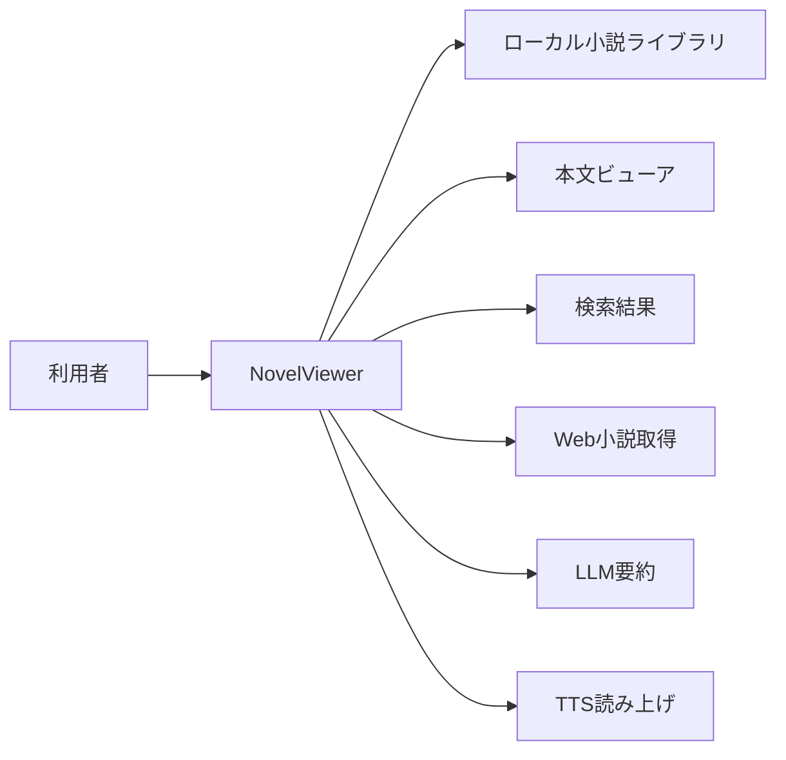

# 概要・主要ユースケース

## システム概要

NovelViewerは、Web小説サイトから作品を取得し、ローカル環境で閲覧するFlutterデスクトップアプリケーションである。🟢 VERIFIED [REF: README.md:5] [REF: lib/main.dart:23-39]

対応対象としてmacOSとWindowsが明記され、Linuxは未確認とされている。🟢 VERIFIED [REF: README.md:7-11]

起動処理は、ログ初期化、Windows音声バックエンド初期化、デスクトップSQLite初期化、ライブラリディレクトリ準備、設定マイグレーション、メタデータDB接続、依存注入、更新確認、Flutter UI起動の順に進む。🟢 VERIFIED [REF: lib/main.dart:23-76]

## 主要機能

| ID | 機能 | 利用者価値 | 根拠 |
|---|---|---|---|
| UC-01 | Web小説の取得 | オンライン作品をローカルライブラリへ保存する | 🟢 VERIFIED [REF: README.md:5] [REF: lib/home_screen.dart:311-315] |
| UC-02 | 横書き・縦書き閲覧 | 表示方式を選択して本文を読む | 🟢 VERIFIED [REF: README.md:15] |
| UC-03 | 全文検索 | ライブラリ内テキストを横断検索する | 🟢 VERIFIED [REF: README.md:16] [REF: lib/home_screen.dart:342-347] |
| UC-04 | ブックマーク | 読書位置を登録・解除する | 🟢 VERIFIED [REF: README.md:17] [REF: lib/home_screen.dart:257-260] |
| UC-05 | LLM要約 | 指定語をネタばれ制御付きで確認する | 🟢 VERIFIED [REF: README.md:18-19] |
| UC-06 | 音声読み上げ | 参照音声を用いて本文を読み上げ、読み上げテキストを編集する | 🟢 VERIFIED [REF: README.md:20] |
| UC-07 | 表示・動作設定 | 設定ダイアログからアプリ動作を変更する | 🟢 VERIFIED [REF: lib/home_screen.dart:316-319] |

## UIの全体像

メイン画面は左のライブラリ領域、中央の本文領域、任意表示の右検索結果領域から構成される。🟢 VERIFIED [REF: lib/home_screen.dart:325-347]

検索、ブックマーク、ペイン切替、TTS切替は設定可能なキーボードショートカットへ接続される。🟢 VERIFIED [REF: lib/home_screen.dart:231-269]

## 起動時の構成

`NovelViewerApp`はテーマと言語設定を監視し、TTS DBのvacuumライフサイクルと読書進捗の自動保存・自動再開リスナーをアプリ存続期間中維持する。🟢 VERIFIED [REF: lib/app.dart:9-26]

ルートUIはMaterial 3のライト・ダークテーマ、多言語化、`HomeScreen`を構成する。🟢 VERIFIED [REF: lib/app.dart:28-45]

テーマの既定値がライトであること、保存値`theme_mode=dark`によりダークへ切り替わること、ダークテーマが定義されることはWidgetテストで検証されている。🟢 VERIFIED [REF: test/app_test.dart:23-55]

## 対象インベントリ

| Inventory ID | 対象 | 章内での扱い |
|---|---|---|
| INV-0009 | `lib/app.dart` | ルートWidget、テーマ、多言語化、常駐リスナー |
| INV-0200 | `lib/main.dart` | プロセス起動、初期化、依存注入 |
| INV-0239 | `test/app_test.dart` | テーマ構成の検証 |

## Deep-dive candidates

- **D-001**: 起動時マイグレーションとDB初期化の失敗時挙動。データ損失や起動不能に関係するため優先度が高い。
- **D-002**: 読書進捗の自動保存・自動再開リスナー。アプリ全期間の副作用として構成されるため、状態遷移の追跡候補とする。
- **D-003**: バックグラウンド更新確認。初回描画を阻害しない一方、失敗通知と再試行の境界を外部連携章で確認する。

## Detail questions raised in this chapter

- None

## Sources Read

- `README.md`
- `lib/main.dart`
- `lib/app.dart`
- `lib/home_screen.dart`
- `test/app_test.dart`
