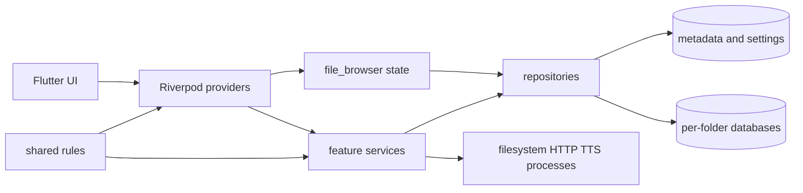
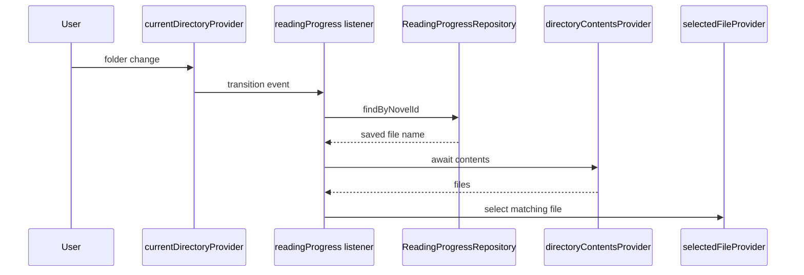
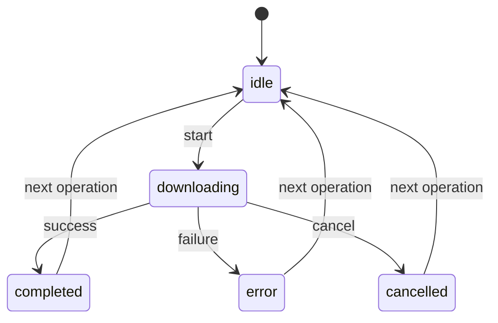

# アーキテクチャ

## 章のスコープ

本章は、CH-02 に割り当てられた 67 インベントリ項目（本体 34、テスト 33）を対象に、Riverpod による依存性注入・状態管理、機能境界、フォルダ単位データ資源のライフサイクル、共有ルールを概観する。[CONFIDENCE: HIGH] [REF: lib/features/file_browser/providers/file_browser_providers.dart:21-64]

## モジュール

| ID | モジュール | 責務と境界 | 主な依存方向 | 根拠 |
|---|---|---|---|---|
| M-01 | `app` | 起動前マイグレーションと、選択中小説・ファイルからウィンドウタイトルを導出するアプリケーション組立層。 | settings、file browser、reading progress | 🟢 VERIFIED [REF: lib/app/startup_migrations.dart:6-15] [REF: lib/app/selected_file_progress_title_provider.dart:5-21] |
| M-02 | `app_update` | 起動時に override されるパッケージ情報、HTTP クライアント、更新設定から更新確認・インストーラ更新器を構成し、結果を状態として公開する。 | settings、外部 GitHub/OS プロセス | 🟢 VERIFIED [REF: lib/features/app_update/providers/update_providers.dart:16-57] |
| M-03 | `file_browser` | 現在ディレクトリと選択ファイルを状態の基点とし、ファイル一覧、表示名、TTS 状態、進捗バッジ、ダウンロード先候補を派生する。フォルダ切替時は旧フォルダの DB provider を破棄する。 | filesystem、metadata、reading progress、folder DB | 🟢 VERIFIED [REF: lib/features/file_browser/providers/file_browser_providers.dart:25-64] [REF: lib/features/file_browser/providers/file_browser_providers.dart:79-130] |
| M-04 | `episode_navigation` | ファイル一覧と選択から前後話を導出し、開始位置 intent とファイル選択を順序付きで更新する。 | file browser | 🟢 VERIFIED [REF: lib/features/episode_navigation/providers/adjacent_files_provider.dart:28-37] [REF: lib/features/episode_navigation/providers/episode_navigation_controller.dart:20-34] |
| M-05 | `bookmark` | 現在位置を登録済み小説フォルダへ解決し、フォルダ単位 repository、一覧、現在行の登録状態、ジャンプ要求を公開する。 | file browser、novel-data DB | 🟢 VERIFIED [REF: lib/features/bookmark/providers/bookmark_providers.dart:10-49] [REF: lib/features/bookmark/providers/bookmark_providers.dart:58-109] |
| M-06 | `reading_progress` | 選択ファイル変更を保存し、ディレクトリ遷移時に保存済みファイルを一度だけ自動選択する。書込み revision が集約バッジの再計算を通知する。 | file browser、metadata DB | 🟢 VERIFIED [REF: lib/features/reading_progress/providers/reading_progress_providers.dart:13-64] [REF: lib/features/reading_progress/providers/reading_progress_providers.dart:67-143] |
| M-07 | `text_download` | ダウンロード状態を保持し、サイト registry、download service、episode cache、metadata repository を調停するアプリケーションサービス境界。 | downloader、site adapters、metadata/cache DB | 🟢 VERIFIED [REF: lib/features/text_download/providers/text_download_providers.dart:16-65] [REF: lib/features/text_download/providers/text_download_providers.dart:89-146] |
| M-08 | `text_search` | 検索 UI 状態と検索結果を provider 化し、検索セッション終了時に関連状態をまとめて閉じる。 | file browser、search service、layout | 🟢 VERIFIED [REF: lib/features/text_search/providers/text_search_providers.dart:13-33] [REF: lib/features/text_search/providers/text_search_providers.dart:46-91] |
| M-09 | `llm_summary` | 設定から LLM client を選択し、フォルダ単位の要約・事実 repository と検索 service を要約 service に合成する。履歴、マーク語、hover 状態も provider で結合する。 | settings、HTTP、novel-data DB、text search | 🟢 VERIFIED [REF: lib/features/llm_summary/providers/llm_summary_providers.dart:14-43] [REF: lib/features/llm_summary/providers/llm_summary_providers.dart:48-95] |
| M-10 | `tts` | 音声状態、再生要求、編集、書出し、設定、モデルパス、終了時 vacuum を独立した provider 群として公開する。 | settings、folder DB、Flutter lifecycle | 🟢 VERIFIED [REF: lib/features/tts/providers/tts_playback_providers.dart:5-70] [REF: lib/features/tts/providers/tts_settings_providers.dart:12-68] [REF: lib/features/tts/providers/vacuum_lifecycle_provider.dart:80-91] |
| M-11 | `shared` | feature 型に依存しない episode 解決、novel ID/所有フォルダ解決、取消、hash、ファイル名、一時ディレクトリ、layout 状態を提供する。 | Dart/Flutter 基盤のみ | 🟢 VERIFIED [REF: lib/shared/episode/episode_resolver.dart:5-18] [REF: lib/shared/utils/novel_id_resolver.dart:3-20] |

### Deep-dive candidates (refer to them by ID)

- **D-A2-001**: M-03 フォルダ切替時の DB handle 解放と provider invalidation の順序（複数 DB に跨る）。
- **D-A2-002**: M-06 非同期 listener の競合回避と自動復元規則。
- **D-A2-003**: M-07 ダウンロードの cancel/error 時における cache DB の閉鎖保証。
- **D-A2-004**: M-09 LLM 履歴・fact cache・ファイルジャンプ間の整合性。
- **D-A2-005**: M-10 アプリ終了時 vacuum の完了保証。

## 主要エンティティ／状態

| 状態・型 | 所有 provider / module | ライフサイクル・意味 | 根拠 |
|---|---|---|---|
| `CurrentDirectoryNotifier`, `SelectedFileNotifier`, `DirectoryContents` | file browser | ナビゲーションの中核状態と、そのディレクトリから導く表示用スナップショット。 | 🟢 VERIFIED [REF: lib/features/file_browser/providers/file_browser_providers.dart:25-57] [REF: lib/features/file_browser/providers/file_browser_providers.dart:225-237] |
| `AdjacentFiles`, `FileEntryStartIntent` | episode navigation | 選択の前後関係と、遷移先を先頭／末尾のどちらから開くかを分離して保持する。 | 🟢 VERIFIED [REF: lib/features/episode_navigation/providers/adjacent_files_provider.dart:9-37] [REF: lib/features/episode_navigation/providers/pending_file_entry_intent_provider.dart:6-19] |
| `DownloadState` / `DownloadStatus` | text download | `idle`, `downloading`, `completed`, `error`, `cancelled` と進捗・エラーを表す。 | 🟢 VERIFIED [REF: lib/features/text_download/providers/text_download_providers.dart:16-63] |
| `HoverPopupState` | LLM summary | token、位置、表示状態、active episode を単一 immutable state として扱う。 | 🟢 VERIFIED [REF: lib/features/llm_summary/providers/hover_popup_provider.dart:15-52] |
| `TtsAudioState`, `TtsPlaybackState`, `TtsGenerationProgress` | TTS | DB 上の生成状態と UI 再生状態を分離する。 | 🟢 VERIFIED [REF: lib/features/tts/providers/tts_playback_providers.dart:5-38] [REF: lib/features/tts/providers/tts_audio_state_provider.dart:41-49] |
| `CancellationToken` | shared | cancel フラグと callback を持ち、取消後の callback 登録にも即時通知する協調取消 primitive。 | 🟢 VERIFIED [REF: lib/shared/utils/cancellation_token.dart:1-47] |

### Deep-dive candidates (refer to them by ID)

- **D-A2-006**: `DownloadState` の全遷移と UI 側の終端状態消費。
- **D-A2-007**: hover popup の 150ms grace period とイベント順序。
- **D-A2-008**: TTS の DB 状態・streaming override・再生状態の三者整合。

## アクション境界

| アクション | 入力→出力 | 失敗・競合時の振る舞い | 根拠 |
|---|---|---|---|
| 起動マイグレーション | `SettingsRepository` → secure storage 移行 | 例外を WARNING に記録し、起動を継続する。 | 🟢 VERIFIED [REF: lib/app/startup_migrations.dart:6-15] |
| 前後話移動 | `AdjacentFiles` → intent 設定 → selected file 更新 | 対象なしなら no-op。intent が selection より先に設定される。 | 🟢 VERIFIED [REF: lib/features/episode_navigation/providers/episode_navigation_controller.dart:20-34] [REF: test/features/episode_navigation/providers/episode_navigation_controller_test.dart:43-109] |
| 進捗自動保存 | selected file event → `upsert` → revision bump | novel ID 不明は no-op、DB 失敗は WARNING を残して UI へ伝播しない。 | 🟢 VERIFIED [REF: lib/features/reading_progress/providers/reading_progress_providers.dart:32-64] |
| 進捗自動復元 | directory event → progress lookup → matching file select | 遷移先変更、欠落ファイル、同一小説の既存選択では上書きしない。 | 🟢 VERIFIED [REF: lib/features/reading_progress/providers/reading_progress_providers.dart:67-143] |
| 終了時 vacuum | dirty folder set → folder ごとの並列 reclaim | 同一 folder は重複排除し、個別失敗を記録して他 folder を継続する。 | 🟢 VERIFIED [REF: lib/features/tts/providers/vacuum_lifecycle_provider.dart:29-76] |
| episode 番号解決 | file name + lexical listing → effective episode | prefix 優先、prefix なしは 1-origin lexical rank、用途により null/1 fallback を使い分ける。 | 🟢 VERIFIED [REF: lib/shared/episode/episode_resolver.dart:49-110] |

### Deep-dive candidates (refer to them by ID)

- **D-A2-009**: provider listener が dispose 後に完了する場合の安全性。
- **D-A2-010**: startup migration の失敗をユーザーへ通知しない設計意図。

## データと依存性

| データ／依存 | スコープ | 接続方法 | 根拠 |
|---|---|---|---|
| `NovelDatabase` / `NovelRepository` | アプリ共有 metadata | 起動時 override された DB から repository と全小説一覧を派生する。 | 🟢 VERIFIED [REF: lib/features/novel_metadata_db/providers/novel_metadata_providers.dart:6-16] |
| `novel_data.db` 系 repository | 小説フォルダ単位 | `FutureProvider.family` と正規化済み `folderDbKey` を通じて bookmark/LLM repository を構成する。 | 🟢 VERIFIED [REF: lib/features/bookmark/providers/bookmark_providers.dart:10-19] [REF: lib/features/llm_summary/providers/llm_summary_providers.dart:48-69] |
| `tts_audio.db` | 小説フォルダ単位 | file browser と TTS state が同じ folder key で参照し、切替時 invalidate、終了時 reclaim を行う。 | 🟢 VERIFIED [REF: lib/features/file_browser/providers/file_browser_providers.dart:43-50] [REF: lib/features/tts/providers/tts_audio_state_provider.dart:41-49] |
| `SettingsRepository` | アプリ共有設定 | shortcut、LLM、TTS の notifier が watch/read し、変更時に永続化する。 | 🟢 VERIFIED [REF: lib/features/keyboard_shortcuts/providers/keyboard_shortcut_providers.dart:21-40] [REF: lib/features/tts/providers/tts_settings_providers.dart:24-50] |
| `libraryPathProvider`, `packageInfoProvider`, `novelDatabaseProvider` | composition root 入力 | 本体定義は `UnimplementedError` とし、起動時 `ProviderScope` override を必須にする。 | 🟢 VERIFIED [REF: lib/features/file_browser/providers/file_browser_providers.dart:59-61] [REF: lib/features/app_update/providers/update_providers.dart:16-19] [REF: lib/features/novel_metadata_db/providers/novel_metadata_providers.dart:6-8] |

永続データの論理所有者は「アプリ共有 metadata/settings」と「小説フォルダ単位 DB」に分かれる。[CONFIDENCE: MED] これは複数 provider の接続形態から導いたアーキテクチャ上の分類であり、明示的な設計文書上の呼称ではない。[ASSUMED: データ所有境界を provider の生成スコープから推定; basis: family provider と startup override の反復] [REF: lib/features/llm_summary/providers/llm_summary_providers.dart:48-76] [REF: lib/features/novel_metadata_db/providers/novel_metadata_providers.dart:6-16]

### Deep-dive candidates (refer to them by ID)

- **D-A2-011**: 全 per-folder DB の key 正規化・close・invalidate 対応表。
- **D-A2-012**: composition root で必須 override が満たされることの静的／起動時検証。

## モジュール依存図

この図は provider ファイルの import と生成関係を要約した構造図である。[CONFIDENCE: MED] [REF: lib/features/text_download/providers/text_download_providers.dart:89-134] [REF: lib/features/llm_summary/providers/llm_summary_providers.dart:72-95]

## 代表シーケンス：読書位置の自動復元

遅延中に current directory が変わった場合は選択を中止し、保存された絶対パスではなく現在一覧内のファイル名で照合する。[CONFIDENCE: HIGH] [REF: lib/features/reading_progress/providers/reading_progress_providers.dart:104-142]

## 状態遷移：ダウンロード

列挙値はソースで確認できるが、終端状態から `idle` への遷移タイミングは本章割当範囲だけでは一律に確定できない。[CONFIDENCE: LOW] [ASSUMED: 次操作開始時に状態が再初期化される; basis: notifier が操作開始時に状態を更新する] [REF: lib/features/text_download/providers/text_download_providers.dart:16-65]

## 割当インベントリ網羅表

| 区分 | 対象 inventory IDs | 検査結果 |
|---|---|---|
| アプリ／更新 | `INV-0010`, `INV-0011`, `INV-0027`, `INV-0240`, `INV-0241`, `INV-0242` | 🟢 VERIFIED: provider wiring、タイトル導出、起動 migration と対応テストを確認。[REF: test/app/reading_progress_wiring_test.dart:100-160] [REF: test/app/selected_file_progress_title_provider_test.dart:76-144] [REF: test/app/startup_migrations_test.dart:29-58] |
| bookmark／navigation | `INV-0032`, `INV-0037`, `INV-0038`, `INV-0039`, `INV-0254`, `INV-0262`, `INV-0263`, `INV-0264` | 🟢 VERIFIED: folder 解決、repository、前後話、intent 順序を確認。[REF: test/features/bookmark/bookmark_providers_test.dart:89-283] [REF: test/features/episode_navigation/providers/adjacent_files_provider_test.dart:41-141] |
| file browser | `INV-0049`, `INV-0278`, `INV-0279`, `INV-0280`, `INV-0281`, `INV-0282`, `INV-0283` | 🟢 VERIFIED: 一覧派生、表示名、TTS 状態、進捗バッジ、handle 解放を確認。[REF: test/features/file_browser/providers/directory_contents_title_mapping_test.dart:54-71] [REF: test/features/file_browser/providers/folder_switch_handle_release_test.dart:26-58] |
| shortcut／LLM | `INV-0056`, `INV-0085`, `INV-0086`, `INV-0087`, `INV-0088`, `INV-0089`, `INV-0090`, `INV-0289`, `INV-0316`, `INV-0317`, `INV-0318`, `INV-0319`, `INV-0320` | 🟢 VERIFIED: 設定永続化、client 合成、履歴、hover、marked word、model list を確認。[REF: test/features/keyboard_shortcuts/providers/keyboard_shortcut_providers_test.dart:28-81] [REF: test/features/llm_summary/providers/llm_summary_providers_test.dart:30-197] |
| metadata／delete／progress | `INV-0092`, `INV-0097`, `INV-0100`, `INV-0334`, `INV-0335` | 🟢 VERIFIED: repository wiring と非同期 listener の保存・復元・失敗抑制を確認。[REF: test/features/reading_progress/providers/reading_progress_listeners_test.dart:94-565] [REF: test/features/reading_progress/providers/reading_progress_providers_test.dart:27-40] |
| download／search | `INV-0121`, `INV-0125`, `INV-0380` | 🟢 VERIFIED: orchestration provider と検索 state/result を確認。[REF: lib/features/text_download/providers/text_download_providers.dart:65-189] [REF: test/features/text_search/providers/text_search_providers_test.dart:26-228] |
| TTS | `INV-0186`, `INV-0188`, `INV-0189`, `INV-0190`, `INV-0192`, `INV-0193`, `INV-0194`, `INV-0457`, `INV-0459`, `INV-0461`, `INV-0462`, `INV-0463` | 🟢 VERIFIED: segmenter、audio state、編集、export、playback、設定、vacuum を確認。[REF: test/features/tts/providers/text_segmenter_provider_test.dart:7-8] [REF: test/features/tts/providers/tts_settings_providers_test.dart:26-304] |
| shared | `INV-0210`, `INV-0214`, `INV-0215`, `INV-0216`, `INV-0217`, `INV-0218`, `INV-0219`, `INV-0477`, `INV-0480`, `INV-0481`, `INV-0482`, `INV-0483`, `INV-0484` | 🟢 VERIFIED: episode、layout、取消、hash、ファイル名、novel owner、一時 directory の各 utility とテストを確認。[REF: test/shared/episode/episode_resolver_test.dart:8-185] [REF: test/shared/utils/novel_id_resolver_test.dart:5-91] |

## Detail questions raised in this chapter

- Q-002: 回答済み。ダウンロード終端状態を`idle`へ戻す責務はnotifierが持つ。[REF: lib/features/text_download/providers/text_download_providers.dart:16-65]
- Q-003: 回答済み。必須Provider未override時のfail-fast契約を維持する。[REF: lib/features/novel_metadata_db/providers/novel_metadata_providers.dart:6-8]
- Q-004: 回答済み。`detached`時の非同期vacuumはbest-effort運用とする。[REF: lib/features/tts/providers/vacuum_lifecycle_provider.dart:41-76]

## Sources Read

- `lib/app/selected_file_progress_title_provider.dart`
- `lib/app/startup_migrations.dart`
- `lib/features/app_update/providers/update_providers.dart`
- `lib/features/bookmark/providers/bookmark_providers.dart`
- `lib/features/episode_navigation/providers/adjacent_files_provider.dart`
- `lib/features/episode_navigation/providers/episode_navigation_controller.dart`
- `lib/features/episode_navigation/providers/pending_file_entry_intent_provider.dart`
- `lib/features/file_browser/providers/file_browser_providers.dart`
- `lib/features/keyboard_shortcuts/providers/keyboard_shortcut_providers.dart`
- `lib/features/llm_summary/providers/hover_popup_provider.dart`
- `lib/features/llm_summary/providers/llm_summary_detail_provider.dart`
- `lib/features/llm_summary/providers/llm_summary_history_provider.dart`
- `lib/features/llm_summary/providers/llm_summary_providers.dart`
- `lib/features/llm_summary/providers/marked_words_provider.dart`
- `lib/features/llm_summary/providers/ollama_model_list_provider.dart`
- `lib/features/novel_delete/providers/novel_delete_providers.dart`
- `lib/features/novel_metadata_db/providers/novel_metadata_providers.dart`
- `lib/features/reading_progress/providers/reading_progress_providers.dart`
- `lib/features/text_download/providers/text_download_providers.dart`
- `lib/features/text_search/providers/text_search_providers.dart`
- `lib/features/tts/providers/text_segmenter_provider.dart`
- `lib/features/tts/providers/tts_audio_state_provider.dart`
- `lib/features/tts/providers/tts_edit_providers.dart`
- `lib/features/tts/providers/tts_export_providers.dart`
- `lib/features/tts/providers/tts_playback_providers.dart`
- `lib/features/tts/providers/tts_settings_providers.dart`
- `lib/features/tts/providers/vacuum_lifecycle_provider.dart`
- `lib/shared/episode/episode_resolver.dart`
- `lib/shared/providers/layout_providers.dart`
- `lib/shared/utils/cancellation_token.dart`
- `lib/shared/utils/content_hash.dart`
- `lib/shared/utils/file_name_utils.dart`
- `lib/shared/utils/novel_id_resolver.dart`
- `lib/shared/utils/temp_directory_utils.dart`
- `test/app/reading_progress_wiring_test.dart`
- `test/app/selected_file_progress_title_provider_test.dart`
- `test/app/startup_migrations_test.dart`
- `test/features/bookmark/bookmark_providers_test.dart`
- `test/features/episode_navigation/providers/adjacent_files_provider_test.dart`
- `test/features/episode_navigation/providers/episode_navigation_controller_test.dart`
- `test/features/episode_navigation/providers/pending_file_entry_intent_provider_test.dart`
- `test/features/file_browser/providers/directory_contents_title_mapping_test.dart`
- `test/features/file_browser/providers/directory_contents_tts_status_test.dart`
- `test/features/file_browser/providers/download_destination_folders_provider_test.dart`
- `test/features/file_browser/providers/folder_switch_handle_release_test.dart`
- `test/features/file_browser/providers/reading_progress_badge_provider_test.dart`
- `test/features/file_browser/providers/selected_novel_title_provider_test.dart`
- `test/features/keyboard_shortcuts/providers/keyboard_shortcut_providers_test.dart`
- `test/features/llm_summary/providers/hover_popup_provider_test.dart`
- `test/features/llm_summary/providers/llm_summary_history_provider_test.dart`
- `test/features/llm_summary/providers/llm_summary_providers_test.dart`
- `test/features/llm_summary/providers/marked_words_provider_test.dart`
- `test/features/llm_summary/providers/ollama_model_list_provider_test.dart`
- `test/features/reading_progress/providers/reading_progress_listeners_test.dart`
- `test/features/reading_progress/providers/reading_progress_providers_test.dart`
- `test/features/text_search/providers/text_search_providers_test.dart`
- `test/features/tts/providers/text_segmenter_provider_test.dart`
- `test/features/tts/providers/tts_audio_state_provider_test.dart`
- `test/features/tts/providers/tts_playback_state_test.dart`
- `test/features/tts/providers/tts_settings_providers_test.dart`
- `test/features/tts/providers/vacuum_lifecycle_provider_test.dart`
- `test/shared/episode/episode_resolver_test.dart`
- `test/shared/providers/layout_providers_test.dart`
- `test/shared/utils/cancellation_token_test.dart`
- `test/shared/utils/content_hash_test.dart`
- `test/shared/utils/novel_id_resolver_test.dart`
- `test/shared/utils/temp_directory_utils_test.dart`
