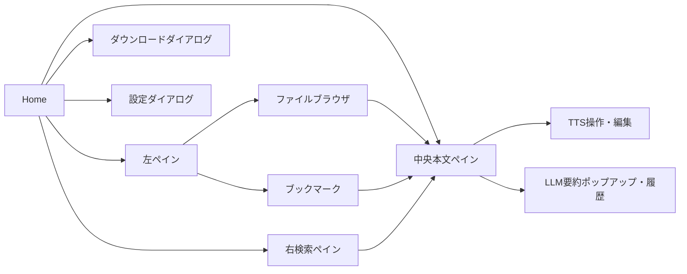

# 画面・画面遷移

## 章のスコープ

本章は、デスクトップUIの画面構成、モーダル、ユーザー操作による表示状態の遷移、および縦書き・横書きビューアの表示責務を扱う。永続化方式や各サービス内部の仕様は、画面に現れる境界だけを記載する。[CONFIDENCE: HIGH] [REF: lib/home_screen.dart:233-352]

## 画面モジュール

| ID | 画面・領域 | 主な責務 | 主な状態・依存 | 判定 |
|---|---|---|---|---|
| S-01 | `HomeScreen` | アプリバーと左右固定幅・中央可変幅のペインを構成し、ショートカットのActionを束ねる。[REF: lib/home_screen.dart:233-352] | 選択ファイル、検索表示、ブックマーク操作。[REF: lib/home_screen.dart:91-144] | 🟢 VERIFIED |
| S-02 | `LeftColumnPanel` | ファイルブラウザとブックマーク一覧をタブで切り替える。[REF: lib/features/bookmark/presentation/left_column_panel.dart:7-50] | `TabController`を保持する。[REF: lib/features/bookmark/presentation/left_column_panel.dart:14-28] | 🟢 VERIFIED |
| S-03 | `FileBrowserPanel` | ライブラリ配下の移動、ファイル選択、フォルダ作成・移動・改名・削除・更新を提供する。[REF: lib/features/file_browser/presentation/file_browser_panel.dart:39-165] [REF: lib/features/file_browser/presentation/file_browser_panel.dart:431-617] | 現在ディレクトリ、選択ファイル、読書進捗、TTS状態。[REF: lib/features/file_browser/presentation/file_browser_panel.dart:122-157] | 🟢 VERIFIED |
| S-04 | `BookmarkListPanel` | ブックマークをファイル単位で表示し、選択した位置へ移動する。[REF: lib/features/bookmark/presentation/bookmark_list_panel.dart:12-66] | ブックマーク一覧と選択ファイル。[REF: lib/features/bookmark/presentation/bookmark_list_panel.dart:19-58] | 🟢 VERIFIED |
| S-05 | `TextViewerPanel` | ファイル本文と、利用可能時のTTS操作バーを縦に配置する。[REF: lib/features/text_viewer/presentation/text_viewer_panel.dart:14-44] | 選択ファイルから読み込んだ本文。[REF: lib/features/text_viewer/presentation/text_viewer_panel.dart:20-38] | 🟢 VERIFIED |
| S-06 | `TextContentRenderer` | 表示モードに応じて横書き選択テキストまたは`VerticalTextViewer`を構築し、検索・ブックマーク・TTS強調を反映する。[REF: lib/features/text_viewer/presentation/widgets/text_content_renderer.dart:625-670] | 表示モード、検索一致、選択ファイル、強調範囲。[REF: lib/features/text_viewer/presentation/widgets/text_content_renderer.dart:625-650] | 🟢 VERIFIED |
| S-07 | `VerticalTextViewer` / `VerticalTextPage` | 縦書きのページ分割、ページ移動、スワイプ、ホバー、選択を処理する。[REF: lib/features/text_viewer/presentation/vertical_text_viewer.dart:271-355] [REF: lib/features/text_viewer/presentation/vertical_text_page.dart:30-93] | ページ位置、レイアウト結果、ジェスチャーモード。[REF: lib/features/text_viewer/presentation/vertical_text_page.dart:88-105] | 🟢 VERIFIED |
| S-08 | `SearchResultsPanel` | 検索ボックスとファイル別の一致結果を表示し、結果選択をファイル選択・本文位置へ伝える。[REF: lib/features/text_search/presentation/search_results_panel.dart:10-77] [REF: lib/features/text_search/presentation/search_results_panel.dart:137-177] | 検索語、検索結果、選択一致。[REF: lib/features/text_search/presentation/search_results_panel.dart:22-77] | 🟢 VERIFIED |
| S-09 | LLM要約UI | 分析進捗モーダル、ホバーポップアップ、履歴、詳細・スナップショット表示を提供する。[REF: lib/features/llm_summary/presentation/analysis_runner.dart:21-43] [REF: lib/features/llm_summary/presentation/hover_popup_widget.dart:15-99] [REF: lib/features/llm_summary/presentation/llm_summary_history_panel.dart:13-84] | 分析範囲、ポップアップ状態、履歴項目。[REF: lib/features/llm_summary/presentation/analysis_runner.dart:21-43] | 🟢 VERIFIED |
| S-10 | TTS UI | 再生・一時停止・再開・停止・削除・書出しと、辞書・編集・録音の各ダイアログを提供する。[REF: lib/features/text_viewer/presentation/widgets/tts_controls_bar.dart:386-452] [REF: lib/features/tts/presentation/tts_dictionary_dialog.dart:17-36] [REF: lib/features/tts/presentation/tts_edit_dialog.dart:24-51] [REF: lib/features/tts/presentation/voice_recording_dialog.dart:19-41] | 音声生成・再生・編集状態。[REF: lib/features/text_viewer/presentation/widgets/tts_controls_bar.dart:41-72] | 🟢 VERIFIED |
| S-11 | `DownloadDialog` | URL、保存先、コレクション方式を入力し、ダウンロード開始・取消・完了後の終了を扱う。[REF: lib/features/text_download/presentation/download_dialog.dart:15-32] [REF: lib/features/text_download/presentation/download_dialog.dart:427-456] | 入力検証、進捗、取消状態。[REF: lib/features/text_download/presentation/download_dialog.dart:32-70] | 🟢 VERIFIED |
| S-12 | 更新UI | 更新有無をバッジ表示し、更新ダイアログから後回し・リリースページ・更新開始を選択させる。[REF: lib/features/app_update/presentation/update_badge.dart:8-24] [REF: lib/features/app_update/presentation/update_dialog.dart:159-188] | 利用可能リリースとダウンロード状態。[REF: lib/features/app_update/presentation/update_dialog.dart:33-48] | 🟢 VERIFIED |

## 主要画面遷移

| 起点 | 操作 | 遷移・結果 | 戻り値／副作用 | 判定 |
|---|---|---|---|---|
| Home | ダウンロードボタン | `DownloadDialog`をモーダル表示。[REF: lib/home_screen.dart:307-318] | 完了または取消でHomeへ戻る。[REF: lib/features/text_download/presentation/download_dialog.dart:427-456] | 🟢 VERIFIED |
| Home | 設定ボタン | `SettingsDialog`をモーダル表示。[REF: lib/home_screen.dart:313-320] | 閉じる操作でHomeへ戻る。 | 🟢 VERIFIED |
| 左ペイン | ファイルを選択 | 中央ペインが本文を表示する。[REF: lib/features/file_browser/presentation/file_browser_panel.dart:290-333] | `selectedFileProvider`更新。[REF: lib/features/text_viewer/presentation/widgets/text_content_renderer.dart:264-267] | 🟢 VERIFIED |
| 右ペイン | 検索一致を選択 | 対象ファイルを選択し、一致位置を中央ペインへ通知する。[REF: lib/features/text_search/presentation/search_results_panel.dart:153-177] | `selectedFileProvider`と`selectedSearchMatchProvider`更新。 | 🟢 VERIFIED |
| 左ペイン | ブックマークを選択 | 対象ファイルと行へ移動する。[REF: lib/features/bookmark/presentation/bookmark_list_panel.dart:58-118] | 選択ファイル・ジャンプ行更新。 | 🟢 VERIFIED |
| ファイルブラウザ | フォルダ操作 | 新規・移動・改名・削除の確認ダイアログを開く。[REF: lib/features/file_browser/presentation/file_browser_panel.dart:431-617] | 成功時に一覧を更新する。 | 🟢 VERIFIED |
| 更新バッジ | バッジ押下 | `UpdateDialog`を開く。[REF: lib/features/app_update/presentation/update_badge.dart:18-24] | 後回し、外部ページ、インストーラ取得のいずれか。 | 🟢 VERIFIED |
| 本文 | 表示モード変更 | 横書きレンダラーと縦書きビューアを切り替える。[REF: lib/features/text_viewer/presentation/widgets/text_content_renderer.dart:627-670] | 同一選択ファイルを別レイアウトで表示する。 | 🟢 VERIFIED |
| TTSバー | 編集・再生・書出し | 編集ダイアログまたは再生・書出し処理へ遷移する。[REF: lib/features/text_viewer/presentation/widgets/tts_controls_bar.dart:386-452] | 再生状態・進捗がバーへ反映される。 | 🟢 VERIFIED |

## 表示状態とエッジケース

| 状態 | 表示仕様 | テスト証拠 | 判定 |
|---|---|---|---|
| 右検索ペイン | 初期状態では非表示で、検索表示時は3列構成となる。[REF: test/home_screen_test.dart:24-65] | 初期非表示、3列、固定幅をWidget testで検証。[REF: test/home_screen_test.dart:24-114] | 🟢 VERIFIED |
| ファイル未選択 | 中央ペインはプレースホルダーを表示する。[REF: test/features/text_viewer/presentation/text_viewer_panel_test.dart:29-47] | 未選択と選択後本文表示を検証。[REF: test/features/text_viewer/presentation/text_viewer_panel_test.dart:29-69] | 🟢 VERIFIED |
| ライブラリ未設定／空 | 設定を促す表示、またはテキストファイルなし表示になる。[REF: test/features/file_browser/presentation/file_browser_panel_test.dart:128-200] | 両状態をWidget testで検証。 | 🟢 VERIFIED |
| 検索 | 未実行、実行中、0件、ファイル別結果の各状態を表示する。[REF: test/features/text_search/presentation/search_results_panel_test.dart:15-116] | 検索一致押下時の選択状態も検証。[REF: test/features/text_search/presentation/search_results_panel_test.dart:146-233] | 🟢 VERIFIED |
| 縦書きページ | スワイプ、ホイール、アニメーション、初期ページ、前後話移動を個別テストする。[REF: test/features/text_viewer/presentation/vertical_text_viewer_swipe_test.dart:1-280] [REF: test/features/text_viewer/presentation/vertical_text_viewer_wheel_test.dart:1-168] [REF: test/features/text_viewer/presentation/vertical_text_viewer_episode_nav_test.dart:1-356] | 多数の入力経路を分離して検証。 | 🟢 VERIFIED |
| TTS強調 | 横書き、縦書き、ページオフセットを分けて強調範囲を検証する。[REF: test/features/text_viewer/presentation/tts_highlight_horizontal_test.dart:1-95] [REF: test/features/text_viewer/presentation/tts_highlight_vertical_test.dart:1-143] [REF: test/features/text_viewer/presentation/tts_highlight_page_offset_test.dart:1-216] | 表示モード別テストあり。 | 🟢 VERIFIED |

## 割当インベントリ網羅

以下の全119件を実ファイル単位で検査した。各行のIDは同じ機能境界として本章の表へ統合した。

| 機能境界 | 割当ID | 判定 |
|---|---|---|
| 更新・ブックマーク | INV-0025, INV-0026, INV-0030, INV-0031, INV-0252, INV-0253, INV-0256, INV-0257, INV-0258 | 🟢 VERIFIED |
| ファイルブラウザ・フォルダ操作 | INV-0045, INV-0046, INV-0047, INV-0048, INV-0271, INV-0272, INV-0273, INV-0274, INV-0275, INV-0276, INV-0277 | 🟢 VERIFIED |
| ショートカット | INV-0055, INV-0288 | 🟢 VERIFIED |
| LLM要約表示 | INV-0075, INV-0076, INV-0077, INV-0078, INV-0079, INV-0080, INV-0081, INV-0082, INV-0083, INV-0307, INV-0308, INV-0309, INV-0310, INV-0311, INV-0312, INV-0313, INV-0314 | 🟢 VERIFIED |
| ダウンロード | INV-0120, INV-0351, INV-0352, INV-0353 | 🟢 VERIFIED |
| 検索 | INV-0124, INV-0379 | 🟢 VERIFIED |
| 本文解析・レイアウト | INV-0126, INV-0127, INV-0130, INV-0131, INV-0132, INV-0133, INV-0134, INV-0135, INV-0136, INV-0381, INV-0382, INV-0384, INV-0385, INV-0386, INV-0387, INV-0388, INV-0421, INV-0424 | 🟢 VERIFIED |
| 本文・縦書き表示 | INV-0137, INV-0138, INV-0139, INV-0140, INV-0141, INV-0142, INV-0144, INV-0145, INV-0389, INV-0390, INV-0391, INV-0392, INV-0393, INV-0401, INV-0402, INV-0403, INV-0404, INV-0405, INV-0406, INV-0407, INV-0408, INV-0409, INV-0410, INV-0411, INV-0412, INV-0413, INV-0414, INV-0415, INV-0416, INV-0417, INV-0419, INV-0420, INV-0422, INV-0423 | 🟢 VERIFIED |
| TTS操作・表示 | INV-0143, INV-0181, INV-0182, INV-0183, INV-0184, INV-0394, INV-0395, INV-0396, INV-0397, INV-0398, INV-0399, INV-0400, INV-0418, INV-0455, INV-0456 | 🟢 VERIFIED |
| Homeと共通テスト補助 | INV-0195, INV-0464, INV-0467, INV-0468, INV-0469, INV-0470, INV-0486 | 🟢 VERIFIED |

## Deep-dive candidates (refer to them by ID)

- **D-SCR-001**: `VerticalTextViewer`のページング非同期処理と表示位置復元。大規模かつテスト観点が多い。[🟢 VERIFIED, complex] [REF: lib/features/text_viewer/presentation/vertical_text_viewer.dart:271-355]
- **D-SCR-002**: `TextContentRenderer`の検索・ブックマーク・TTS強調の優先順位。[🟢 VERIFIED, business-critical] [REF: lib/features/text_viewer/presentation/widgets/text_content_renderer.dart:625-670]
- **D-SCR-003**: `FileBrowserPanel`の破壊的操作、進捗更新、ハンドル解放順序。[🟢 VERIFIED, complex] [REF: lib/features/file_browser/presentation/file_browser_panel.dart:431-617]
- **D-SCR-004**: LLMホバーポップアップとルートNavigatorをまたぐ分析モーダルのライフサイクル。[🟢 VERIFIED, unusual] [REF: lib/features/llm_summary/presentation/hover_popup_widget.dart:215-267]
- **D-SCR-005**: TTS編集・再生・書出しの競合抑止と取消フロー。[🟢 VERIFIED, complex] [REF: lib/features/text_viewer/presentation/widgets/tts_controls_bar.dart:264-452]

## Detail questions raised in this chapter

- Q-005: 回答済み。ペイン幅と初期表示状態は当面固定し、ユーザー設定化しない。[REF: test/home_screen_test.dart:24-114]

## Sources Read

- `lib/home_screen.dart`
- `lib/features/app_update/presentation/update_badge.dart`, `lib/features/app_update/presentation/update_dialog.dart`
- `lib/features/bookmark/presentation/bookmark_list_panel.dart`, `lib/features/bookmark/presentation/left_column_panel.dart`
- `lib/features/file_browser/presentation/file_browser_panel.dart`, `lib/features/file_browser/presentation/move_destination_dialog.dart`, `lib/features/file_browser/presentation/new_folder_dialog.dart`, `lib/features/file_browser/presentation/rename_title_dialog.dart`
- `lib/features/keyboard_shortcuts/presentation/shortcut_settings_section.dart`
- `lib/features/llm_summary/presentation/analysis_runner.dart`, `lib/features/llm_summary/presentation/hover_popup_anchor.dart`, `lib/features/llm_summary/presentation/hover_popup_host.dart`, `lib/features/llm_summary/presentation/hover_popup_widget.dart`, `lib/features/llm_summary/presentation/llm_summary_detail_dialog.dart`, `lib/features/llm_summary/presentation/llm_summary_history_menu.dart`, `lib/features/llm_summary/presentation/llm_summary_history_panel.dart`, `lib/features/llm_summary/presentation/outlined_text_badge.dart`, `lib/features/llm_summary/presentation/summary_snapshot_view.dart`
- `lib/features/text_download/presentation/download_dialog.dart`, `lib/features/text_search/presentation/search_results_panel.dart`
- `lib/features/text_viewer/data/column_splitter.dart`, `lib/features/text_viewer/data/kinsoku.dart`, `lib/features/text_viewer/data/ruby_text_parser.dart`, `lib/features/text_viewer/data/swipe_detection.dart`, `lib/features/text_viewer/data/text_file_reader.dart`, `lib/features/text_viewer/data/text_segment.dart`, `lib/features/text_viewer/data/vertical_char_map.dart`, `lib/features/text_viewer/data/vertical_marked_ranges.dart`, `lib/features/text_viewer/data/vertical_text_layout.dart`
- `lib/features/text_viewer/presentation/ruby_text_builder.dart`, `lib/features/text_viewer/presentation/text_viewer_panel.dart`, `lib/features/text_viewer/presentation/vertical_ruby_text_widget.dart`, `lib/features/text_viewer/presentation/vertical_text_page.dart`, `lib/features/text_viewer/presentation/vertical_text_viewer.dart`, `lib/features/text_viewer/presentation/widgets/text_content_renderer.dart`, `lib/features/text_viewer/presentation/widgets/tts_controls_bar.dart`, `lib/features/text_viewer/presentation/widgets/vertical_context_menu.dart`, `lib/features/text_viewer/providers/text_viewer_providers.dart`
- `lib/features/tts/presentation/dictionary_context_menu.dart`, `lib/features/tts/presentation/tts_dictionary_dialog.dart`, `lib/features/tts/presentation/tts_edit_dialog.dart`, `lib/features/tts/presentation/voice_recording_dialog.dart`
- `test/features/app_update/presentation/update_badge_test.dart`, `test/features/app_update/presentation/update_dialog_test.dart`
- `test/features/bookmark/presentation/bookmark_appbar_test.dart`, `test/features/bookmark/presentation/bookmark_list_panel_test.dart`, `test/features/bookmark/presentation/left_column_panel_test.dart`
- `test/features/file_browser/presentation/file_browser_folder_ops_test.dart`, `test/features/file_browser/presentation/file_browser_handle_release_order_test.dart`, `test/features/file_browser/presentation/file_browser_panel_test.dart`, `test/features/file_browser/presentation/move_destination_dialog_test.dart`, `test/features/file_browser/presentation/refresh_invalidate_test.dart`, `test/features/file_browser/presentation/refresh_progress_dialog_test.dart`, `test/features/file_browser/presentation/rename_title_dialog_test.dart`
- `test/features/keyboard_shortcuts/presentation/shortcut_settings_section_test.dart`
- `test/features/llm_summary/presentation/analysis_runner_test.dart`, `test/features/llm_summary/presentation/hover_popup_anchor_test.dart`, `test/features/llm_summary/presentation/hover_popup_e2e_test.dart`, `test/features/llm_summary/presentation/hover_popup_host_test.dart`, `test/features/llm_summary/presentation/hover_popup_widget_test.dart`, `test/features/llm_summary/presentation/llm_summary_detail_dialog_test.dart`, `test/features/llm_summary/presentation/llm_summary_history_menu_test.dart`, `test/features/llm_summary/presentation/llm_summary_history_panel_test.dart`
- `test/features/text_download/download_dialog_cancel_truncate_test.dart`, `test/features/text_download/download_dialog_destination_test.dart`, `test/features/text_download/download_dialog_test.dart`
- `test/features/text_search/presentation/search_results_panel_test.dart`
- `test/features/text_viewer/data/column_splitter_test.dart`, `test/features/text_viewer/data/kinsoku_test.dart`, `test/features/text_viewer/data/swipe_detection_test.dart`, `test/features/text_viewer/data/text_file_reader_test.dart`, `test/features/text_viewer/data/vertical_char_map_test.dart`, `test/features/text_viewer/data/vertical_marked_ranges_test.dart`, `test/features/text_viewer/data/vertical_text_layout_test.dart`
- `test/features/text_viewer/presentation/horizontal_edge_episode_nav_test.dart`, `test/features/text_viewer/presentation/horizontal_page_scroll_test.dart`, `test/features/text_viewer/presentation/resolve_viewer_effects_test.dart`, `test/features/text_viewer/presentation/text_viewer_font_test.dart`, `test/features/text_viewer/presentation/text_viewer_panel_test.dart`, `test/features/text_viewer/presentation/text_viewer_tts_delete_confirmation_test.dart`, `test/features/text_viewer/presentation/tts_auto_page_test.dart`, `test/features/text_viewer/presentation/tts_auto_scroll_test.dart`, `test/features/text_viewer/presentation/tts_export_button_test.dart`, `test/features/text_viewer/presentation/tts_highlight_horizontal_test.dart`, `test/features/text_viewer/presentation/tts_highlight_page_offset_test.dart`, `test/features/text_viewer/presentation/tts_highlight_vertical_test.dart`, `test/features/text_viewer/presentation/vertical_ruby_text_widget_test.dart`, `test/features/text_viewer/presentation/vertical_text_page_hover_test.dart`, `test/features/text_viewer/presentation/vertical_text_page_mark_scan_test.dart`, `test/features/text_viewer/presentation/vertical_text_page_memoization_test.dart`, `test/features/text_viewer/presentation/vertical_text_page_test.dart`, `test/features/text_viewer/presentation/vertical_text_pagination_font_test.dart`, `test/features/text_viewer/presentation/vertical_text_viewer_animation_test.dart`, `test/features/text_viewer/presentation/vertical_text_viewer_episode_nav_test.dart`, `test/features/text_viewer/presentation/vertical_text_viewer_hover_test.dart`, `test/features/text_viewer/presentation/vertical_text_viewer_initial_page_test.dart`, `test/features/text_viewer/presentation/vertical_text_viewer_memoization_test.dart`, `test/features/text_viewer/presentation/vertical_text_viewer_pagination_test.dart`, `test/features/text_viewer/presentation/vertical_text_viewer_swipe_test.dart`, `test/features/text_viewer/presentation/vertical_text_viewer_test.dart`, `test/features/text_viewer/presentation/vertical_text_viewer_wheel_test.dart`, `test/features/text_viewer/presentation/widgets/text_content_renderer_intent_test.dart`, `test/features/text_viewer/presentation/widgets/text_content_renderer_test.dart`, `test/features/text_viewer/presentation/widgets/tts_controls_bar_test.dart`, `test/features/text_viewer/presentation/widgets/vertical_context_menu_test.dart`, `test/features/text_viewer/providers/selected_text_provider_test.dart`, `test/features/text_viewer/ruby_text_parser_test.dart`, `test/features/text_viewer/ruby_text_spans_hover_test.dart`, `test/features/text_viewer/ruby_text_spans_test.dart`, `test/features/text_viewer/text_segment_test.dart`
- `test/features/tts/presentation/dictionary_context_menu_test.dart`, `test/features/tts/presentation/tts_dictionary_dialog_test.dart`
- `test/helpers/localized_material_app.dart`, `test/home_screen_dynamic_shortcuts_test.dart`, `test/home_screen_pane_focus_test.dart`, `test/home_screen_test.dart`, `test/home_screen_tts_shortcut_test.dart`, `test/widget_test.dart`
