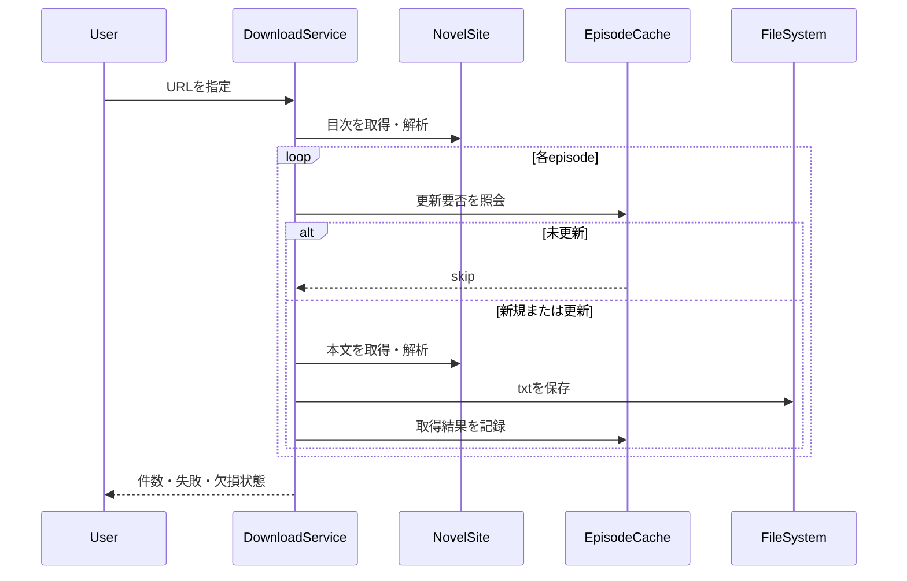
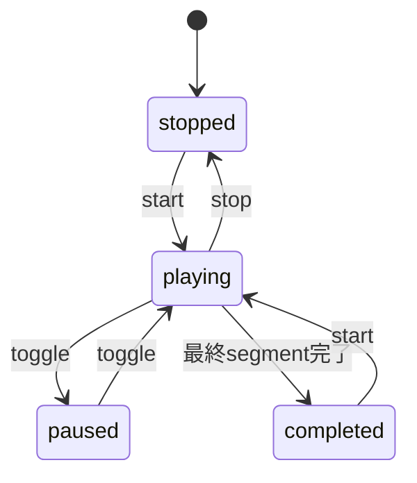

# 機能・ユースケース

本章は、CH-04 に割り当てられた実装44件とテスト66件を対象に、保守時に必要となる振る舞いの境界を整理する。記載内容はコードから確認できる現行仕様であり、事業上の意図は別途明示した箇所を除いて断定しない。

## 機能モジュール一覧

| 機能領域 | 主な責務 | 実装境界 | 状態 |
|---|---|---|---|
| アプリ更新 | 配布形態判定、インストーラー取得、SHA-256検証、起動、更新設定 | `DistributionDetector` は Windows のレジストリ値を読み、失敗時を含め portable にフォールバックする。[REF: lib/features/app_update/data/distribution_detector.dart:15-43] `InstallerUpdater` は asset 有無、ダウンロード、検証、プロセス起動の結果を `UpdateOutcome` に変換する。[REF: lib/features/app_update/data/installer_updater.dart:11-90] | 🟢 VERIFIED |
| ファイル管理 | テキスト一覧、サブディレクトリ、組織フォルダー、作成・改名・削除 | 操作失敗は `DirectoryOpError` と `DirectoryOpException` で分類される。[REF: lib/features/file_browser/data/file_system_service.dart:26-56] 小説フォルダー配下は組織フォルダー探索から枝ごと除外される。[REF: test/features/file_browser/data/download_destination_folders_test.dart:30-102] | 🟢 VERIFIED |
| キーボードショートカット | 編集可能アクション、既定割当、永続化用codec、Intent変換 | 検索、ブックマーク、TTS切替、ペイン切替が変更可能で、ページ移動は固定 Intent として分離される。[REF: lib/features/keyboard_shortcuts/data/shortcut_action.dart:1-14] [REF: lib/features/keyboard_shortcuts/data/shortcut_intents.dart:12-49] | 🟢 VERIFIED |
| LLM要約 | コンテキスト分割、事実抽出、集約、最終要約、進捗通知 | パイプラインはファイル単位の事実抽出と事実からの要約を分離し、応答JSONを検証する。[REF: lib/features/llm_summary/data/llm_summary_pipeline.dart:12-191] サービスは対象ファイルの選別、スナップショット保存、LLMリソース解放を統括する。[REF: lib/features/llm_summary/data/llm_summary_service.dart:22-233] | 🟢 VERIFIED |
| 小説削除 | DBハンドル解放、ディレクトリ削除、関連DB行削除 | ファイル削除後にDB行をトランザクションで削除し、ファイル削除失敗時はDB行を残すことがテストされる。[REF: test/features/novel_delete/data/novel_delete_order_test.dart:78-132] [REF: test/features/novel_delete/data/novel_delete_service_test.dart:77-219] | 🟢 VERIFIED |
| メタデータ移行 | 旧形式データから小説単位DBへの移行 | フォルダーパス解決器とDB openerを注入でき、移行処理をファイルシステム・DB実装から分離する。[REF: lib/features/novel_metadata_db/data/novel_data_migrator.dart:12-188] | 🟢 VERIFIED |
| 小説ダウンロード | サイト判定、目次・本文取得、差分更新、再試行、キャンセル、ファイル保存 | `DownloadService` がフォルダー命名、目次収集、エピソード取得、キャッシュ判定、進捗、失敗数を統括する。[REF: lib/features/text_download/data/download_service.dart:241-922] | 🟢 VERIFIED |
| 本文検索 | `.txt` 横断検索、行番号・前後文脈の返却 | 結果はファイル単位の `SearchResult` と行単位の `SearchMatch` で表現される。[REF: lib/features/text_search/data/search_models.dart:1-35] 検索はASCIIで大文字小文字を区別せず、`.txt` のみを対象にする。[REF: test/features/text_search/data/text_search_service_test.dart:27-114] | 🟢 VERIFIED |
| TTS | 文分割、モデル実行、isolate、ストリーミング再生、編集、音声出力、参照音声 | Qwen3/Piperのモデル実行とセッション、再生制御、編集用セグメント、WAV/MP3出力が個別クラスに分割される。[REF: lib/features/tts/data/tts_engine.dart:10-299] [REF: lib/features/tts/data/piper_tts_engine.dart:9-98] [REF: lib/features/tts/data/tts_session.dart:16-204] | 🟢 VERIFIED |

### Deep-dive candidates (refer to them by ID)

- **D-A4-001**: `DownloadService` の目次ページング、差分判定、再試行、キャンセルが交差する制御フロー。[🟢 VERIFIED, complex] [REF: lib/features/text_download/data/download_service.dart:241-922]
- **D-A4-002**: `TtsStreamingController` の既存音声再利用、生成、再生、停止・再開、ハイライト更新。[🟢 VERIFIED, complex] [REF: lib/features/tts/data/tts_streaming_controller.dart:37-388]
- **D-A4-003**: `TtsEditController` の辞書適用、DBマージ、音声再生成、セグメント編集。[🟢 VERIFIED, complex] [REF: lib/features/tts/data/tts_edit_controller.dart:19-471]
- **D-A4-004**: 汎用Webフォールバックを製品仕様としてどこまで保証するか。[🔴 ASSUMED, business-rule] [REF: test/features/text_download/url_validation_test.dart:30-39]

## 主要アクション

| アクション | 入力 | 正常時 | 例外・境界 | 状態 |
|---|---|---|---|---|
| インストーラー更新 | リリース情報、進捗callback | asset取得後にハッシュを検証し、引数付きで起動して終了callbackを呼ぶ。[REF: test/features/app_update/data/installer_updater_test.dart:85-104] | asset欠落、検証不一致、取得失敗、起動失敗を別 outcome にする。[REF: test/features/app_update/data/installer_updater_test.dart:105-196] | 🟢 VERIFIED |
| フォルダー操作 | ディレクトリと名前 | `.txt` 一覧・子フォルダー一覧を返し、作成・改名・削除を行う。[REF: test/features/file_browser/data/file_system_service_test.dart:19-157] [REF: test/features/file_browser/data/file_system_service_test.dart:158-408] | 数値接頭辞付きファイルを数値順にし、接頭辞なしは後段で名前順にする。[REF: test/features/file_browser/data/file_system_service_test.dart:40-87] | 🟢 VERIFIED |
| 要約生成 | 用語、ファイル別コンテキスト、表示言語 | 上限内でchunk化し、Stage 1で事実抽出、Stage 2で最終要約を生成する。[REF: test/features/llm_summary/data/context_chunker_test.dart:5-59] [REF: test/features/llm_summary/data/llm_summary_pipeline_per_file_test.dart:28-204] | 圧縮が進まない場合と再帰深度上限で精錬を停止する。[REF: test/features/llm_summary/data/llm_summary_pipeline_per_file_test.dart:205-257] | 🟢 VERIFIED |
| 小説削除 | 小説フォルダー名 | 開いているDBハンドルを解放し、フォルダーと読書進捗・小説行を削除する。[REF: test/features/novel_delete/data/novel_delete_service_test.dart:77-158] | DB行削除はatomicで、途中失敗時はrollbackする。[REF: test/features/novel_delete/data/novel_delete_service_test.dart:159-192] | 🟢 VERIFIED |
| 新規・差分ダウンロード | URL、site adapter、cancel token | 初回は全話、再実行時は更新日時が同じキャッシュ済み話をskipする。[REF: test/features/text_download/incremental_download_test.dart:247-427] | 本文parseが空なら保存もcache登録もせず失敗に数える。[REF: test/features/text_download/empty_parse_failure_test.dart:51-142] | 🟢 VERIFIED |
| コレクション追加 | 任意Web記事URL、コレクション | 固定4桁連番で保存し、同一URL再取得は重複せず更新する。[REF: test/features/text_download/collection_download_test.dart:62-213] | 空本文は `EmptyIndexException` とし保存しない。[REF: test/features/text_download/collection_download_test.dart:236-255] | 🟢 VERIFIED |
| 本文検索 | ディレクトリ、検索語、文脈行数 | ファイルパス、行番号、該当行または前後文脈を返す。[REF: lib/features/text_search/data/text_search_service.dart:7-99] | 該当なしは空結果、ファイル先頭・末尾では文脈範囲を切り詰める。[REF: test/features/text_search/data/text_search_service_test.dart:47-64] [REF: test/features/text_search/data/text_search_service_test.dart:115-186] | 🟢 VERIFIED |
| TTSストリーミング | 本文、モデル設定、辞書、保存済みセグメント | 保存済み音声を再生し、未生成分を順次合成・保存・再生する。[REF: test/features/tts/data/tts_streaming_controller_test.dart:544-730] | 停止時は部分状態を保存し、一時停止後は再開できる。[REF: test/features/tts/data/tts_streaming_controller_test.dart:731-812] | 🟢 VERIFIED |
| TTS編集・export | 編集セグメント、モデル、出力先 | セグメント単位で生成し、WAVのPCMを連結してMP3へencodeする。[REF: lib/features/tts/data/tts_audio_export_service.dart:24-112] [REF: test/features/tts/data/tts_audio_export_service_test.dart:48-177] | 辞書は新規・未生成テキストへ適用し、DB既存テキストへは再適用しない。[REF: test/features/tts/data/tts_edit_controller_test.dart:278-491] | 🟢 VERIFIED |

### Deep-dive candidates (refer to them by ID)

- **D-A4-005**: 更新失敗 outcome とUI通知・再試行方針の対応。[🟡 INFERRED, cross-chapter] [REF: lib/features/app_update/data/installer_updater.dart:11-90]
- **D-A4-006**: LLM応答のJSON抽出と異常応答の利用者向け復旧経路。[🟢 VERIFIED, complex] [REF: lib/features/llm_summary/data/llm_summary_pipeline.dart:145-191]
- **D-A4-007**: 小説削除でファイル削除成功後にDB transactionが失敗した場合の整合性回復。[🟡 INFERRED, operational] [REF: lib/features/novel_delete/data/novel_delete_service.dart:6-58]

## ダウンロードの業務ルール

| ルール | 現行の振る舞い | 状態 |
|---|---|---|
| URL解決 | なろう、カクヨム等の専用adapterを優先し、未対応のHTTP(S)は汎用Web adapterへフォールバックする。[REF: test/features/text_download/novel_site_test.dart:86-136] | 🟢 VERIFIED |
| 対応サイト | なろうは `ncode.syosetu.com` と `novel18.syosetu.com`、カクヨムは作品path、ハーメルンは小説ID path、青空文庫はHTMLファイルURLを判定する。[REF: test/features/text_download/narou_site_test.dart:29-89] [REF: test/features/text_download/kakuyomu_site_test.dart:80-139] [REF: test/features/text_download/hameln_site_test.dart:74-147] [REF: test/features/text_download/aozora_site_test.dart:11-61] | 🟢 VERIFIED |
| 空目次guard | episodesが空かつ短編本文もない場合、フォルダーを作らず `EmptyIndexException` とする。[REF: test/features/text_download/empty_index_guard_test.dart:26-86] 青空等の本文付き短編は対象外である。[REF: test/features/text_download/empty_index_guard_test.dart:87-108] | 🟢 VERIFIED |
| ページング欠損 | 2ページ目以降の取得・parse失敗は、それ以前の話を保持して `indexTruncated=true` とする。[REF: test/features/text_download/index_truncated_test.dart:25-94] | 🟢 VERIFIED |
| 一過性障害 | 5xxとtimeoutは再試行し、4xxは再試行しない。キャンセルはretry待機中でも `CancelledException` として表面化する。[REF: test/features/text_download/transient_retry_test.dart:83-322] | 🟢 VERIFIED |
| キャンセル | 中断以前の保存済み話は保持し、次回はcacheによりskipできる。[REF: test/features/text_download/download_cancellation_test.dart:34-101] | 🟢 VERIFIED |
| User-Agent | site指定値をdefaultより優先する。[REF: test/features/text_download/user_agent_precedence_test.dart:22-51] | 🟢 VERIFIED |
| ファイル命名 | 話数総数の桁数でzero paddingし、不正文字をsanitizeする。[REF: test/features/text_download/file_naming_test.dart:5-54] 桁数境界の変化時は既存ファイル名を移行する。[REF: test/features/text_download/episode_filename_pad_migration_test.dart:65-184] | 🟢 VERIFIED |
| ライブラリ | base directory配下のライブラリpathを解決し、存在しなければ作成する。[REF: test/features/text_download/novel_library_service_test.dart:8-58] | 🟢 VERIFIED |

この流れは、キャッシュ判定、保存、進捗・結果集計を行う実装と対応する。[REF: lib/features/text_download/data/download_service.dart:369-922]

### Deep-dive candidates (refer to them by ID)

- **D-A4-008**: サイト別parserのDOM変更耐性と検知・通知方針。[🟢 VERIFIED, business-critical] [REF: test/features/text_download/index_fixture_parsing_test.dart:17-82]
- **D-A4-009**: 話数桁境界でのファイル名移行と重複ファイル処理。[🟢 VERIFIED, complex] [REF: test/features/text_download/episode_filename_pad_migration_test.dart:65-296]
- **D-A4-010**: 100ページ上限到達を `indexTruncated` としない理由。[🟡 INFERRED, business-rule] [REF: test/features/text_download/index_truncated_test.dart:130-147]

## TTSの状態とデータフロー

| 構成要素 | 振る舞い | 状態 |
|---|---|---|
| `TextSegmenter` | 句点・感嘆符・疑問符・改行で分割し、閉じ括弧を句末へ含め、ルビ表記を読みへ変換する。[REF: test/features/tts/data/text_segmenter_test.dart:11-105] | 🟢 VERIFIED |
| `TtsEngine` | native modelをloadし、言語、参照音声、abort handleを用いて音声を合成する。[REF: lib/features/tts/data/tts_engine.dart:28-299] | 🟢 VERIFIED |
| `PiperTtsEngine` | Piper modelのload、length/noise parameter設定、合成、disposeを提供する。[REF: test/features/tts/data/piper_tts_engine_test.dart:110-204] | 🟢 VERIFIED |
| `TtsIsolate` | model load、synthesis、disposeをmessage/responseで隔離し、abort handleを管理する。[REF: lib/features/tts/data/tts_isolate.dart:21-540] | 🟢 VERIFIED |
| `TtsSession` | 同等設定のmodel loadを再利用し、合成中abortとdispose後の利用禁止を保証する。[REF: test/features/tts/data/tts_session_test.dart:150-276] | 🟢 VERIFIED |
| `SegmentPlayer` | file path設定後にstate streamを購読し、最後以外のsegmentはpause、最後はbuffer drainを待つ。[REF: test/features/tts/data/segment_player_test.dart:68-192] | 🟢 VERIFIED |
| `TtsEditSegment` | DB保存済み編集内容と本文由来segmentをmergeし、音声未生成状態も表現する。[REF: test/features/tts/data/tts_edit_segment_test.dart:34-157] | 🟢 VERIFIED |
| `VoiceRecordingService` | permission確認後、16kHz mono WAVで一時録音し、cancel時は一時ファイルを削除する。[REF: test/features/tts/data/voice_recording_service_test.dart:102-165] | 🟢 VERIFIED |
| `VoiceReferenceService` | ライブラリと同階層のvoices directoryを作成し、対応音声を列挙・追加・解決する。[REF: test/features/tts/data/voice_reference_service_test.dart:22-138] | 🟢 VERIFIED |
| `WavWriter` | float sampleをclampして16bit PCMへ変換しRIFF/WAVを書き出す。[REF: test/features/tts/data/wav_writer_test.dart:20-116] | 🟢 VERIFIED |

toggleの解決は停止中ならstart、再生・待機中ならpause、一時停止中ならresumeとなる。[REF: test/features/tts/data/tts_toggle_test.dart:6-47]

### Deep-dive candidates (refer to them by ID)

- **D-A4-011**: isolate crash・native abort・Future完了の競合処理。[🟢 VERIFIED, complex] [REF: lib/features/tts/data/tts_isolate.dart:135-540]
- **D-A4-012**: 長文分割時の最大長、句読点、括弧、ルビの優先順位。[🟢 VERIFIED, complex] [REF: lib/features/tts/data/text_segmenter.dart:13-217]
- **D-A4-013**: 参照音声ファイルの許可拡張子、copy、重複命名、削除規則。[🟢 VERIFIED, operational] [REF: lib/features/tts/data/voice_reference_service.dart:4-104]

## 割当インベントリの網羅

以下の表でCH-04の110件を一意に網羅する。各行の範囲は実際に読んだ割当ソースの有効行範囲である。

| 領域 | Inventory IDs / inspected sources | 状態 |
|---|---|---|
| アプリ更新（実装） | INV-0012 `distribution_detector.dart` [REF: lib/features/app_update/data/distribution_detector.dart:1-44]; INV-0014 `installer_downloader.dart` [REF: lib/features/app_update/data/installer_downloader.dart:1-118]; INV-0015 `installer_updater.dart` [REF: lib/features/app_update/data/installer_updater.dart:1-91]; INV-0016 `installer_verifier.dart` [REF: lib/features/app_update/data/installer_verifier.dart:1-37]; INV-0017 `process_starter.dart` [REF: lib/features/app_update/data/process_starter.dart:1-21]; INV-0018 `registry_reader.dart` [REF: lib/features/app_update/data/registry_reader.dart:1-35]; INV-0019 `release_info.dart` [REF: lib/features/app_update/data/release_info.dart:1-55]; INV-0020 `update_preferences.dart` [REF: lib/features/app_update/data/update_preferences.dart:1-32] | 🟢 VERIFIED |
| ファイル・shortcut（実装） | INV-0040 `file_system_service.dart` [REF: lib/features/file_browser/data/file_system_service.dart:1-300]; INV-0050 `focus_utils.dart` [REF: lib/features/keyboard_shortcuts/data/focus_utils.dart:1-16]; INV-0051 `key_binding_label.dart` [REF: lib/features/keyboard_shortcuts/data/key_binding_label.dart:1-23]; INV-0052 `shortcut_action.dart` [REF: lib/features/keyboard_shortcuts/data/shortcut_action.dart:1-14]; INV-0053 `shortcut_bindings.dart` [REF: lib/features/keyboard_shortcuts/data/shortcut_bindings.dart:1-141]; INV-0054 `shortcut_intents.dart` [REF: lib/features/keyboard_shortcuts/data/shortcut_intents.dart:1-52] | 🟢 VERIFIED |
| LLM要約（実装） | INV-0057 `context_chunker.dart` [REF: lib/features/llm_summary/data/context_chunker.dart:1-34]; INV-0060 `llm_prompt_builder.dart` [REF: lib/features/llm_summary/data/llm_prompt_builder.dart:1-56]; INV-0061 `llm_response_format_exception.dart` [REF: lib/features/llm_summary/data/llm_response_format_exception.dart:1-28]; INV-0062 `llm_summary_pipeline.dart` [REF: lib/features/llm_summary/data/llm_summary_pipeline.dart:1-192]; INV-0064 `llm_summary_service.dart` [REF: lib/features/llm_summary/data/llm_summary_service.dart:1-234] | 🟢 VERIFIED |
| 削除・移行・download・search（実装） | INV-0091 `novel_delete_service.dart` [REF: lib/features/novel_delete/data/novel_delete_service.dart:1-59]; INV-0093 `novel_data_migrator.dart` [REF: lib/features/novel_metadata_db/data/novel_data_migrator.dart:1-189]; INV-0112 `download_service.dart` [REF: lib/features/text_download/data/download_service.dart:1-923]; INV-0113 `novel_library_service.dart` [REF: lib/features/text_download/data/novel_library_service.dart:1-81]; INV-0122 `search_models.dart` [REF: lib/features/text_search/data/search_models.dart:1-35]; INV-0123 `text_search_service.dart` [REF: lib/features/text_search/data/text_search_service.dart:1-100] | 🟢 VERIFIED |
| TTS（実装1） | INV-0150 `piper_tts_engine.dart` [REF: lib/features/tts/data/piper_tts_engine.dart:1-99]; INV-0151 `segment_player.dart` [REF: lib/features/tts/data/segment_player.dart:1-131]; INV-0152 `text_segmenter.dart` [REF: lib/features/tts/data/text_segmenter.dart:1-218]; INV-0153 `tts_adapters.dart` [REF: lib/features/tts/data/tts_adapters.dart:1-37]; INV-0155 `tts_audio_export_service.dart` [REF: lib/features/tts/data/tts_audio_export_service.dart:1-204]; INV-0159 `tts_edit_controller.dart` [REF: lib/features/tts/data/tts_edit_controller.dart:1-472]; INV-0160 `tts_edit_segment.dart` [REF: lib/features/tts/data/tts_edit_segment.dart:1-62]; INV-0161 `tts_engine.dart` [REF: lib/features/tts/data/tts_engine.dart:1-300] | 🟢 VERIFIED |
| TTS（実装2） | INV-0162 `tts_engine_type.dart` [REF: lib/features/tts/data/tts_engine_type.dart:1-8]; INV-0163 `tts_isolate.dart` [REF: lib/features/tts/data/tts_isolate.dart:1-541]; INV-0164 `tts_language.dart` [REF: lib/features/tts/data/tts_language.dart:1-22]; INV-0166 `tts_model_size.dart` [REF: lib/features/tts/data/tts_model_size.dart:1-14]; INV-0168 `tts_playback_controller.dart` [REF: lib/features/tts/data/tts_playback_controller.dart:1-12]; INV-0169 `tts_session.dart` [REF: lib/features/tts/data/tts_session.dart:1-205]; INV-0170 `tts_streaming_controller.dart` [REF: lib/features/tts/data/tts_streaming_controller.dart:1-389]; INV-0171 `tts_toggle.dart` [REF: lib/features/tts/data/tts_toggle.dart:1-27]; INV-0172 `voice_recording_service.dart` [REF: lib/features/tts/data/voice_recording_service.dart:1-65]; INV-0173 `voice_reference_service.dart` [REF: lib/features/tts/data/voice_reference_service.dart:1-105]; INV-0174 `wav_writer.dart` [REF: lib/features/tts/data/wav_writer.dart:1-80] | 🟢 VERIFIED |
| 更新・ファイル・shortcut（test） | INV-0243 [REF: test/features/app_update/data/distribution_detector_test.dart:1-104]; INV-0245 [REF: test/features/app_update/data/installer_downloader_test.dart:1-68]; INV-0246 [REF: test/features/app_update/data/installer_updater_test.dart:1-197]; INV-0247 [REF: test/features/app_update/data/installer_verifier_test.dart:1-124]; INV-0248 [REF: test/features/app_update/data/registry_reader_test.dart:1-47]; INV-0249 [REF: test/features/app_update/data/update_preferences_test.dart:1-53]; INV-0265 [REF: test/features/file_browser/data/download_destination_folders_test.dart:1-119]; INV-0266 [REF: test/features/file_browser/data/file_system_service_test.dart:1-409]; INV-0284 [REF: test/features/keyboard_shortcuts/data/focus_utils_test.dart:1-43]; INV-0285 [REF: test/features/keyboard_shortcuts/data/key_binding_label_test.dart:1-30]; INV-0286 [REF: test/features/keyboard_shortcuts/data/shortcut_action_test.dart:1-53]; INV-0287 [REF: test/features/keyboard_shortcuts/data/shortcut_bindings_test.dart:1-114] | 🟢 VERIFIED |
| LLM・削除・移行（test） | INV-0290 [REF: test/features/llm_summary/data/analysis_write_after_close_test.dart:1-53]; INV-0291 [REF: test/features/llm_summary/data/context_chunker_test.dart:1-60]; INV-0294 [REF: test/features/llm_summary/data/llm_prompt_builder_test.dart:1-136]; INV-0295 [REF: test/features/llm_summary/data/llm_summary_pipeline_per_file_test.dart:1-323]; INV-0298 [REF: test/features/llm_summary/data/llm_summary_service_test.dart:1-427]; INV-0299 [REF: test/features/llm_summary/data/v5_migration_test.dart:1-317]; INV-0321 [REF: test/features/novel_delete/data/novel_delete_order_test.dart:1-133]; INV-0322 [REF: test/features/novel_delete/data/novel_delete_service_test.dart:1-220]; INV-0329 [REF: test/features/novel_metadata_db/data/schema_fidelity_test.dart:1-69] | 🟢 VERIFIED |
| download（test 1） | INV-0348 [REF: test/features/text_download/aozora_site_test.dart:1-252]; INV-0349 [REF: test/features/text_download/collection_download_test.dart:1-300]; INV-0350 [REF: test/features/text_download/download_cancellation_test.dart:1-143]; INV-0354 [REF: test/features/text_download/download_provider_state_test.dart:1-354]; INV-0355 [REF: test/features/text_download/download_release_handle_test.dart:1-122]; INV-0356 [REF: test/features/text_download/download_service_test.dart:1-207]; INV-0357 [REF: test/features/text_download/empty_index_guard_test.dart:1-109]; INV-0358 [REF: test/features/text_download/empty_parse_failure_test.dart:1-206]; INV-0359 [REF: test/features/text_download/episode_filename_pad_migration_test.dart:1-297]; INV-0360 [REF: test/features/text_download/file_browser_refresh_test.dart:1-62]; INV-0361 [REF: test/features/text_download/file_naming_test.dart:1-55] | 🟢 VERIFIED |
| download（test 2） | INV-0362 [REF: test/features/text_download/generic_web_site_test.dart:1-277]; INV-0363 [REF: test/features/text_download/hameln_site_test.dart:1-420]; INV-0364 [REF: test/features/text_download/helpers/download_test_helpers.dart:1-278]; INV-0365 [REF: test/features/text_download/incremental_download_test.dart:1-929]; INV-0366 [REF: test/features/text_download/index_fixture_parsing_test.dart:1-83]; INV-0367 [REF: test/features/text_download/index_truncated_test.dart:1-148]; INV-0368 [REF: test/features/text_download/kakuyomu_site_test.dart:1-685]; INV-0369 [REF: test/features/text_download/narou_site_test.dart:1-523]; INV-0370 [REF: test/features/text_download/novel_library_service_test.dart:1-59]; INV-0371 [REF: test/features/text_download/novel_site_test.dart:1-137]; INV-0372 [REF: test/features/text_download/refresh_novel_test.dart:1-178]; INV-0373 [REF: test/features/text_download/request_timeout_test.dart:1-81]; INV-0374 [REF: test/features/text_download/transient_retry_test.dart:1-323]; INV-0375 [REF: test/features/text_download/url_validation_test.dart:1-133]; INV-0376 [REF: test/features/text_download/user_agent_precedence_test.dart:1-52] | 🟢 VERIFIED |
| search・TTS（test 1） | INV-0377 [REF: test/features/text_search/data/search_models_test.dart:1-43]; INV-0378 [REF: test/features/text_search/data/text_search_service_test.dart:1-187]; INV-0427 [REF: test/features/tts/data/piper_tts_engine_test.dart:1-205]; INV-0428 [REF: test/features/tts/data/segment_player_test.dart:1-206]; INV-0429 [REF: test/features/tts/data/text_segmenter_test.dart:1-472]; INV-0430 [REF: test/features/tts/data/tts_adapters_test.dart:1-12]; INV-0432 [REF: test/features/tts/data/tts_audio_export_service_test.dart:1-178]; INV-0435 [REF: test/features/tts/data/tts_edit_controller_test.dart:1-2328]; INV-0436 [REF: test/features/tts/data/tts_edit_segment_test.dart:1-158] | 🟢 VERIFIED |
| TTS（test 2） | INV-0438 [REF: test/features/tts/data/tts_engine_test.dart:1-293]; INV-0439 [REF: test/features/tts/data/tts_isolate_test.dart:1-329]; INV-0440 [REF: test/features/tts/data/tts_language_test.dart:1-36]; INV-0442 [REF: test/features/tts/data/tts_model_size_test.dart:1-34]; INV-0444 [REF: test/features/tts/data/tts_session_test.dart:1-587]; INV-0445 [REF: test/features/tts/data/tts_streaming_controller_test.dart:1-1586]; INV-0446 [REF: test/features/tts/data/tts_toggle_test.dart:1-48]; INV-0447 [REF: test/features/tts/data/voice_recording_service_test.dart:1-166]; INV-0448 [REF: test/features/tts/data/voice_reference_service_test.dart:1-307]; INV-0449 [REF: test/features/tts/data/wav_writer_test.dart:1-117] | 🟢 VERIFIED |

## 未確定事項

### Q-006

- `category`: `business_rule`
- `body`: 未対応HTTP(S)サイトを汎用Web adapterで取り込めることは、正式な互換性保証ですか。それともbest-effort機能であり、DOM変更や抽出誤りを許容する位置付けですか。
- `evidence.file`: `test/features/text_download/novel_site_test.dart`
- `evidence.lines`: `103-136`
- `evidence.code_excerpt`: `resolves generic web fallback for unsupported http(s) URL`
- `related_inventory_ids`: `INV-0362`, `INV-0371`, `INV-0375`
- `severity`: `important`
- `resolution_type`: `ask_sme`
- `status`: `answered`
- `answer`: 汎用Web取得はbest-effort機能とし、専用adapterと同等の互換性は保証しない。

汎用Web取得はbest-effortで、専用adapterと同じ互換性保証を持たない。[CONFIDENCE: HIGH] [REF: test/features/text_download/novel_site_test.dart:86-136]

## Detail questions raised in this chapter

- Q-006: 回答済み。汎用Web adapterはbest-effort。

## Sources Read

- `lib/features/app_update/data/distribution_detector.dart`
- `lib/features/app_update/data/installer_downloader.dart`
- `lib/features/app_update/data/installer_updater.dart`
- `lib/features/app_update/data/installer_verifier.dart`
- `lib/features/app_update/data/process_starter.dart`
- `lib/features/app_update/data/registry_reader.dart`
- `lib/features/app_update/data/release_info.dart`
- `lib/features/app_update/data/update_preferences.dart`
- `lib/features/file_browser/data/file_system_service.dart`
- `lib/features/keyboard_shortcuts/data/focus_utils.dart`
- `lib/features/keyboard_shortcuts/data/key_binding_label.dart`
- `lib/features/keyboard_shortcuts/data/shortcut_action.dart`
- `lib/features/keyboard_shortcuts/data/shortcut_bindings.dart`
- `lib/features/keyboard_shortcuts/data/shortcut_intents.dart`
- `lib/features/llm_summary/data/context_chunker.dart`
- `lib/features/llm_summary/data/llm_prompt_builder.dart`
- `lib/features/llm_summary/data/llm_response_format_exception.dart`
- `lib/features/llm_summary/data/llm_summary_pipeline.dart`
- `lib/features/llm_summary/data/llm_summary_service.dart`
- `lib/features/novel_delete/data/novel_delete_service.dart`
- `lib/features/novel_metadata_db/data/novel_data_migrator.dart`
- `lib/features/text_download/data/download_service.dart`
- `lib/features/text_download/data/novel_library_service.dart`
- `lib/features/text_search/data/search_models.dart`
- `lib/features/text_search/data/text_search_service.dart`
- `lib/features/tts/data/piper_tts_engine.dart`
- `lib/features/tts/data/segment_player.dart`
- `lib/features/tts/data/text_segmenter.dart`
- `lib/features/tts/data/tts_adapters.dart`
- `lib/features/tts/data/tts_audio_export_service.dart`
- `lib/features/tts/data/tts_edit_controller.dart`
- `lib/features/tts/data/tts_edit_segment.dart`
- `lib/features/tts/data/tts_engine.dart`
- `lib/features/tts/data/tts_engine_type.dart`
- `lib/features/tts/data/tts_isolate.dart`
- `lib/features/tts/data/tts_language.dart`
- `lib/features/tts/data/tts_model_size.dart`
- `lib/features/tts/data/tts_playback_controller.dart`
- `lib/features/tts/data/tts_session.dart`
- `lib/features/tts/data/tts_streaming_controller.dart`
- `lib/features/tts/data/tts_toggle.dart`
- `lib/features/tts/data/voice_recording_service.dart`
- `lib/features/tts/data/voice_reference_service.dart`
- `lib/features/tts/data/wav_writer.dart`
- `test/features/app_update/data/distribution_detector_test.dart`
- `test/features/app_update/data/installer_downloader_test.dart`
- `test/features/app_update/data/installer_updater_test.dart`
- `test/features/app_update/data/installer_verifier_test.dart`
- `test/features/app_update/data/registry_reader_test.dart`
- `test/features/app_update/data/update_preferences_test.dart`
- `test/features/file_browser/data/download_destination_folders_test.dart`
- `test/features/file_browser/data/file_system_service_test.dart`
- `test/features/keyboard_shortcuts/data/focus_utils_test.dart`
- `test/features/keyboard_shortcuts/data/key_binding_label_test.dart`
- `test/features/keyboard_shortcuts/data/shortcut_action_test.dart`
- `test/features/keyboard_shortcuts/data/shortcut_bindings_test.dart`
- `test/features/llm_summary/data/analysis_write_after_close_test.dart`
- `test/features/llm_summary/data/context_chunker_test.dart`
- `test/features/llm_summary/data/llm_prompt_builder_test.dart`
- `test/features/llm_summary/data/llm_summary_pipeline_per_file_test.dart`
- `test/features/llm_summary/data/llm_summary_service_test.dart`
- `test/features/llm_summary/data/v5_migration_test.dart`
- `test/features/novel_delete/data/novel_delete_order_test.dart`
- `test/features/novel_delete/data/novel_delete_service_test.dart`
- `test/features/novel_metadata_db/data/schema_fidelity_test.dart`
- `test/features/text_download/aozora_site_test.dart`
- `test/features/text_download/collection_download_test.dart`
- `test/features/text_download/download_cancellation_test.dart`
- `test/features/text_download/download_provider_state_test.dart`
- `test/features/text_download/download_release_handle_test.dart`
- `test/features/text_download/download_service_test.dart`
- `test/features/text_download/empty_index_guard_test.dart`
- `test/features/text_download/empty_parse_failure_test.dart`
- `test/features/text_download/episode_filename_pad_migration_test.dart`
- `test/features/text_download/file_browser_refresh_test.dart`
- `test/features/text_download/file_naming_test.dart`
- `test/features/text_download/generic_web_site_test.dart`
- `test/features/text_download/hameln_site_test.dart`
- `test/features/text_download/helpers/download_test_helpers.dart`
- `test/features/text_download/incremental_download_test.dart`
- `test/features/text_download/index_fixture_parsing_test.dart`
- `test/features/text_download/index_truncated_test.dart`
- `test/features/text_download/kakuyomu_site_test.dart`
- `test/features/text_download/narou_site_test.dart`
- `test/features/text_download/novel_library_service_test.dart`
- `test/features/text_download/novel_site_test.dart`
- `test/features/text_download/refresh_novel_test.dart`
- `test/features/text_download/request_timeout_test.dart`
- `test/features/text_download/transient_retry_test.dart`
- `test/features/text_download/url_validation_test.dart`
- `test/features/text_download/user_agent_precedence_test.dart`
- `test/features/text_search/data/search_models_test.dart`
- `test/features/text_search/data/text_search_service_test.dart`
- `test/features/tts/data/piper_tts_engine_test.dart`
- `test/features/tts/data/segment_player_test.dart`
- `test/features/tts/data/text_segmenter_test.dart`
- `test/features/tts/data/tts_adapters_test.dart`
- `test/features/tts/data/tts_audio_export_service_test.dart`
- `test/features/tts/data/tts_edit_controller_test.dart`
- `test/features/tts/data/tts_edit_segment_test.dart`
- `test/features/tts/data/tts_engine_test.dart`
- `test/features/tts/data/tts_isolate_test.dart`
- `test/features/tts/data/tts_language_test.dart`
- `test/features/tts/data/tts_model_size_test.dart`
- `test/features/tts/data/tts_session_test.dart`
- `test/features/tts/data/tts_streaming_controller_test.dart`
- `test/features/tts/data/tts_toggle_test.dart`
- `test/features/tts/data/voice_recording_service_test.dart`
- `test/features/tts/data/voice_reference_service_test.dart`
- `test/features/tts/data/wav_writer_test.dart`
