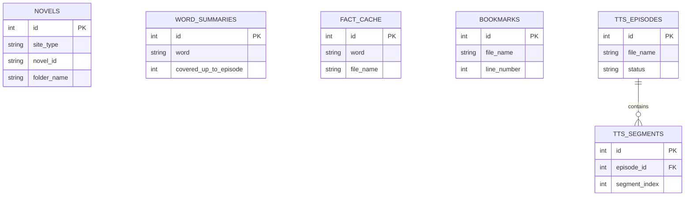
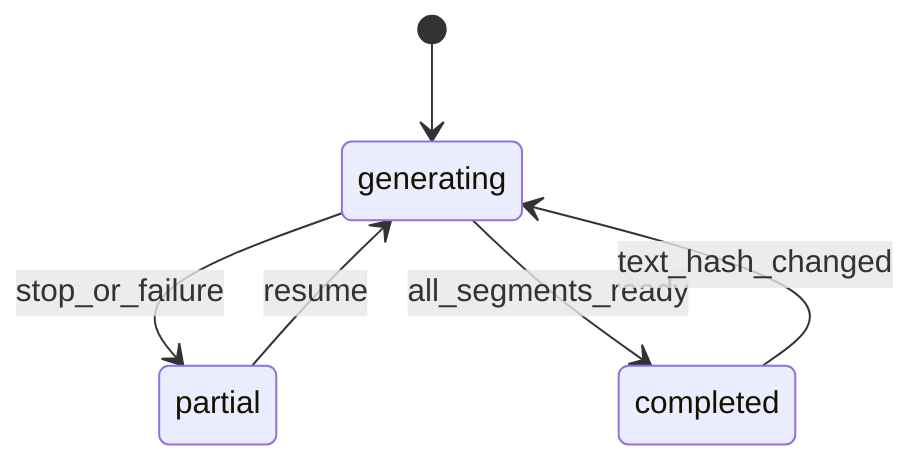
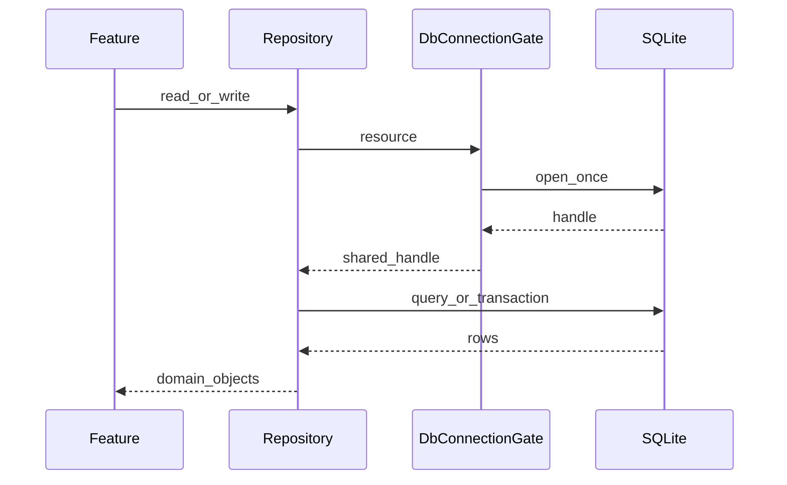

# データモデル

## 章の要約

NovelViewer の永続データは、ライブラリ全体の書誌を保持する `novels.db`、作品フォルダーごとの要約・ブックマークを保持する `novel_data.db`、作品フォルダーごとの音声・辞書DB、ダウンロード先ごとのエピソードキャッシュDBに分割される。`NovelDatabase` の旧スキーマには作品別データも存在するが、現行の作品別スキーマは `NovelDataDatabase` が生成する。🟢 VERIFIED [REF: lib/features/novel_metadata_db/data/novel_database.dart:51-125] [REF: lib/shared/database/novel_data_database.dart:23-102]

DB接続は遅延オープンされ、同時オープンを共有し、クローズ中の再取得を拒否するゲートで保護される。作品フォルダー単位のレジストリは正規化したパスをキーに4種類のDBハンドルを管理する。🟢 VERIFIED [REF: lib/shared/database/db_connection_gate.dart:27-82] [REF: lib/shared/database/per_folder_db_registry.dart:19-70]

## Modules

| モジュール | 責務 | 確度 |
|---|---|---|
| `lib/features/novel_metadata_db/` | ライブラリ全体の作品メタデータとv1〜v9移行 | 🟢 VERIFIED [REF: lib/features/novel_metadata_db/data/novel_database.dart:51-160] |
| `lib/shared/database/` | 作品別DBスキーマ、接続ゲート、パス正規化、ハンドル寿命 | 🟢 VERIFIED [REF: lib/shared/database/novel_data_database.dart:23-106] [REF: lib/shared/database/per_folder_db_registry.dart:19-151] |
| `lib/features/bookmark/`, `lib/features/llm_summary/` | `novel_data.db` のブックマーク、要約、事実キャッシュ | 🟢 VERIFIED [REF: lib/features/bookmark/data/bookmark_repository.dart:8-99] [REF: lib/features/llm_summary/data/fact_cache_repository.dart:12-104] |
| `lib/features/tts/` | 作品別音声セグメント、エピソード状態、読み辞書 | 🟢 VERIFIED [REF: lib/features/tts/data/tts_audio_database.dart:8-137] [REF: lib/features/tts/data/tts_dictionary_database.dart:8-45] |
| `lib/features/episode_cache/` | URLを主キーとする取得済みエピソード情報 | 🟢 VERIFIED [REF: lib/features/episode_cache/data/episode_cache_database.dart:8-46] |
| `lib/features/reading_progress/` | 作品IDごとの最終閲覧ファイル | 🟢 VERIFIED [REF: lib/features/reading_progress/domain/reading_progress.dart:1-24] [REF: lib/features/reading_progress/data/reading_progress_repository.dart:5-50] |
| `lib/features/text_viewer/data/` | パース済み表示セグメントのメモリ内LRUキャッシュ | 🟢 VERIFIED [REF: lib/features/text_viewer/data/parsed_segments_cache.dart:9-32] |

### Deep-dive candidates (refer to them by ID)

- **D-05-001**: `NovelDatabase` v3〜v9移行のデータ退避・重複解消規則（複雑）
- **D-05-002**: `PerFolderDbRegistry` の重複クローズ直列化（並行性）

## Entities

| エンティティ | 主な属性・関係 | 不変条件・変換 | 確度 |
|---|---|---|---|
| `NovelMetadata` | `siteType`, `novelId`, `title`, `url`, `folderName`, `episodeCount`, 日時 | DB列との `toMap` / `fromMap` を提供 | 🟢 VERIFIED [REF: lib/features/novel_metadata_db/domain/novel_metadata.dart:1-50] |
| `Bookmark` | `fileName`, nullable `lineNumber`, `createdAt` | 作品内識別子は `(file_name,line_number)` | 🟢 VERIFIED [REF: lib/features/bookmark/domain/bookmark.dart:3-31] |
| `ReadingProgress` | `novelId`, `fileName`, `updatedAt` | `file_path` を持たない現行列形状 | 🟢 VERIFIED [REF: lib/features/reading_progress/domain/reading_progress.dart:1-24] |
| `EpisodeCache` | URL、話番号、題名、Last-Modified、取得日時 | ISO-8601文字列へ相互変換 | 🟢 VERIFIED [REF: lib/features/episode_cache/domain/episode_cache.dart:1-32] |
| `WordSummary` | 語、対象話上限、要約、出典、作成・更新日時 | `(word,coveredUpToEpisode)` のスナップショット | 🟢 VERIFIED [REF: lib/features/llm_summary/domain/llm_summary_result.dart:9-45] |
| `FactCacheEntry` | 語、ファイル名、facts、content hash、prompt version、更新日時 | `(word,file_name)` 単位のStage-1キャッシュ | 🟢 VERIFIED [REF: lib/features/llm_summary/domain/fact_cache_entry.dart:5-46] |
| `HistoryEntry` | 語と複数の `WordSummary` | スナップショットを集約 | 🟢 VERIFIED [REF: lib/features/llm_summary/domain/history_entry.dart:8-54] |
| `TtsEpisode` | ファイル名、sample rate、状態、参照音声、text hash、日時 | DB行の必須列欠落を拒否 | 🟢 VERIFIED [REF: lib/features/tts/domain/tts_episode.dart:4-37] [REF: lib/features/tts/domain/_row_helpers.dart:4-13] |
| `TtsSegment` | episode ID、順序、テキスト範囲、音声BLOB、参照音声、memo | nullable BLOBを `Uint8List` 化 | 🟢 VERIFIED [REF: lib/features/tts/domain/tts_segment.dart:5-51] |
| `TtsEngineConfig` | 共通モデルディレクトリ・sample rateと、Qwen3/Piper固有値 | sealed hierarchy、値等価性を定義 | 🟢 VERIFIED [REF: lib/features/tts/domain/tts_engine_config.dart:23-136] |
| `MoveDestination` / `ReadingProgressBadge` | 移動候補、既読数と総話数 | 子孫への移動を除外し、進捗率を0〜1に制限 | 🟢 VERIFIED [REF: lib/features/file_browser/domain/move_destination.dart:22-44] [REF: lib/features/file_browser/domain/reading_progress_badge.dart:19-42] |
| `UpdateStatus` / `DistributionType` | 更新の4状態、installer/portable | 自動確認は24時間間隔、手動確認は抑制条件を無視 | 🟢 VERIFIED [REF: lib/features/app_update/domain/update_check_service.dart:8-95] [REF: lib/features/app_update/domain/distribution_type.dart:1-5] |
| `AnalysisProgress`, `LlmConfig`, `MarkSpan`, `HoverToken` | 解析進捗、LLM接続設定、マーク範囲、ホバー範囲 | UI・解析処理間で受け渡す値オブジェクト | 🟢 VERIFIED [REF: lib/features/llm_summary/domain/analysis_progress.dart:1-33] [REF: lib/features/llm_summary/domain/llm_config.dart:1-12] [REF: lib/features/llm_summary/domain/mark_matcher.dart:5-81] [REF: lib/features/llm_summary/domain/hover_token.dart:1-11] |

### Deep-dive candidates (refer to them by ID)

- **D-05-003**: `WordSummary` と `FactCacheEntry` の無効化境界（業務上重要）
- **D-05-004**: `TtsEpisodeStatus` と部分生成データの整合性（状態遷移）
- **D-05-005**: `TtsEngineConfig` のプロバイダー値からの構築（設定依存）

## Actions

| 境界 | 主操作 | データ規則 | 確度 |
|---|---|---|---|
| `NovelRepository` | upsert、一覧、folder/site+ID検索、削除、題名更新 | `(site_type,novel_id)` 衝突時更新、一覧は題名順 | 🟢 VERIFIED [REF: lib/features/novel_metadata_db/data/novel_repository.dart:5-81] |
| `BookmarkRepository` | add/remove/find/exists | null行番号のファイルブックマークは重複追加を抑止 | 🟢 VERIFIED [REF: lib/features/bookmark/data/bookmark_repository.dart:15-99] |
| `LlmSummaryRepository` | snapshot保存・検索・履歴・削除 | `(word,covered_up_to_episode)` をupsert | 🟢 VERIFIED [REF: lib/features/llm_summary/data/llm_summary_repository.dart:8-92] |
| `FactCacheRepository` | upsert/find/invalidate/delete | `(word,file_name)` 衝突時に本文・hash・version・日時を更新 | 🟢 VERIFIED [REF: lib/features/llm_summary/data/fact_cache_repository.dart:27-104] |
| `ReadingProgressRepository` | upsert/find/findAll | `novel_id` 単位に最終ファイルを置換 | 🟢 VERIFIED [REF: lib/features/reading_progress/data/reading_progress_repository.dart:5-50] |
| `TtsAudioRepository` | episode/segment作成、検索、更新、削除、vacuum | episodeとsegmentの整合をトランザクションで操作 | 🟢 VERIFIED [REF: lib/features/tts/data/tts_audio_repository.dart:8-208] |
| `TtsDictionaryRepository` | 一覧、upsert、削除、テキスト変換 | 長いsurfaceを優先して置換 | 🟢 VERIFIED [REF: lib/features/tts/data/tts_dictionary_repository.dart:3-110] |
| `ParsedSegmentsCache` | `getOrParse`、clear | content hashをキーとし、上限超過時に最古を除去 | 🟢 VERIFIED [REF: lib/features/text_viewer/data/parsed_segments_cache.dart:9-32] |
| `openOrResetDatabase` | SQLiteオープン、条件付き破損DB再作成 | `deleteOnFailure` がfalseなら元ファイルを保持して再throw | 🟢 VERIFIED [REF: lib/shared/database/database_opener.dart:31-61] |

### Deep-dive candidates (refer to them by ID)

- **D-05-006**: TTS episode/segment更新のトランザクション境界（複雑）
- **D-05-007**: LLM再解析時のsnapshot/fact cache更新順（業務ルール）

## Data

| DB / テーブル | 主な列 | キー・索引 | 確度 |
|---|---|---|---|
| `novels.db` / `novels` | site_type, novel_id, title, url, folder_name, episode_count, timestamps | PK id、UNIQUE folder_name、UNIQUE `(site_type,novel_id)` | 🟢 VERIFIED [REF: lib/features/novel_metadata_db/data/novel_database.dart:111-126] |
| `novel_data.db` / `word_summaries` | word, covered_up_to_episode, summary, source_file, timestamps | UNIQUE `(word,covered_up_to_episode)` | 🟢 VERIFIED [REF: lib/shared/database/novel_data_database.dart:60-73] |
| `novel_data.db` / `fact_cache` | word, file_name, facts, content_hash, prompt_version, updated_at | UNIQUE `(word,file_name)` | 🟢 VERIFIED [REF: lib/shared/database/novel_data_database.dart:75-88] |
| `novel_data.db` / `bookmarks` | file_name, nullable line_number, created_at | `UNIQUE(file_name,line_number)`。SQLiteのNULL意味論を補うためリポジトリ側でもファイルブックマークを重複確認 | 🟢 VERIFIED [REF: lib/shared/database/novel_data_database.dart:90-98] [REF: lib/features/bookmark/data/bookmark_repository.dart:15-24] |
| `tts_audio.db` / `tts_episodes` | file_name, sample_rate, status, ref_wav_path, text_hash, timestamps | UNIQUE file_name | 🟢 VERIFIED [REF: lib/features/tts/data/tts_audio_database.dart:63-72] |
| `tts_audio.db` / `tts_segments` | episode_id, segment_index, text/offset/length, audio BLOB, sample_count, ref_wav_path, memo | FK episode_id（cascade）、UNIQUE `(episode_id,segment_index)` | 🟢 VERIFIED [REF: lib/features/tts/data/tts_audio_database.dart:76-95] |
| `tts_dictionary.db` / `tts_dictionary` | surface, reading | PK id、UNIQUE surface | 🟢 VERIFIED [REF: lib/features/tts/data/tts_dictionary_database.dart:36-41] |
| `episode_cache.db` / `episode_cache` | url, episode_index, title, last_modified, downloaded_at | PK url | 🟢 VERIFIED [REF: lib/features/episode_cache/data/episode_cache_database.dart:35-43] |
| `novels.db` / 旧作品別テーブル | word_summaries, fact_cache, bookmarks, reading_progress | v4〜v9で列形状・一意性を段階変更 | 🟢 VERIFIED [REF: lib/features/novel_metadata_db/data/novel_database.dart:134-160] [REF: lib/features/novel_metadata_db/data/novel_database.dart:172-294] |



`novels` と作品別テーブルは物理DBが異なり、DBレベルの外部キーは存在しない。作品フォルダー名とDB配置によってアプリケーション層で関連付けられる。🟡 INFERRED [REF: lib/features/novel_metadata_db/data/novel_database.dart:76-87] [REF: lib/shared/database/novel_data_database.dart:28-43]

### Deep-dive candidates (refer to them by ID)

- **D-05-008**: `NovelDatabase` v8での旧データ分配・重複解消（最優先、複雑）
- **D-05-009**: `bookmarks` のnullable複合UNIQUEとアプリ側重複防止
- **D-05-010**: TTS segment v3再作成時のFK/cascade保持

## Dependencies

| 依存 | 用途 | 接点 | 確度 |
|---|---|---|---|
| `sqflite_common_ffi` / `sqflite` API | デスクトップSQLite接続、query/insert/transaction | 全永続DB | 🟢 VERIFIED [REF: lib/shared/database/database_opener.dart:1-43] |
| Riverpod | フォルダー単位DB、repository、メモリキャッシュのライフサイクル | family/provider定義 | 🟢 VERIFIED [REF: lib/features/tts/providers/tts_audio_database_provider.dart:14-27] [REF: lib/shared/database/novel_data_database_provider.dart:7-14] |
| `path` | DB配置、フォルダーキー正規化 | DBパスとレジストリキー | 🟢 VERIFIED [REF: lib/shared/database/folder_db_key.dart:1-20] [REF: lib/features/episode_cache/data/episode_cache_database.dart:23-27] |
| `crypto`由来のcontent hash利用 | 表示パース、LLM fact、TTS本文の同一性判定 | hashをキャッシュキー/失効判定へ使用 | 🟡 INFERRED [REF: lib/features/text_viewer/data/parsed_segments_cache.dart:18-30] [REF: lib/features/llm_summary/domain/fact_cache_entry.dart:32-46] |

### Deep-dive candidates (refer to them by ID)

- **D-05-011**: SQLite FFI初期化とプラットフォーム差
- **D-05-012**: content hashアルゴリズム変更時のキャッシュ互換性

## 状態遷移とデータフロー



TTS状態の許容値は `generating`, `partial`, `completed` である。本文hash不一致時の再生成や停止時の部分状態はrepository/controllerテストで検証されている。🟢 VERIFIED [REF: lib/features/tts/domain/tts_episode_status.dart:1-13] [REF: test/features/tts/data/tts_audio_repository_test.dart:358-424]



## 移行・整合性・障害時動作

- `NovelDatabase` は schema version 9 で、各旧versionから条件分岐で順次移行する。🟢 VERIFIED [REF: lib/features/novel_metadata_db/data/novel_database.dart:53-57] [REF: lib/features/novel_metadata_db/data/novel_database.dart:134-163]
- v8移行は作品フォルダーごとのDBへデータを分配するため、フォルダーファイル一覧を注入可能にしている。🟢 VERIFIED [REF: lib/features/novel_metadata_db/data/novel_database.dart:16-47] [REF: lib/features/novel_metadata_db/data/novel_database.dart:316-389]
- `TtsAudioDatabase` はv2で `text_hash` を追加し、v3でsegment表を再作成する。🟢 VERIFIED [REF: lib/features/tts/data/tts_audio_database.dart:98-137]
- DBオープン失敗時の削除・再作成は呼び出し側の `deleteOnFailure` に依存する。作品データDBは保全のため削除しない。🟢 VERIFIED [REF: lib/shared/database/database_opener.dart:31-61] [REF: lib/shared/database/novel_data_database.dart:38-48]
- 接続中の同時取得は同じFutureを共有し、close中の取得は `DatabaseClosingException` を投げる。🟢 VERIFIED [REF: lib/shared/database/db_connection_gate.dart:37-82]

## 割当インベントリ網羅性

以下はCH-05の102ユニットを個別に対応付けた網羅表である。

| Inventory ID | 対応ファイル | 要約 |
|---|---|---|
| INV-0021 | `lib/features/app_update/domain/distribution_type.dart` | 配布形態enum 🟢 VERIFIED |
| INV-0022 | `lib/features/app_update/domain/update_check_service.dart` | 更新確認状態と判定サービス 🟢 VERIFIED |
| INV-0023 | `lib/features/app_update/domain/update_constants.dart` | 更新URL・version正規化規則 🟢 VERIFIED |
| INV-0024 | `lib/features/app_update/domain/version_comparator.dart` | SemVer比較規則 🟢 VERIFIED |
| INV-0028 | `lib/features/bookmark/data/bookmark_repository.dart` | bookmark CRUD 🟢 VERIFIED |
| INV-0029 | `lib/features/bookmark/domain/bookmark.dart` | bookmark行モデル 🟢 VERIFIED |
| INV-0033 | `lib/features/episode_cache/data/episode_cache_database.dart` | episode cacheスキーマ 🟢 VERIFIED |
| INV-0034 | `lib/features/episode_cache/data/episode_cache_repository.dart` | episode cacheアクセス 🟢 VERIFIED |
| INV-0035 | `lib/features/episode_cache/domain/episode_cache.dart` | episode cache行モデル 🟢 VERIFIED |
| INV-0036 | `lib/features/episode_navigation/domain/file_entry_start_intent.dart` | ファイル開始位置enum 🟢 VERIFIED |
| INV-0041 | `lib/features/file_browser/domain/move_destination.dart` | 移動先値モデル・候補構築 🟢 VERIFIED |
| INV-0042 | `lib/features/file_browser/domain/move_follow.dart` | 移動後パス追従規則 🟢 VERIFIED |
| INV-0043 | `lib/features/file_browser/domain/novel_folder_classifier.dart` | 作品フォルダー分類規則 🟢 VERIFIED |
| INV-0044 | `lib/features/file_browser/domain/reading_progress_badge.dart` | 既読数・進捗率モデル 🟢 VERIFIED |
| INV-0058 | `lib/features/llm_summary/data/fact_cache_repository.dart` | fact cache CRUD・失効 🟢 VERIFIED |
| INV-0063 | `lib/features/llm_summary/data/llm_summary_repository.dart` | 要約snapshot永続化 🟢 VERIFIED |
| INV-0067 | `lib/features/llm_summary/domain/analysis_progress.dart` | 解析進捗sealed model 🟢 VERIFIED |
| INV-0068 | `lib/features/llm_summary/domain/fact_cache_entry.dart` | fact cache行モデル 🟢 VERIFIED |
| INV-0069 | `lib/features/llm_summary/domain/first_line_containing.dart` | 語の初出行算出 🟢 VERIFIED |
| INV-0070 | `lib/features/llm_summary/domain/history_entry.dart` | 語別snapshot集約 🟢 VERIFIED |
| INV-0071 | `lib/features/llm_summary/domain/hover_token.dart` | hover文字範囲record 🟢 VERIFIED |
| INV-0072 | `lib/features/llm_summary/domain/llm_config.dart` | LLM provider設定モデル 🟢 VERIFIED |
| INV-0073 | `lib/features/llm_summary/domain/llm_summary_result.dart` | WordSummaryモデル 🟢 VERIFIED |
| INV-0074 | `lib/features/llm_summary/domain/mark_matcher.dart` | mark範囲・styleモデル 🟢 VERIFIED |
| INV-0084 | `lib/features/llm_summary/providers/hover_popup_cache_provider.dart` | hover要約メモリキャッシュ 🟢 VERIFIED |
| INV-0094 | `lib/features/novel_metadata_db/data/novel_database.dart` | 書誌DB現行スキーマ・v1〜v9移行 🟢 VERIFIED |
| INV-0095 | `lib/features/novel_metadata_db/data/novel_repository.dart` | 書誌CRUD 🟢 VERIFIED |
| INV-0096 | `lib/features/novel_metadata_db/domain/novel_metadata.dart` | 書誌行モデル 🟢 VERIFIED |
| INV-0098 | `lib/features/reading_progress/data/reading_progress_repository.dart` | 閲覧進捗upsert・検索 🟢 VERIFIED |
| INV-0099 | `lib/features/reading_progress/domain/reading_progress.dart` | 閲覧進捗行モデル 🟢 VERIFIED |
| INV-0128 | `lib/features/text_viewer/data/parsed_segments_cache.dart` | hash-keyed LRU cache 🟢 VERIFIED |
| INV-0129 | `lib/features/text_viewer/data/parsed_segments_cache_provider.dart` | parsed cache provider 🟢 VERIFIED |
| INV-0154 | `lib/features/tts/data/tts_audio_database.dart` | TTS episode/segmentスキーマ・移行 🟢 VERIFIED |
| INV-0156 | `lib/features/tts/data/tts_audio_repository.dart` | TTS episode/segment CRUD 🟢 VERIFIED |
| INV-0157 | `lib/features/tts/data/tts_dictionary_database.dart` | TTS辞書スキーマ 🟢 VERIFIED |
| INV-0158 | `lib/features/tts/data/tts_dictionary_repository.dart` | TTS辞書CRUD・置換 🟢 VERIFIED |
| INV-0175 | `lib/features/tts/domain/_row_helpers.dart` | DB必須列検証helper 🟢 VERIFIED |
| INV-0176 | `lib/features/tts/domain/tts_engine_config.dart` | TTS engine設定sealed model 🟢 VERIFIED |
| INV-0177 | `lib/features/tts/domain/tts_episode.dart` | TTS episode行モデル 🟢 VERIFIED |
| INV-0178 | `lib/features/tts/domain/tts_episode_status.dart` | TTS episode状態enum 🟢 VERIFIED |
| INV-0179 | `lib/features/tts/domain/tts_ref_wav_resolver.dart` | 参照音声解決規則 🟢 VERIFIED |
| INV-0180 | `lib/features/tts/domain/tts_segment.dart` | TTS segment行モデル 🟢 VERIFIED |
| INV-0187 | `lib/features/tts/providers/tts_audio_database_provider.dart` | 作品別TTS DB provider 🟢 VERIFIED |
| INV-0201 | `lib/shared/database/database_closing_exception.dart` | close中アクセス例外 🟢 VERIFIED |
| INV-0202 | `lib/shared/database/database_opener.dart` | DB open・任意reset 🟢 VERIFIED |
| INV-0203 | `lib/shared/database/db_connection_gate.dart` | 非同期接続ライフサイクル 🟢 VERIFIED |
| INV-0204 | `lib/shared/database/folder_db_handles.dart` | 作品別DB一括解放 🟢 VERIFIED |
| INV-0205 | `lib/shared/database/folder_db_key.dart` | フォルダーkey正規化 🟢 VERIFIED |
| INV-0206 | `lib/shared/database/novel_data_database.dart` | 作品別要約・bookmarkスキーマ 🟢 VERIFIED |
| INV-0207 | `lib/shared/database/novel_data_database_provider.dart` | 作品別data DB provider 🟢 VERIFIED |
| INV-0208 | `lib/shared/database/per_folder_db_registry.dart` | 作品別4 DB handle registry 🟢 VERIFIED |
| INV-0209 | `lib/shared/database/per_folder_db_registry_provider.dart` | registry provider 🟢 VERIFIED |
| INV-0250 | `test/features/app_update/domain/update_check_service_test.dart` | 更新確認規則のテスト 🟢 VERIFIED |
| INV-0251 | `test/features/app_update/domain/version_comparator_test.dart` | version比較テスト 🟢 VERIFIED |
| INV-0255 | `test/features/bookmark/bookmark_repository_test.dart` | bookmark永続化テスト 🟢 VERIFIED |
| INV-0259 | `test/features/episode_cache/data/episode_cache_database_test.dart` | episode DBテスト 🟢 VERIFIED |
| INV-0260 | `test/features/episode_cache/data/episode_cache_repository_test.dart` | episode repositoryテスト 🟢 VERIFIED |
| INV-0261 | `test/features/episode_cache/domain/episode_cache_test.dart` | episode行変換テスト 🟢 VERIFIED |
| INV-0267 | `test/features/file_browser/domain/move_destination_test.dart` | 移動候補テスト 🟢 VERIFIED |
| INV-0268 | `test/features/file_browser/domain/move_follow_test.dart` | 移動追従テスト 🟢 VERIFIED |
| INV-0269 | `test/features/file_browser/domain/novel_folder_classifier_test.dart` | 作品分類テスト 🟢 VERIFIED |
| INV-0270 | `test/features/file_browser/domain/reading_progress_badge_test.dart` | 進捗badgeテスト 🟢 VERIFIED |
| INV-0292 | `test/features/llm_summary/data/fact_cache_repository_test.dart` | fact cache repositoryテスト 🟢 VERIFIED |
| INV-0296 | `test/features/llm_summary/data/llm_summary_repository_test.dart` | 要約repositoryテスト 🟢 VERIFIED |
| INV-0297 | `test/features/llm_summary/data/llm_summary_service_cache_test.dart` | 要約cache統合テスト 🟢 VERIFIED |
| INV-0300 | `test/features/llm_summary/domain/analysis_progress_test.dart` | 解析進捗テスト 🟢 VERIFIED |
| INV-0301 | `test/features/llm_summary/domain/fact_cache_validity_test.dart` | fact cache有効性テスト 🟢 VERIFIED |
| INV-0302 | `test/features/llm_summary/domain/first_line_containing_test.dart` | 初出行テスト 🟢 VERIFIED |
| INV-0303 | `test/features/llm_summary/domain/history_entry_test.dart` | 履歴集約テスト 🟢 VERIFIED |
| INV-0304 | `test/features/llm_summary/domain/llm_config_test.dart` | LLM設定テスト 🟢 VERIFIED |
| INV-0305 | `test/features/llm_summary/domain/llm_summary_result_test.dart` | 要約モデルテスト 🟢 VERIFIED |
| INV-0306 | `test/features/llm_summary/domain/mark_matcher_test.dart` | mark matchingテスト 🟢 VERIFIED |
| INV-0315 | `test/features/llm_summary/providers/hover_popup_cache_provider_test.dart` | hover cacheテスト 🟢 VERIFIED |
| INV-0323 | `test/features/novel_metadata_db/data/novel_database_migration_full_chain_test.dart` | 全version移行テスト 🟢 VERIFIED |
| INV-0324 | `test/features/novel_metadata_db/data/novel_database_migration_v4_test.dart` | v4移行テスト 🟢 VERIFIED |
| INV-0325 | `test/features/novel_metadata_db/data/novel_database_migration_v6_test.dart` | v6移行テスト 🟢 VERIFIED |
| INV-0326 | `test/features/novel_metadata_db/data/novel_database_migration_v7_test.dart` | v7移行テスト 🟢 VERIFIED |
| INV-0327 | `test/features/novel_metadata_db/data/novel_database_migration_v8_test.dart` | v8作品別分配テスト 🟢 VERIFIED |
| INV-0328 | `test/features/novel_metadata_db/data/novel_database_migration_v9_test.dart` | v9移行テスト 🟢 VERIFIED |
| INV-0330 | `test/features/novel_metadata_db/novel_database_test.dart` | 書誌DB配置・openテスト 🟢 VERIFIED |
| INV-0331 | `test/features/novel_metadata_db/novel_repository_test.dart` | 書誌repositoryテスト 🟢 VERIFIED |
| INV-0332 | `test/features/reading_progress/data/reading_progress_repository_test.dart` | 進捗repositoryテスト 🟢 VERIFIED |
| INV-0333 | `test/features/reading_progress/domain/reading_progress_test.dart` | 進捗行変換テスト 🟢 VERIFIED |
| INV-0383 | `test/features/text_viewer/data/parsed_segments_cache_test.dart` | parsed cache LRUテスト 🟢 VERIFIED |
| INV-0431 | `test/features/tts/data/tts_audio_database_test.dart` | TTS DBスキーマ・移行テスト 🟢 VERIFIED |
| INV-0433 | `test/features/tts/data/tts_audio_repository_test.dart` | TTS repositoryテスト 🟢 VERIFIED |
| INV-0434 | `test/features/tts/data/tts_dictionary_repository_test.dart` | TTS辞書テスト 🟢 VERIFIED |
| INV-0437 | `test/features/tts/data/tts_engine_embedding_cache_test.dart` | speaker embedding cacheテスト 🟢 VERIFIED |
| INV-0450 | `test/features/tts/domain/tts_engine_config_test.dart` | engine設定値等価性テスト 🟢 VERIFIED |
| INV-0451 | `test/features/tts/domain/tts_episode_status_test.dart` | episode状態変換テスト 🟢 VERIFIED |
| INV-0452 | `test/features/tts/domain/tts_episode_test.dart` | episode DB行変換テスト 🟢 VERIFIED |
| INV-0453 | `test/features/tts/domain/tts_ref_wav_resolver_test.dart` | 参照音声解決テスト 🟢 VERIFIED |
| INV-0454 | `test/features/tts/domain/tts_segment_test.dart` | segment DB行変換テスト 🟢 VERIFIED |
| INV-0458 | `test/features/tts/providers/tts_audio_database_provider_test.dart` | TTS DB lifecycleテスト 🟢 VERIFIED |
| INV-0465 | `test/helpers/novel_data_db_fixture.dart` | 作品別DB test fixture 🟢 VERIFIED |
| INV-0466 | `test/helpers/novel_metadata_db_fixture.dart` | 書誌DB test fixture 🟢 VERIFIED |
| INV-0471 | `test/shared/database/database_opener_test.dart` | open/reset障害テスト 🟢 VERIFIED |
| INV-0472 | `test/shared/database/db_connection_gate_test.dart` | 接続gate並行性テスト 🟢 VERIFIED |
| INV-0473 | `test/shared/database/folder_db_handles_test.dart` | DB一括解放テスト 🟢 VERIFIED |
| INV-0474 | `test/shared/database/folder_db_key_test.dart` | path正規化テスト 🟢 VERIFIED |
| INV-0475 | `test/shared/database/novel_data_database_test.dart` | 作品別現行スキーマテスト 🟢 VERIFIED |
| INV-0476 | `test/shared/database/per_folder_db_registry_test.dart` | registry共有・closeテスト 🟢 VERIFIED |

表内の実装ユニットは前節の厳密参照に、テストユニットは `## Sources Read` の検査済みファイルに対応する。代表的な全移行・接続・作品別スキーマ検証はそれぞれ明示的なテスト根拠を持つ。🟢 VERIFIED [REF: test/features/novel_metadata_db/data/novel_database_migration_full_chain_test.dart:10-92] [REF: test/shared/database/db_connection_gate_test.dart:15-123] [REF: test/shared/database/novel_data_database_test.dart:31-149]

## 不確実性

`NovelDatabase` の旧作品別テーブルは当面維持する。`reading_progress` を作品別DBへ移していない理由はコードから確定できない。[CONFIDENCE: MED] [REF: lib/features/novel_metadata_db/data/novel_database.dart:134-163] [REF: lib/shared/database/novel_data_database.dart:58-102]

## Detail questions raised in this chapter

- Q-007: 回答済み。旧作品別スキーマは当面維持する。

```json
{
  "id": "Q-007",
  "generated_at_phase": "investigation",
  "category": "architecture_decision",
  "body": "NovelDatabase に残る旧 word_summaries、fact_cache、bookmarks、reading_progress スキーマは、互換期間終了後に削除する計画がありますか？",
  "evidence": {
    "file": "lib/features/novel_metadata_db/data/novel_database.dart",
    "lines": "134-163",
    "code_excerpt": "if (oldVersion < 8) { await _migrateToV8(db); }"
  },
  "related_inventory_ids": ["INV-0094", "INV-0327"],
  "severity": "important",
  "resolution_type": "ask_sme",
  "status": "answered",
  "answer": "旧作品別スキーマは当面維持する。",
  "answerer": "user",
  "answered_at": "2026-06-28T09:01:43.2056948+09:00",
  "related_question_ids": []
}
```

## Sources Read

- `lib/features/app_update/domain/distribution_type.dart`
- `lib/features/app_update/domain/update_check_service.dart`
- `lib/features/app_update/domain/update_constants.dart`
- `lib/features/app_update/domain/version_comparator.dart`
- `lib/features/bookmark/data/bookmark_repository.dart`
- `lib/features/bookmark/domain/bookmark.dart`
- `lib/features/episode_cache/data/episode_cache_database.dart`
- `lib/features/episode_cache/data/episode_cache_repository.dart`
- `lib/features/episode_cache/domain/episode_cache.dart`
- `lib/features/episode_navigation/domain/file_entry_start_intent.dart`
- `lib/features/file_browser/domain/move_destination.dart`
- `lib/features/file_browser/domain/move_follow.dart`
- `lib/features/file_browser/domain/novel_folder_classifier.dart`
- `lib/features/file_browser/domain/reading_progress_badge.dart`
- `lib/features/llm_summary/data/fact_cache_repository.dart`
- `lib/features/llm_summary/data/llm_summary_repository.dart`
- `lib/features/llm_summary/domain/analysis_progress.dart`
- `lib/features/llm_summary/domain/fact_cache_entry.dart`
- `lib/features/llm_summary/domain/first_line_containing.dart`
- `lib/features/llm_summary/domain/history_entry.dart`
- `lib/features/llm_summary/domain/hover_token.dart`
- `lib/features/llm_summary/domain/llm_config.dart`
- `lib/features/llm_summary/domain/llm_summary_result.dart`
- `lib/features/llm_summary/domain/mark_matcher.dart`
- `lib/features/llm_summary/providers/hover_popup_cache_provider.dart`
- `lib/features/novel_metadata_db/data/novel_database.dart`
- `lib/features/novel_metadata_db/data/novel_repository.dart`
- `lib/features/novel_metadata_db/domain/novel_metadata.dart`
- `lib/features/reading_progress/data/reading_progress_repository.dart`
- `lib/features/reading_progress/domain/reading_progress.dart`
- `lib/features/text_viewer/data/parsed_segments_cache.dart`
- `lib/features/text_viewer/data/parsed_segments_cache_provider.dart`
- `lib/features/tts/data/tts_audio_database.dart`
- `lib/features/tts/data/tts_audio_repository.dart`
- `lib/features/tts/data/tts_dictionary_database.dart`
- `lib/features/tts/data/tts_dictionary_repository.dart`
- `lib/features/tts/domain/_row_helpers.dart`
- `lib/features/tts/domain/tts_engine_config.dart`
- `lib/features/tts/domain/tts_episode.dart`
- `lib/features/tts/domain/tts_episode_status.dart`
- `lib/features/tts/domain/tts_ref_wav_resolver.dart`
- `lib/features/tts/domain/tts_segment.dart`
- `lib/features/tts/providers/tts_audio_database_provider.dart`
- `lib/shared/database/database_closing_exception.dart`
- `lib/shared/database/database_opener.dart`
- `lib/shared/database/db_connection_gate.dart`
- `lib/shared/database/folder_db_handles.dart`
- `lib/shared/database/folder_db_key.dart`
- `lib/shared/database/novel_data_database.dart`
- `lib/shared/database/novel_data_database_provider.dart`
- `lib/shared/database/per_folder_db_registry.dart`
- `lib/shared/database/per_folder_db_registry_provider.dart`
- `test/features/app_update/domain/update_check_service_test.dart`
- `test/features/app_update/domain/version_comparator_test.dart`
- `test/features/bookmark/bookmark_repository_test.dart`
- `test/features/episode_cache/data/episode_cache_database_test.dart`
- `test/features/episode_cache/data/episode_cache_repository_test.dart`
- `test/features/episode_cache/domain/episode_cache_test.dart`
- `test/features/file_browser/domain/move_destination_test.dart`
- `test/features/file_browser/domain/move_follow_test.dart`
- `test/features/file_browser/domain/novel_folder_classifier_test.dart`
- `test/features/file_browser/domain/reading_progress_badge_test.dart`
- `test/features/llm_summary/data/fact_cache_repository_test.dart`
- `test/features/llm_summary/data/llm_summary_repository_test.dart`
- `test/features/llm_summary/data/llm_summary_service_cache_test.dart`
- `test/features/llm_summary/domain/analysis_progress_test.dart`
- `test/features/llm_summary/domain/fact_cache_validity_test.dart`
- `test/features/llm_summary/domain/first_line_containing_test.dart`
- `test/features/llm_summary/domain/history_entry_test.dart`
- `test/features/llm_summary/domain/llm_config_test.dart`
- `test/features/llm_summary/domain/llm_summary_result_test.dart`
- `test/features/llm_summary/domain/mark_matcher_test.dart`
- `test/features/llm_summary/providers/hover_popup_cache_provider_test.dart`
- `test/features/novel_metadata_db/data/novel_database_migration_full_chain_test.dart`
- `test/features/novel_metadata_db/data/novel_database_migration_v4_test.dart`
- `test/features/novel_metadata_db/data/novel_database_migration_v6_test.dart`
- `test/features/novel_metadata_db/data/novel_database_migration_v7_test.dart`
- `test/features/novel_metadata_db/data/novel_database_migration_v8_test.dart`
- `test/features/novel_metadata_db/data/novel_database_migration_v9_test.dart`
- `test/features/novel_metadata_db/novel_database_test.dart`
- `test/features/novel_metadata_db/novel_repository_test.dart`
- `test/features/reading_progress/data/reading_progress_repository_test.dart`
- `test/features/reading_progress/domain/reading_progress_test.dart`
- `test/features/text_viewer/data/parsed_segments_cache_test.dart`
- `test/features/tts/data/tts_audio_database_test.dart`
- `test/features/tts/data/tts_audio_repository_test.dart`
- `test/features/tts/data/tts_dictionary_repository_test.dart`
- `test/features/tts/data/tts_engine_embedding_cache_test.dart`
- `test/features/tts/domain/tts_engine_config_test.dart`
- `test/features/tts/domain/tts_episode_status_test.dart`
- `test/features/tts/domain/tts_episode_test.dart`
- `test/features/tts/domain/tts_ref_wav_resolver_test.dart`
- `test/features/tts/domain/tts_segment_test.dart`
- `test/features/tts/providers/tts_audio_database_provider_test.dart`
- `test/helpers/novel_data_db_fixture.dart`
- `test/helpers/novel_metadata_db_fixture.dart`
- `test/shared/database/database_opener_test.dart`
- `test/shared/database/db_connection_gate_test.dart`
- `test/shared/database/folder_db_handles_test.dart`
- `test/shared/database/folder_db_key_test.dart`
- `test/shared/database/novel_data_database_test.dart`
- `test/shared/database/per_folder_db_registry_test.dart`
