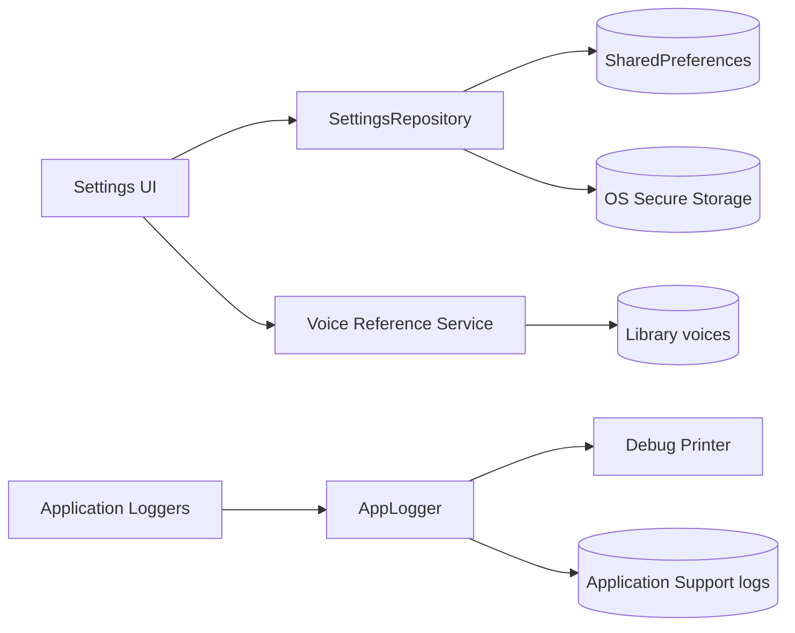

# 06. 設定・ローカルデータ・セキュリティ境界

## 章の要約

NovelViewer の設定は、通常設定を `SharedPreferences`、LLM API キーを `FlutterSecureStorage`、実行ログをアプリケーションサポートディレクトリ配下のファイルへ分離して保存する。[CONFIDENCE: HIGH] [REF: lib/features/settings/data/settings_repository.dart:18-52] [REF: lib/shared/logging/app_logger.dart:77-80]

設定画面は「一般」「読み上げ」「アプリ情報 / 更新」の3タブで構成され、一般タブに表示・LLM・ショートカット、読み上げタブにエンジン別設定と参照音声、更新タブにバージョンおよび更新確認を配置する。[CONFIDENCE: HIGH] [REF: lib/features/settings/presentation/settings_dialog.dart:49-64] [REF: lib/features/settings/presentation/settings_dialog.dart:80-128]

## アクセス・認証境界

アプリはローカルプロセスとして起動し、認証画面やHTTPセッションを経由せずに`HomeScreen`をルート画面として表示する。🟢 VERIFIED [REF: lib/main.dart:71-76] [REF: lib/app.dart:28-45]

Webテンプレート上の認証、ロール認可、セッション管理は本デスクトップ構成には非該当である。🟡 INFERRED [ASSUMED: OSユーザー境界がアプリの利用者境界となる; basis: 起動経路が直接HomeScreenへ到達し、設定とDBがローカル保存される] [REF: lib/main.dart:37-64] [REF: lib/app.dart:28-45]

外部LLMへのAPIキーはアプリ内認証ではなく、接続先サービスへ渡す資格情報としてsecure storageへ分離される。🟢 VERIFIED [REF: lib/features/settings/data/settings_repository.dart:141-152]

## モジュール

| ID | モジュール | 責務 | 主な境界 | 状態 |
|---|---|---|---|---|
| M-06-01 | 🟢 VERIFIED `features/settings/data` | 🟢 VERIFIED 設定値の既定値・検証・永続化 | 🟢 VERIFIED `SharedPreferences` / `FlutterSecureStorage` | 🟢 VERIFIED [REF: lib/features/settings/data/settings_repository.dart:17-52] |
| M-06-02 | 🟢 VERIFIED `features/settings/providers` | 🟢 VERIFIED 永続値を Riverpod 状態として公開 | 🟢 VERIFIED UI とリポジトリの間 | 🟢 VERIFIED [REF: lib/features/settings/providers/settings_providers.dart:9-39] |
| M-06-03 | 🟢 VERIFIED `features/settings/presentation` | 🟢 VERIFIED 設定の表示・編集、モデル取得、音声ファイル操作 | 🟢 VERIFIED ユーザー入力と各Provider/サービスの間 | 🟢 VERIFIED [REF: lib/features/settings/presentation/settings_dialog.dart:40-64] [REF: lib/features/settings/presentation/sections/voice_reference_section.dart:40-78] |
| M-06-04 | 🟢 VERIFIED `l10n` | 🟢 VERIFIED `en` / `ja` / `zh` のUI文言を提供 | 🟢 VERIFIED Flutter localization delegate | 🟢 VERIFIED [REF: lib/l10n/app_localizations.dart:88-101] [REF: lib/l10n/app_localizations.dart:1694-1720] |
| M-06-05 | 🟢 VERIFIED `shared/logging` | 🟢 VERIFIED ログレベル、出力先、ローテーションを管理 | 🟢 VERIFIED `logging` レコードとデバッグ/ファイル出力 | 🟢 VERIFIED [REF: lib/shared/logging/app_logger.dart:21-46] [REF: lib/shared/logging/file_log_sink.dart:27-49] |

## エンティティ

| ID | 型 | 主要内容 | 制約・既定値 | 状態 |
|---|---|---|---|---|
| E-06-01 | 🟢 VERIFIED `SettingsRepository` | 🟢 VERIFIED 設定キー群を読み書き | 🟢 VERIFIED フォントサイズ10–32、列間隔0–24 | 🟢 VERIFIED [REF: lib/features/settings/data/settings_repository.dart:17-44] |
| E-06-02 | 🟢 VERIFIED `FontFamily` | 🟢 VERIFIED system、ヒラギノ2種、游明朝、游ゴシック | 🟢 VERIFIED ヒラギノはmacOS限定、Windows名を変換 | 🟢 VERIFIED [REF: lib/features/settings/data/font_family.dart:3-28] [REF: lib/features/settings/data/font_family.dart:40-56] |
| E-06-03 | 🟢 VERIFIED `TextDisplayMode` | 🟢 VERIFIED `horizontal` / `vertical` | 🟢 VERIFIED 不正値は `horizontal` | 🟢 VERIFIED [REF: lib/features/settings/data/text_display_mode.dart:1-4] [REF: lib/features/settings/data/settings_repository.dart:70-75] |
| E-06-04 | 🟢 VERIFIED 設定Notifier群 | 🟢 VERIFIED locale、theme、display、font size、column spacing、font family | 🟢 VERIFIED font size/spacing はpreviewとpersistを分離 | 🟢 VERIFIED [REF: lib/features/settings/providers/settings_providers.dart:24-137] |
| E-06-05 | 🟢 VERIFIED `LogSink` / `FileLogSink` | 🟢 VERIFIED 初期化、同期書込、終了の抽象化とファイル実装 | 🟢 VERIFIED 既定上限1 MiB、保持世代は active + `.1` + `.2` | 🟢 VERIFIED [REF: lib/shared/logging/log_sink.dart:3-9] [REF: lib/shared/logging/file_log_sink.dart:9-25] [REF: lib/shared/logging/file_log_sink.dart:71-95] |

## アクション

| ID | 操作 | 入出力・副作用 | 失敗時 | 状態 |
|---|---|---|---|---|
| A-06-01 | 🟢 VERIFIED 通常設定の読書き | 🟢 VERIFIED enum名・数値・JSON文字列を `SharedPreferences` に保存 | 🟢 VERIFIED 不正enumは既定値、数値は読込/一部書込時にclamp | 🟢 VERIFIED [REF: lib/features/settings/data/settings_repository.dart:57-139] [REF: lib/features/settings/data/settings_repository.dart:267-285] |
| A-06-02 | 🟢 VERIFIED APIキー保存 | 🟢 VERIFIED 空文字は削除、それ以外はsecure storageへ書込 | 🟢 VERIFIED 呼出側へ例外が伝播する | 🟢 VERIFIED [REF: lib/features/settings/data/settings_repository.dart:141-152] |
| A-06-03 | 🟢 VERIFIED 旧APIキー移行 | 🟢 VERIFIED 平文キーをsecure storageへ移し、成功後に平文を削除 | 🟢 VERIFIED secure storage失敗時は平文を残しWARNINGを記録 | 🟢 VERIFIED [REF: lib/features/settings/data/settings_repository.dart:154-180] |
| A-06-04 | 🟢 VERIFIED LLM設定編集 | 🟢 VERIFIED provider、URL、APIキー、modelを保存し、Ollamaモデル一覧を再取得 | 🟢 VERIFIED 一覧取得のloading/error/retryを表示 | 🟢 VERIFIED [REF: lib/features/settings/presentation/sections/llm_settings_section.dart:52-80] [REF: lib/features/settings/presentation/sections/llm_settings_section.dart:176-278] |
| A-06-05 | 🟢 VERIFIED 参照音声管理 | 🟢 VERIFIED 一覧、追加、録音、選択、改名、フォルダ表示 | 🟢 VERIFIED 引数・状態・ファイル例外をUI通知 | 🟢 VERIFIED [REF: lib/features/settings/presentation/sections/voice_reference_section.dart:29-78] [REF: lib/features/settings/presentation/sections/voice_reference_section.dart:80-120] |
| A-06-06 | 🟢 VERIFIED ログ出力 | 🟢 VERIFIED debugは全レベルをprinter、releaseはINFO以上をファイルへ送る | 🟢 VERIFIED sink初期化/書込失敗はprinterへフォールバック | 🟢 VERIFIED [REF: lib/shared/logging/app_logger.dart:21-46] [REF: lib/shared/logging/app_logger.dart:60-75] |
| A-06-07 | 🟢 VERIFIED ログローテーション | 🟢 VERIFIED 上限超過前に `.1`、`.2` へ世代移動 | 🟢 VERIFIED ファイル操作失敗後もactiveを再オープン | 🟢 VERIFIED [REF: lib/shared/logging/file_log_sink.dart:41-49] [REF: lib/shared/logging/file_log_sink.dart:71-95] |

## 永続データ

| 保存先 | 保存内容 | 保護・検証 | ライフサイクル | 状態 |
|---|---|---|---|---|
| 🟢 VERIFIED `SharedPreferences` | 🟢 VERIFIED locale、表示、テーマ、フォント、LLM provider/URL/model、TTS、Piper、ショートカット | 🟢 VERIFIED enumのfallback、表示数値のclamp、ショートカットのdecode fallback | 🟢 VERIFIED 各setterで即時保存 | 🟢 VERIFIED [REF: lib/features/settings/data/settings_repository.dart:18-44] [REF: lib/features/settings/data/settings_repository.dart:182-285] |
| 🟢 VERIFIED OS secure storage | 🟢 VERIFIED `llm_api_key` | 🟢 VERIFIED 通常設定から分離し、空文字で削除 | 🟢 VERIFIED 旧平文値を起動時反復可能な処理で移行可能 | 🟢 VERIFIED [REF: lib/features/settings/data/settings_repository.dart:141-180] |
| 🟢 VERIFIED application support `/logs` | 🟢 VERIFIED UTC時刻、level、logger名、message | 🟢 VERIFIED CR/LF/TAB/backslashをescapeし1レコード1行化 | 🟢 VERIFIED 1 MiBで最大2世代をローテーション | 🟢 VERIFIED [REF: lib/shared/logging/app_logger.dart:77-80] [REF: lib/shared/logging/file_log_sink.dart:61-95] |
| 🟢 VERIFIED library配下 voices領域（サービス境界） | 🟢 VERIFIED 参照音声ファイルと選択ファイル名 | 🟢 VERIFIED UIは重複名を拒否し、サービス例外を表示 | 🟢 VERIFIED drop/record/rename/refreshで更新 | 🟢 VERIFIED [REF: lib/features/settings/presentation/sections/voice_reference_section.dart:40-120] [REF: lib/features/settings/presentation/sections/voice_reference_section.dart:254-268] |

## 依存関係

| 依存 | 用途 | セキュリティ上の境界 | 状態 |
|---|---|---|---|
| 🟢 VERIFIED `shared_preferences` | 🟢 VERIFIED 非機密設定のローカル永続化 | 🟢 VERIFIED APIキーの新規保存対象外 | 🟢 VERIFIED [REF: lib/features/settings/data/settings_repository.dart:4-4] [REF: lib/features/settings/data/settings_repository.dart:122-152] |
| 🟢 VERIFIED `flutter_secure_storage` | 🟢 VERIFIED LLM APIキーの読書き・削除 | 🟢 VERIFIED OS側secure storage実装との境界 | 🟢 VERIFIED [REF: lib/features/settings/data/settings_repository.dart:2-2] [REF: lib/features/settings/data/settings_repository.dart:141-152] |
| 🟢 VERIFIED `http.Client` | 🟢 VERIFIED LLM/Ollama関連通信で共有しdispose時close | 🟢 VERIFIED endpoint URLはユーザー設定値 | 🟢 VERIFIED [REF: lib/features/settings/providers/settings_providers.dart:3-17] [REF: lib/features/settings/data/settings_repository.dart:122-139] |
| 🟢 VERIFIED Flutter l10n | 🟢 VERIFIED `en`、`ja`、`zh` のdelegate生成 | 🟢 VERIFIED 未対応localeはlookupでFlutterError | 🟢 VERIFIED [REF: lib/l10n/app_localizations.dart:88-101] [REF: lib/l10n/app_localizations.dart:1694-1725] |

## セキュリティ境界

- APIキーは通常設定と別のsecure storageへ保存されるため、現在の書込経路では `SharedPreferences` に平文保存されない。[CONFIDENCE: HIGH] [REF: lib/features/settings/data/settings_repository.dart:122-152] [REF: test/features/settings/data/settings_repository_test.dart:207-245]
- 旧バージョン由来の平文APIキーは、安全な保存先への書込成功後にのみ削除される。secure storageに既存値があれば上書きしない。[CONFIDENCE: HIGH] [REF: lib/features/settings/data/settings_repository.dart:162-180] [REF: test/features/settings/data/settings_repository_test.dart:249-310]
- APIキー入力欄は伏字表示されるが、画面状態には復号済み文字列を保持する。[CONFIDENCE: HIGH] [REF: lib/features/settings/presentation/sections/llm_settings_section.dart:52-70] [REF: lib/features/settings/presentation/sections/llm_settings_section.dart:153-163]
- ログ基盤は任意の `LogRecord.message` を加工せず（制御文字のescapeのみ）保存する。共通redactionは設けず、機密情報・個人情報をメッセージへ含めない責任はログ呼出側が負う。[CONFIDENCE: HIGH] [REF: lib/shared/logging/file_log_sink.dart:61-68]

## ローカライズ

生成されたlocalization APIは `en`、`ja`、`zh` をサポートし、設定画面、TTS、更新、ショートカット用の文言を各実装クラスで提供する。[CONFIDENCE: HIGH] [REF: lib/l10n/app_localizations.dart:97-101] [REF: lib/l10n/app_localizations.dart:155-431] [REF: lib/l10n/app_localizations_en.dart:39-182] [REF: lib/l10n/app_localizations_ja.dart:38-180] [REF: lib/l10n/app_localizations_zh.dart:38-180]

## 割当インベントリ網羅表

| Inventory IDs | 対象 | 状態 |
|---|---|---|
| INV-0101, INV-0102, INV-0103 | 🟢 VERIFIED 設定データ型・repository | 🟢 VERIFIED [REF: lib/features/settings/data/font_family.dart:1-57] [REF: lib/features/settings/data/settings_repository.dart:1-287] [REF: lib/features/settings/data/text_display_mode.dart:1-4] |
| INV-0104, INV-0105, INV-0106, INV-0107, INV-0108, INV-0109, INV-0110 | 🟢 VERIFIED 設定画面7ファイル | 🟢 VERIFIED [REF: lib/features/settings/presentation/sections/about_and_update_section.dart:1-123] [REF: lib/features/settings/presentation/sections/general_settings_section.dart:1-145] [REF: lib/features/settings/presentation/sections/llm_settings_section.dart:1-284] [REF: lib/features/settings/presentation/sections/piper_settings_section.dart:1-181] [REF: lib/features/settings/presentation/sections/qwen3_settings_section.dart:1-175] [REF: lib/features/settings/presentation/sections/voice_reference_section.dart:1-310] [REF: lib/features/settings/presentation/settings_dialog.dart:1-166] |
| INV-0111 | 🟢 VERIFIED 設定Provider | 🟢 VERIFIED [REF: lib/features/settings/providers/settings_providers.dart:1-137] |
| INV-0196, INV-0197, INV-0198, INV-0199 | 🟢 VERIFIED localization APIと3言語実装 | 🟢 VERIFIED [REF: lib/l10n/app_localizations.dart:1-1728] [REF: lib/l10n/app_localizations_en.dart:1-903] [REF: lib/l10n/app_localizations_ja.dart:1-886] [REF: lib/l10n/app_localizations_zh.dart:1-884] |
| INV-0211, INV-0212, INV-0213 | 🟢 VERIFIED ログ抽象・実装 | 🟢 VERIFIED [REF: lib/shared/logging/app_logger.dart:1-83] [REF: lib/shared/logging/file_log_sink.dart:1-97] [REF: lib/shared/logging/log_sink.dart:1-9] |
| INV-0336, INV-0337, INV-0338 | 🟢 VERIFIED 設定データ層テスト | 🟢 VERIFIED [REF: test/features/settings/data/font_family_test.dart:1-109] [REF: test/features/settings/data/settings_repository_shortcuts_test.dart:1-57] [REF: test/features/settings/data/settings_repository_test.dart:1-388] |
| INV-0339, INV-0340, INV-0341, INV-0342, INV-0343, INV-0344, INV-0345, INV-0346 | 🟢 VERIFIED 設定UIテスト | 🟢 VERIFIED [REF: test/features/settings/presentation/llm_settings_test.dart:1-278] [REF: test/features/settings/presentation/settings_dialog_phase_a_test.dart:1-166] [REF: test/features/settings/presentation/settings_dialog_tabs_test.dart:1-139] [REF: test/features/settings/presentation/settings_dialog_test.dart:1-170] [REF: test/features/settings/presentation/settings_piper_l10n_test.dart:1-56] [REF: test/features/settings/presentation/settings_test.dart:1-50] [REF: test/features/settings/presentation/tts_model_download_ui_test.dart:1-164] [REF: test/features/settings/presentation/voice_reference_selector_test.dart:1-306] |
| INV-0347 | 🟢 VERIFIED 設定Providerテスト | 🟢 VERIFIED [REF: test/features/settings/providers/settings_providers_test.dart:1-227] |
| INV-0478, INV-0479 | 🟢 VERIFIED ログテスト | 🟢 VERIFIED [REF: test/shared/logging/app_logger_test.dart:1-165] [REF: test/shared/logging/file_log_sink_test.dart:1-139] |
| INV-0485 | 🟢 VERIFIED secure storageテストダブル | 🟢 VERIFIED [REF: test/test_utils/flutter_secure_storage_mock.dart:1-65] |

## Deep-dive candidates (refer to them by ID)

- **D-06-001**: APIキー移行の起動時呼出元とLinux secure storage障害時の運用手順 — 機密情報境界・重要 [REF: lib/features/settings/data/settings_repository.dart:154-180]
- **D-06-002**: ログ呼出箇所全体のsecret/個人情報redaction監査 — セキュリティ重要 [REF: lib/shared/logging/file_log_sink.dart:61-68]
- **D-06-003**: 参照音声サービス側のpath traversal、拡張子、サイズ検証 — この章のUI境界外 [REF: lib/features/settings/presentation/sections/voice_reference_section.dart:40-69]
- **D-06-004**: ユーザー指定LLM endpointの許可方式とHTTP/TLS要件 — 外部連携境界 [REF: lib/features/settings/data/settings_repository.dart:122-139]
- **D-06-005**: 更新確認設定の永続化先・配布形態判定 — 更新機能Provider側の追加調査候補 [REF: lib/features/settings/presentation/sections/about_and_update_section.dart:20-59]

## Detail questions raised in this chapter

- **Q-008**
  - `category`: `security_compliance`
  - `body`: ログへAPIキー、本文、ファイルパスなどの機密・個人情報を出力しない全体方針、または共通redactionを要件化しますか。
  - `evidence`: `{"file":"lib/shared/logging/file_log_sink.dart","lines":"61-68","code_excerpt":"messageは制御文字をescapeしてそのままログ行へ含める"}`
  - `related_inventory_ids`: `["INV-0212","INV-0479"]`
  - `severity`: `critical`
  - `resolution_type`: `ask_sme`
  - `status`: `answered`
  - `resolution`: ログ呼出側責任とし、共通redactionは要件化しない。
- **Q-009**
  - `category`: `security_compliance`
  - `body`: ユーザー指定のLLM endpointについて、HTTPS強制、localhost例外、接続先allowlist等の要件はありますか。
  - `evidence`: `{"file":"lib/features/settings/data/settings_repository.dart","lines":"122-139","code_excerpt":"llm_base_urlを文字列として保存し、ここではschemeやhostを検証しない"}`
  - `related_inventory_ids`: `["INV-0102","INV-0106"]`
  - `severity`: `important`
  - `resolution_type`: `ask_sme`
  - `status`: `answered`
  - `resolution`: HTTP/HTTPSを許可し、接続先allowlistは設けない。

## Sources Read

- `lib/main.dart`
- `lib/app.dart`
- `lib/features/settings/data/font_family.dart`
- `lib/features/settings/data/settings_repository.dart`
- `lib/features/settings/data/text_display_mode.dart`
- `lib/features/settings/presentation/sections/about_and_update_section.dart`
- `lib/features/settings/presentation/sections/general_settings_section.dart`
- `lib/features/settings/presentation/sections/llm_settings_section.dart`
- `lib/features/settings/presentation/sections/piper_settings_section.dart`
- `lib/features/settings/presentation/sections/qwen3_settings_section.dart`
- `lib/features/settings/presentation/sections/voice_reference_section.dart`
- `lib/features/settings/presentation/settings_dialog.dart`
- `lib/features/settings/providers/settings_providers.dart`
- `lib/l10n/app_localizations.dart`
- `lib/l10n/app_localizations_en.dart`
- `lib/l10n/app_localizations_ja.dart`
- `lib/l10n/app_localizations_zh.dart`
- `lib/shared/logging/app_logger.dart`
- `lib/shared/logging/file_log_sink.dart`
- `lib/shared/logging/log_sink.dart`
- `test/features/settings/data/font_family_test.dart`
- `test/features/settings/data/settings_repository_shortcuts_test.dart`
- `test/features/settings/data/settings_repository_test.dart`
- `test/features/settings/presentation/llm_settings_test.dart`
- `test/features/settings/presentation/settings_dialog_phase_a_test.dart`
- `test/features/settings/presentation/settings_dialog_tabs_test.dart`
- `test/features/settings/presentation/settings_dialog_test.dart`
- `test/features/settings/presentation/settings_piper_l10n_test.dart`
- `test/features/settings/presentation/settings_test.dart`
- `test/features/settings/presentation/tts_model_download_ui_test.dart`
- `test/features/settings/presentation/voice_reference_selector_test.dart`
- `test/features/settings/providers/settings_providers_test.dart`
- `test/shared/logging/app_logger_test.dart`
- `test/shared/logging/file_log_sink_test.dart`
- `test/test_utils/flutter_secure_storage_mock.dart`
