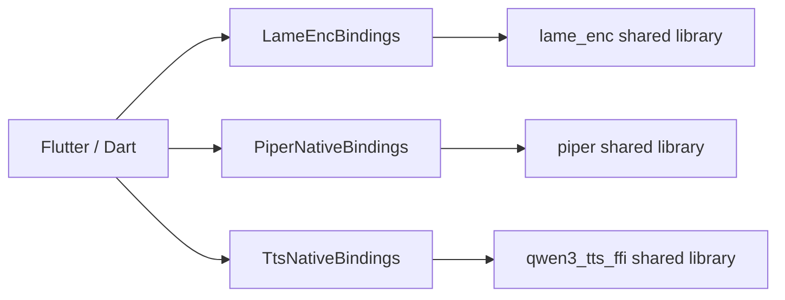
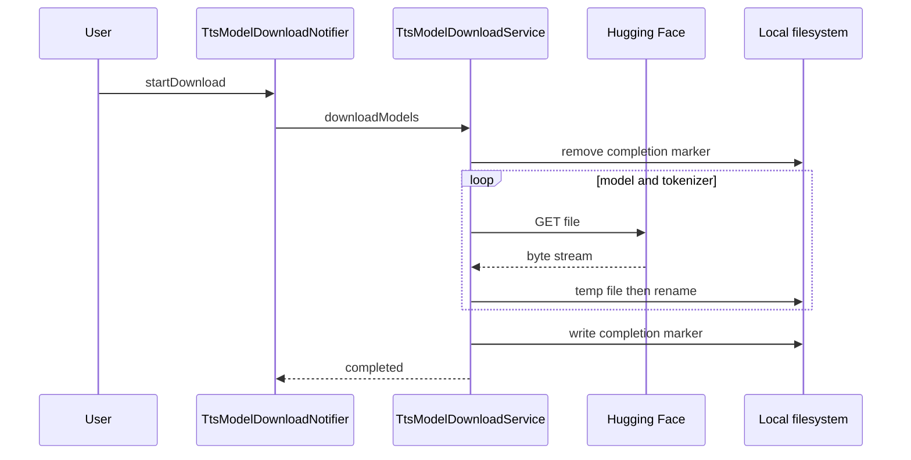

# 外部システム連携

本章は、CH-07 に割り当てられた25ユニットを対象に、NovelViewer と外部HTTPサービス、Web小説サイト、モデル配布元、ネイティブ共有ライブラリとの境界を整理する。記述は実装から確認できる通信・変換・エラー処理に限定し、外部サービス側の契約意図は断定しない。

## 連携モジュール

| ID | モジュール | 責務 | 状態 |
|---|---|---|---|
| INV-0013 | `github_release_client` | 🟢 VERIFIED GitHub Releases API から最新安定版のJSONを取得し、`ReleaseInfo`へ変換する。[REF: lib/features/app_update/data/github_release_client.dart:14-28] | 🟢 VERIFIED |
| INV-0059 | `llm_client` | 🟢 VERIFIED LLM連携に `generate` と任意のリソース解放を共通契約として与える。[REF: lib/features/llm_summary/data/llm_client.dart:1-5] | 🟢 VERIFIED |
| INV-0065 | `ollama_client` | 🟢 VERIFIED Ollama のモデル一覧、生成、モデル解放APIを呼び出す。[REF: lib/features/llm_summary/data/ollama_client.dart:18-63] | 🟢 VERIFIED |
| INV-0066 | `openai_compatible_client` | 🟢 VERIFIED OpenAI互換の chat completions API を呼び出す。[REF: lib/features/llm_summary/data/openai_compatible_client.dart:20-38] | 🟢 VERIFIED |
| INV-0114 | `aozora_site` | 🟢 VERIFIED 青空文庫のHTMLをShift_JISで復号し、単一本文を抽出する。[REF: lib/features/text_download/data/sites/aozora_site.dart:35-72] | 🟢 VERIFIED |
| INV-0115 | `generic_web_site` | 🟢 VERIFIED 専用アダプタが扱わないHTTP(S)ページから、タイトルと本文をヒューリスティック抽出する。[REF: lib/features/text_download/data/sites/generic_web_site.dart:11-29] | 🟢 VERIFIED |
| INV-0116 | `hameln_site` | 🟢 VERIFIED ハーメルンの作品URLを識別し、目次行と本文要素を解析する。[REF: lib/features/text_download/data/sites/hameln_site.dart:20-38] [REF: lib/features/text_download/data/sites/hameln_site.dart:72-137] | 🟢 VERIFIED |
| INV-0117 | `kakuyomu_site` | 🟢 VERIFIED カクヨムの `__NEXT_DATA__` から作品メタデータとエピソードを構成し、本文要素を抽出する。[REF: lib/features/text_download/data/sites/kakuyomu_site.dart:43-68] [REF: lib/features/text_download/data/sites/kakuyomu_site.dart:132-139] | 🟢 VERIFIED |
| INV-0118 | `narou_site` | 🟢 VERIFIED なろうの目次、更新日、ページング、本文をDOMから解析する。[REF: lib/features/text_download/data/sites/narou_site.dart:51-116] [REF: lib/features/text_download/data/sites/narou_site.dart:131-159] | 🟢 VERIFIED |
| INV-0119 | `novel_site` | 🟢 VERIFIED サイトアダプタ契約と、HTTP(S) URLを適合するアダプタへ振り分けるレジストリを定義する。[REF: lib/features/text_download/data/sites/novel_site.dart:65-73] [REF: lib/features/text_download/data/sites/novel_site.dart:76-99] | 🟢 VERIFIED |
| INV-0146 | `lame_enc_bindings` | 🟢 VERIFIED LAMEエンコーダ共有ライブラリを開き、初期化・エンコード・flush・closeシンボルを束縛する。[REF: lib/features/tts/data/lame_enc_bindings.dart:26-61] | 🟢 VERIFIED |
| INV-0147 | `model_download_utils` | 🟢 VERIFIED HTTPストリームを一時ファイルへ保存し、成功後に目的パスへrenameする共通ダウンロード処理である。[REF: lib/features/tts/data/model_download_utils.dart:10-22] [REF: lib/features/tts/data/model_download_utils.dart:49] | 🟢 VERIFIED |
| INV-0148 | `piper_model_download_service` | 🟢 VERIFIED 固定リビジョンのHugging FaceモデルとGitHub ReleaseのOpenJTalk辞書を取得する。[REF: lib/features/tts/data/piper_model_download_service.dart:22-28] [REF: lib/features/tts/data/piper_model_download_service.dart:60-97] | 🟢 VERIFIED |
| INV-0149 | `piper_native_bindings` | 🟢 VERIFIED Piper共有ライブラリの初期化、合成、音声取得、パラメータ設定、エラー取得をFFIへ公開する。[REF: lib/features/tts/data/piper_native_bindings.dart:31-92] | 🟢 VERIFIED |
| INV-0165 | `tts_model_download_service` | 🟢 VERIFIED Qwen3-TTS本体とtokenizerをHugging Faceから取得し、完了マーカーで整合性を判定する。[REF: lib/features/tts/data/tts_model_download_service.dart:14-23] [REF: lib/features/tts/data/tts_model_download_service.dart:59-100] | 🟢 VERIFIED |
| INV-0167 | `tts_native_bindings` | 🟢 VERIFIED Qwen3-TTS共有ライブラリのライフサイクル、合成、音声・埋め込み、abort操作をFFIへ公開する。[REF: lib/features/tts/data/tts_native_bindings.dart:123-137] [REF: lib/features/tts/data/tts_native_bindings.dart:139-229] | 🟢 VERIFIED |
| INV-0185 | `piper_model_download_providers` | 🟢 VERIFIED Piperモデル・辞書の存在確認、進捗、完了、分類済みエラーをRiverpod状態として管理する。[REF: lib/features/tts/providers/piper_model_download_providers.dart:35-59] [REF: lib/features/tts/providers/piper_model_download_providers.dart:62-109] | 🟢 VERIFIED |
| INV-0191 | `tts_model_download_providers` | 🟢 VERIFIED Qwen3-TTSモデルの移行・存在確認・ダウンロード状態をRiverpodで管理する。[REF: lib/features/tts/providers/tts_model_download_providers.dart:43-70] [REF: lib/features/tts/providers/tts_model_download_providers.dart:73-105] | 🟢 VERIFIED |

### Deep-dive candidates (refer to them by ID)

- **D-071**: `generic_web_site` — 任意Webページに対する文字コード判定と本文密度ヒューリスティックの誤抽出分析（複雑）。[REF: lib/features/text_download/data/sites/generic_web_site.dart:84-100] [REF: lib/features/text_download/data/sites/generic_web_site.dart:132-176]
- **D-072**: `novel_site` — 専用アダプタ優先順位とfallbackの回帰条件（業務上重要）。[REF: lib/features/text_download/data/sites/novel_site.dart:76-99]
- **D-073**: `tts_native_bindings` — C ABIの所有権、abort handle、埋め込みメモリ解放規約（複雑）。[REF: lib/features/tts/data/tts_native_bindings.dart:6-22] [REF: lib/features/tts/data/tts_native_bindings.dart:79-121]

## 外部HTTP依存

| 外部先 | 操作・データ | 認証・通信条件 | 失敗時の扱い | 状態 |
|---|---|---|---|---|
| GitHub Releases API | 🟢 VERIFIED 最新releaseのJSONをGETする。[REF: lib/features/app_update/data/github_release_client.dart:27-37] | 🟢 VERIFIED `User-Agent` とGitHub JSON用`Accept`を送り、10秒を既定timeoutとする。[REF: lib/features/app_update/data/github_release_client.dart:16-25] [REF: lib/features/app_update/data/github_release_client.dart:31-37] | 🟢 VERIFIED 通信、非200、JSON変換を `GithubReleaseException` に正規化する。[REF: lib/features/app_update/data/github_release_client.dart:38-55] | 🟢 VERIFIED |
| Ollama | 🟢 VERIFIED `GET /api/tags`、`POST /api/generate`を使用する。[REF: lib/features/llm_summary/data/ollama_client.dart:18-23] [REF: lib/features/llm_summary/data/ollama_client.dart:41-47] | 🟢 VERIFIED JSON生成では `Content-Type: application/json`、非streamingを指定する。[REF: lib/features/llm_summary/data/ollama_client.dart:43-47] [REF: lib/features/llm_summary/data/ollama_client.dart:65-73] | 🟢 VERIFIED 非200を本文付き例外、構造不正を `LlmResponseFormatException` とする。[REF: lib/features/llm_summary/data/ollama_client.dart:74-94] | 🟢 VERIFIED |
| OpenAI互換API | 🟢 VERIFIED `<baseUrl>/chat/completions`へmodelとuser messageをPOSTする。[REF: lib/features/llm_summary/data/openai_compatible_client.dart:29-38] | 🟢 VERIFIED API keyが空でない場合のみBearer認証を付与する。[REF: lib/features/llm_summary/data/openai_compatible_client.dart:22-27] | 🟢 VERIFIED 非200は本文付き例外、choices/message/contentの不正は形式例外にする。[REF: lib/features/llm_summary/data/openai_compatible_client.dart:45-68] | 🟢 VERIFIED |
| Web小説・一般Web | 🟢 VERIFIED 青空文庫、ハーメルン、カクヨム、なろうを専用解析し、残るHTTP(S)をgeneric adapterが扱う。[REF: lib/features/text_download/data/sites/novel_site.dart:1-6] [REF: lib/features/text_download/data/sites/generic_web_site.dart:60-64] | 🟢 VERIFIED 青空文庫はHTTP入力をHTTPSへ昇格するが、generic adapterはHTTPしか提供しない旧サイトを考慮してschemeを維持する。[REF: lib/features/text_download/data/sites/aozora_site.dart:26-33] [REF: lib/features/text_download/data/sites/generic_web_site.dart:75-82] | 🟢 VERIFIED generic adapterは抽出本文が200文字未満なら本文なしとして返す。[REF: lib/features/text_download/data/sites/generic_web_site.dart:26-29] [REF: lib/features/text_download/data/sites/generic_web_site.dart:95-106] | 🟢 VERIFIED |
| Hugging Face | 🟢 VERIFIED Piperはcommit hash固定、Qwen3-TTSは`main`参照のURLからモデルを取得する。[REF: lib/features/tts/data/piper_model_download_service.dart:22-23] [REF: lib/features/tts/data/tts_model_download_service.dart:14-15] | 🟢 VERIFIED 共通処理はHTTP 200のみ成功とする。[REF: lib/features/tts/data/model_download_utils.dart:17-22] | 🟢 VERIFIED 完了前はmarkerを除去し、全ファイル成功後にmarkerを書く。[REF: lib/features/tts/data/tts_model_download_service.dart:83-100] | 🟢 VERIFIED |
| GitHub Release（OpenJTalk） | 🟢 VERIFIED `r9y9/open_jtalk` v1.11.1の辞書tar.gzを取得し展開する。[REF: lib/features/tts/data/piper_model_download_service.dart:27-28] [REF: lib/features/tts/data/piper_model_download_service.dart:100-136] | 🟡 INFERRED URLに認証情報はなく公開assetとして取得する。[REF: lib/features/tts/data/piper_model_download_service.dart:27-28] | 🟢 VERIFIED 展開プロセスが失敗するとstderrを含む例外にする。[REF: lib/features/tts/data/piper_model_download_service.dart:121-128] | 🟢 VERIFIED |

### Deep-dive candidates (refer to them by ID)

- **D-074**: Qwen3-TTS配布URL — `main`参照による再現性と互換性リスク（運用上重要）。[REF: lib/features/tts/data/tts_model_download_service.dart:14-15]
- **D-075**: LLM HTTP clients — timeout、再試行、キャンセルの上位層責務を含む障害時挙動（高複雑度）。[REF: lib/features/llm_summary/data/ollama_client.dart:65-80] [REF: lib/features/llm_summary/data/openai_compatible_client.dart:20-51]

## ネイティブライブラリ境界

| 境界 | プラットフォーム名 | 公開操作 | 状態 |
|---|---|---|---|
| LAME | 🟢 VERIFIED Windowsは`lame_enc_ffi.dll`、macOSは`liblame_enc_ffi.dylib`を選択する。[REF: lib/features/tts/data/lame_enc_bindings.dart:36-41] | 🟢 VERIFIED init、encode、flush、close。[REF: lib/features/tts/data/lame_enc_bindings.dart:52-61] | 🟢 VERIFIED |
| Piper | 🟢 VERIFIED 実行OSに応じた共有ライブラリ名を選び、未対応OSを拒否する。[REF: lib/features/tts/data/piper_native_bindings.dart:41-45] | 🟢 VERIFIED init、loaded判定、free、synthesize、音声取得、各種float設定、error取得。[REF: lib/features/tts/data/piper_native_bindings.dart:47-92] | 🟢 VERIFIED |
| Qwen3-TTS | 🟢 VERIFIED Windowsは`qwen3_tts_ffi.dll`、macOSは`libqwen3_tts_ffi.dylib`を選択し、他OSを拒否する。[REF: lib/features/tts/data/tts_native_bindings.dart:126-137] | 🟢 VERIFIED 通常・voice・embedding合成、speaker embedding保存/読込/解放、abort/resetを束縛する。[REF: lib/features/tts/data/tts_native_bindings.dart:167-229] | 🟢 VERIFIED |

### Deep-dive candidates (refer to them by ID)

- **D-076**: 3共有ライブラリのABI互換性 — Dart typedefとネイティブheaderの機械的突合（高複雑度）。[REF: lib/features/tts/data/tts_native_bindings.dart:8-121]

## 代表シーケンス

この順序は、Notifierがサービスを呼び、サービスがmarkerを事前削除し、各ファイルを共通ダウンローダで取得した後にmarkerを作成する実装に対応する。[REF: lib/features/tts/providers/tts_model_download_providers.dart:73-98] [REF: lib/features/tts/data/tts_model_download_service.dart:73-100] [REF: lib/features/tts/data/model_download_utils.dart:10-49]

## 検証証拠

| ID | テスト対象 | 確認された契約 | 状態 |
|---|---|---|---|
| INV-0244 | `github_release_client_test` | 🟢 VERIFIED 200応答解析、User-Agent、null body、非200、不正JSON、asset不在を検証する。[REF: test/features/app_update/data/github_release_client_test.dart:9-125] | 🟢 VERIFIED |
| INV-0293 | `llm_client_test` | 🟢 VERIFIED Ollama/OpenAI互換の要求形式、解放、モデル一覧、UTF-8、異常JSON、非200を検証する。[REF: test/features/llm_summary/data/llm_client_test.dart:18-179] [REF: test/features/llm_summary/data/llm_client_test.dart:185-531] | 🟢 VERIFIED |
| INV-0425 | `lame_enc_bindings_test` | 🟢 VERIFIED OS別ライブラリ名、未対応OS、DLL束縛、ライフサイクル、PCMエンコードを検証する。[REF: test/features/tts/data/lame_enc_bindings_test.dart:9-100] | 🟢 VERIFIED |
| INV-0426 | `piper_model_download_service_test` | 🟢 VERIFIED PiperモデルURLが`main`でなく固定revisionを使うことを検証する。[REF: test/features/tts/data/piper_model_download_service_test.dart:22-71] | 🟢 VERIFIED |
| INV-0441 | `tts_model_download_service_test` | 🟢 VERIFIED size別ファイル、marker、legacy移行、進捗、HTTP/ネットワーク失敗時のpartial cleanupを検証する。[REF: test/features/tts/data/tts_model_download_service_test.dart:23-205] [REF: test/features/tts/data/tts_model_download_service_test.dart:205-373] | 🟢 VERIFIED |
| INV-0443 | `tts_native_bindings_test` | 🟢 VERIFIED OS別ライブラリ名、未対応OS、`setLanguage`シンボルを検証する。[REF: test/features/tts/data/tts_native_bindings_test.dart:8-43] | 🟢 VERIFIED |
| INV-0460 | `tts_model_download_providers_test` | 🟢 VERIFIED models path、初期状態、legacy移行、成功・HTTP・network状態遷移、完了パスを検証する。[REF: test/features/tts/providers/tts_model_download_providers_test.dart:30-206] | 🟢 VERIFIED |

### Deep-dive candidates (refer to them by ID)

- **D-077**: サイトアダプタ群 — CH-07割当にはサイト解析テストが含まれないため、別章割当テストとの横断的な回帰対応表を作る（網羅性）。[REF: lib/features/text_download/data/sites/novel_site.dart:65-99]
- **D-078**: Piper provider — 本章割当には `piper_model_download_providers` の専用テストが含まれないため、状態遷移のテスト所在を横断調査する（網羅性）。[REF: lib/features/tts/providers/piper_model_download_providers.dart:62-109]

## 割当カバレッジ

| 区分 | 対象ID | 状態 |
|---|---|---|
| 更新・LLM | INV-0013, INV-0059, INV-0065, INV-0066 | 🟢 VERIFIED |
| Webサイト | INV-0114, INV-0115, INV-0116, INV-0117, INV-0118, INV-0119 | 🟢 VERIFIED |
| TTS配布・FFI | INV-0146, INV-0147, INV-0148, INV-0149, INV-0165, INV-0167, INV-0185, INV-0191 | 🟢 VERIFIED |
| テスト | INV-0244, INV-0293, INV-0425, INV-0426, INV-0441, INV-0443, INV-0460 | 🟢 VERIFIED |

## Detail questions raised in this chapter

- None

## Sources Read

- `lib/features/app_update/data/github_release_client.dart`
- `lib/features/llm_summary/data/llm_client.dart`
- `lib/features/llm_summary/data/ollama_client.dart`
- `lib/features/llm_summary/data/openai_compatible_client.dart`
- `lib/features/text_download/data/sites/aozora_site.dart`
- `lib/features/text_download/data/sites/generic_web_site.dart`
- `lib/features/text_download/data/sites/hameln_site.dart`
- `lib/features/text_download/data/sites/kakuyomu_site.dart`
- `lib/features/text_download/data/sites/narou_site.dart`
- `lib/features/text_download/data/sites/novel_site.dart`
- `lib/features/tts/data/lame_enc_bindings.dart`
- `lib/features/tts/data/model_download_utils.dart`
- `lib/features/tts/data/piper_model_download_service.dart`
- `lib/features/tts/data/piper_native_bindings.dart`
- `lib/features/tts/data/tts_model_download_service.dart`
- `lib/features/tts/data/tts_native_bindings.dart`
- `lib/features/tts/providers/piper_model_download_providers.dart`
- `lib/features/tts/providers/tts_model_download_providers.dart`
- `test/features/app_update/data/github_release_client_test.dart`
- `test/features/llm_summary/data/llm_client_test.dart`
- `test/features/tts/data/lame_enc_bindings_test.dart`
- `test/features/tts/data/piper_model_download_service_test.dart`
- `test/features/tts/data/tts_model_download_service_test.dart`
- `test/features/tts/data/tts_native_bindings_test.dart`
- `test/features/tts/providers/tts_model_download_providers_test.dart`
