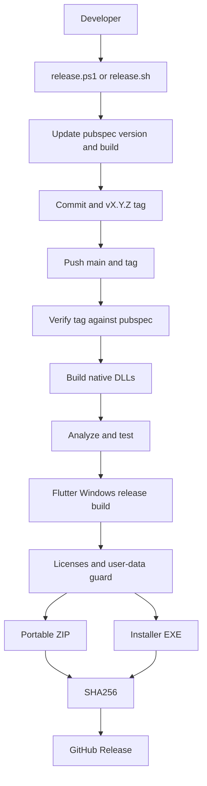

# 08. ビルド・配布・運用

## 章の要約

NovelViewer は Flutter stable を使用するマルチプラットフォーム構成だが、継続的テストと自動リリースは Windows runner に集約されている。[CONFIDENCE: HIGH] [REF: .fvmrc:1-3] [REF: .github/workflows/test.yml:12-20] [REF: .github/workflows/release.yml:15-17]

タグ `v*` のpushがWindowsリリースを起動し、タグと `pubspec.yaml` の整合性確認、ネイティブDLL作成、静的解析、テスト、Flutter release build、ライセンス同梱、ユーザーデータ混入検査、ZIP/installer/SHA256生成、GitHub Releases公開までを行う。[CONFIDENCE: HIGH] [REF: .github/workflows/release.yml:3-26] [REF: .github/workflows/release.yml:46-79] [REF: .github/workflows/release.yml:81-171]

## モジュール

| ID | モジュール | 責務 | 状態 |
|---|---|---|---|
| M-08-01 | 🟢 VERIFIED Flutter構成 | 🟢 VERIFIED SDKチャネル、Dart SDK、version、lint、l10nを定義 | 🟢 VERIFIED [REF: .fvmrc:1-3] [REF: pubspec.yaml:19-22] [REF: analysis_options.yaml:1-16] [REF: l10n.yaml:1-3] |
| M-08-02 | 🟢 VERIFIED GitHub Actions | 🟢 VERIFIED main/PR検証とtag駆動Windowsリリース | 🟢 VERIFIED [REF: .github/workflows/test.yml:3-38] [REF: .github/workflows/release.yml:3-171] |
| M-08-03 | 🟢 VERIFIED ネイティブビルドスクリプト | 🟢 VERIFIED Qwen3 TTS、LAME、Piper/ONNX RuntimeをmacOS/Windows向けに作成・配置 | 🟢 VERIFIED [REF: scripts/build_tts_macos.sh:10-39] [REF: scripts/build_tts_windows.bat:8-36] [REF: scripts/build_lame_macos.sh:8-25] [REF: scripts/build_lame_windows.bat:8-23] [REF: scripts/build_piper_macos.sh:8-53] [REF: scripts/build_piper_windows.bat:8-36] |
| M-08-04 | 🟢 VERIFIED リリーススクリプト | 🟢 VERIFIED version/build更新、commit、tag、pushをWindows/Unixで同等化 | 🟢 VERIFIED [REF: scripts/release.ps1:1-10] [REF: scripts/release.ps1:73-91] [REF: scripts/release.sh:1-10] [REF: scripts/release.sh:75-92] |
| M-08-05 | 🟢 VERIFIED プラットフォームrunner | 🟢 VERIFIED Android/iOS/Linux/macOS/Windowsの起動・bundle設定 | 🟢 VERIFIED [REF: android/app/build.gradle.kts:1-44] [REF: ios/Runner/AppDelegate.swift:1-13] [REF: linux/CMakeLists.txt:1-128] [REF: linux/runner/main.cc:1-6] [REF: macos/Runner/AppDelegate.swift:1-13] [REF: windows/CMakeLists.txt:1-113] [REF: windows/runner/main.cpp:1-43] |

## アクション

| ID | 操作 | 前提・入力 | 結果 | 状態 |
|---|---|---|---|---|
| A-08-01 | 🟢 VERIFIED CI検証 | 🟢 VERIFIED main pushまたはPR、Windows latest | 🟢 VERIFIED `flutter pub get`、`flutter analyze`、`flutter test` | 🟢 VERIFIED [REF: .github/workflows/test.yml:3-10] [REF: .github/workflows/test.yml:20-38] |
| A-08-02 | 🟢 VERIFIED release前処理 | 🟢 VERIFIED cleanなmain、増加する `X.Y.Z`、重複しないtag | 🟢 VERIFIED build番号+1、commit、tag、main/tag push | 🟢 VERIFIED [REF: scripts/release.sh:13-26] [REF: scripts/release.sh:28-75] [REF: scripts/release.sh:76-92] |
| A-08-03 | 🟢 VERIFIED tag/version検査 | 🟢 VERIFIED tagとpubspecのversion（build metadata除外） | 🟢 VERIFIED 不一致ならbuild前に終了 | 🟢 VERIFIED [REF: scripts/verify_release_version.sh:13-46] [REF: .github/workflows/release.yml:24-26] |
| A-08-04 | 🟢 VERIFIED Windows package作成 | 🟢 VERIFIED Vulkan SDK、Flutter、CMake生成DLL、Inno Setup | 🟢 VERIFIED portable ZIPとinstaller EXE | 🟢 VERIFIED [REF: .github/workflows/release.yml:28-79] [REF: .github/workflows/release.yml:117-143] |
| A-08-05 | 🟢 VERIFIED artifact検査 | 🟢 VERIFIED ネイティブlicense、runtime user-data除外、成果物存在 | 🟢 VERIFIED SHA256 sidecarとGitHub Release | 🟢 VERIFIED [REF: .github/workflows/release.yml:81-115] [REF: .github/workflows/release.yml:123-170] |
| A-08-06 | 🟢 VERIFIED TTS benchmark | 🟢 VERIFIED model directory必須、warmup/runs/timeout/max tokens等を検証 | 🟢 VERIFIED 実行時間・モデル情報等をtimestamp付きJSONへ保存 | 🟢 VERIFIED [REF: scripts/benchmark_tts.sh:52-106] [REF: scripts/benchmark_tts.sh:121-161] [REF: scripts/benchmark_tts.sh:243-289] |
| A-08-07 | 🟢 VERIFIED cleanup | 🟢 VERIFIED repository rootから実行 | 🟢 VERIFIED Flutter cleanとrootの `flutter_*.log` 削除 | 🟢 VERIFIED [REF: scripts/clean.bat:1-12] [REF: scripts/clean.sh:1-8] |

## データ・成果物

| 成果物 | 生成元 | 配置・命名 | 検証 | 状態 |
|---|---|---|---|---|
| 🟢 VERIFIED Windows portable | 🟢 VERIFIED Flutter runner release一式 | 🟢 VERIFIED `novel_viewer-windows-x64-v*.zip` | 🟢 VERIFIED SHA256を生成 | 🟢 VERIFIED [REF: .github/workflows/release.yml:117-121] [REF: .github/workflows/release.yml:145-160] |
| 🟢 VERIFIED Windows installer | 🟢 VERIFIED Inno Setup | 🟢 VERIFIED `novel_viewer-setup-v*.exe` | 🟢 VERIFIED license存在・EXE存在・SHA256を確認 | 🟢 VERIFIED [REF: .github/workflows/release.yml:123-160] |
| 🟢 VERIFIED native runtime | 🟢 VERIFIED Qwen3/LAME/Piper/ONNX build | 🟢 VERIFIED Windows release directoryまたはmacOS Frameworks | 🟢 VERIFIED CIはPiper/ONNX DLL存在を明示検査 | 🟢 VERIFIED [REF: scripts/build_tts_windows.bat:27-36] [REF: scripts/build_lame_windows.bat:14-23] [REF: scripts/build_piper_windows.bat:16-36] [REF: .github/workflows/release.yml:61-66] |
| 🟢 VERIFIED benchmark record | 🟢 VERIFIED TTS CLI | 🟢 VERIFIED `benchmarks/benchmark_YYYYMMDD_HHMMSS.json` | 🟢 VERIFIED 数値引数とCLI存在を事前検査 | 🟢 VERIFIED [REF: scripts/benchmark_tts.sh:96-116] [REF: scripts/benchmark_tts.sh:259-289] |
| 🟢 VERIFIED Flutter bundles | 🟢 VERIFIED Linux/Windows CMake install | 🟢 VERIFIED executable、data、libraries、native assets、AOT | 🟢 VERIFIED assetsは再コピー前に旧内容を削除 | 🟢 VERIFIED [REF: linux/CMakeLists.txt:78-128] [REF: windows/CMakeLists.txt:66-113] |

永続的な業務データschemaはこの章の割当に含まれず、本章のデータ対象はビルド成果物、version metadata、benchmark結果である。[CONFIDENCE: HIGH] [REF: pubspec.yaml:7-19] [REF: scripts/benchmark_tts.sh:259-289] [REF: .github/workflows/release.yml:117-170]

## 依存関係

| 依存 | 用途 | version/取得方法 | 状態 |
|---|---|---|---|
| 🟢 VERIFIED Flutter / Dart | 🟢 VERIFIED app build、analyze、test | 🟢 VERIFIED Flutter `stable`、Dart `^3.10.8` | 🟢 VERIFIED [REF: .fvmrc:1-3] [REF: pubspec.yaml:21-22] |
| 🟢 VERIFIED GitHub Actions | 🟢 VERIFIED checkout、Flutter setup、release upload | 🟢 VERIFIED `actions/checkout@v5`、`subosito/flutter-action@v2`、`softprops/action-gh-release@v2` | 🟢 VERIFIED [REF: .github/workflows/release.yml:20-44] [REF: .github/workflows/release.yml:162-170] |
| 🟢 VERIFIED Vulkan SDK | 🟢 VERIFIED Windows Qwen3 native build | 🟢 VERIFIED CI時点のlatestをLunarG APIから取得 | 🟢 VERIFIED [REF: .github/workflows/release.yml:28-38] |
| 🟢 VERIFIED CMake / platform toolchains | 🟢 VERIFIED native FFIとdesktop runner | 🟢 VERIFIED Linux CMake 3.13、Windows CMake 3.14、C++14/17 | 🟢 VERIFIED [REF: linux/CMakeLists.txt:1-3] [REF: linux/CMakeLists.txt:42-46] [REF: windows/CMakeLists.txt:1-3] [REF: windows/CMakeLists.txt:40-49] |
| 🟢 VERIFIED Inno Setup | 🟢 VERIFIED Windows installer | 🟢 VERIFIED CIでChocolateyから導入 | 🟢 VERIFIED [REF: .github/workflows/release.yml:74-76] [REF: .github/workflows/release.yml:123-143] |

## CI・リリースフロー

リリースworkflowは同一ref単位で並行実行をcancelし、GitHub contentsへのwrite権限を持つ。[CONFIDENCE: HIGH] [REF: .github/workflows/release.yml:8-17]

通常CIではネイティブDLLを作らず、DLL不在時にFFI integration testがself-skipする前提である。このため通常CIのgreenはネイティブ統合を含む完全なWindows検証を意味しない。[CONFIDENCE: HIGH] [REF: .github/workflows/test.yml:14-20]

## プラットフォーム別運用

| Platform | build/runner特性 | 配布自動化 | 状態 |
|---|---|---|---|
| 🟢 VERIFIED Windows | 🟢 VERIFIED C++17、Unicode、UTF-8、warnings as errors、1280x720 window | 🟢 VERIFIED ZIP/installer/GitHub Release | 🟢 VERIFIED [REF: windows/CMakeLists.txt:32-51] [REF: windows/runner/main.cpp:20-33] [REF: .github/workflows/release.yml:117-170] |
| 🟢 VERIFIED macOS | 🟢 VERIFIED native dylibをFrameworksへ配置し、XcodeでEmbed & Signする手順 | 🟡 INFERRED repository内に自動公開workflowは割当ソース上見当たらない | 🟢 VERIFIED [REF: scripts/build_tts_macos.sh:30-44] [REF: scripts/build_lame_macos.sh:17-30] [REF: scripts/build_piper_macos.sh:20-53] |
| 🟢 VERIFIED Linux | 🟢 VERIFIED relocatable bundle、GTK3、RPATH `$ORIGIN/lib` | 🟡 INFERRED repository内に自動公開workflowは割当ソース上見当たらない | 🟢 VERIFIED [REF: linux/CMakeLists.txt:7-17] [REF: linux/CMakeLists.txt:53-61] [REF: linux/CMakeLists.txt:78-128] |
| 🟢 VERIFIED Android | 🟢 VERIFIED Flutter由来SDK値、Java/Kotlin 17 | 正式な保守・配布対象外 | 🟢 VERIFIED [REF: android/app/build.gradle.kts:8-30] |
| 🟢 VERIFIED iOS | 🟢 VERIFIED generated plugin登録を行う標準AppDelegate | 正式な保守・配布対象外 | 🟢 VERIFIED [REF: ios/Runner/AppDelegate.swift:1-13] |

## 品質・安全ゲート

- release前スクリプトはversion形式、clean tree、main branch、local/remote tag重複、semantic version増加を検査してから変更する。[CONFIDENCE: HIGH] [REF: scripts/release.sh:13-74] [REF: scripts/release.ps1:13-71]
- Unix/PowerShell双方のrelease integration testは失敗時の無変更性と、成功時のversion更新、commit、tag、push、clean treeを一時repositoryで確認する。[CONFIDENCE: HIGH] [REF: scripts/test/release_test.sh:45-88] [REF: scripts/test/release_test.ps1:57-107]
- tag/version verifierにはbuild metadataの有無とversion不一致のテストがある。[CONFIDENCE: HIGH] [REF: scripts/test/verify_release_version_test.sh:32-43]
- package前に `NovelViewer`、`models`、`voices`、`novel_metadata.db` の存在を禁止し、開発者データの混入をfail closedで防ぐ。[CONFIDENCE: HIGH] [REF: .github/workflows/release.yml:98-115]
- Android/iOSは正式な保守・配布対象外である。Android releaseがdebug signing configを使用している点は現対象範囲では配布要件違反としない。[CONFIDENCE: HIGH] [REF: android/app/build.gradle.kts:33-38]

## 割当インベントリ網羅表

| Inventory IDs | 対象 | 状態 |
|---|---|---|
| INV-0001, INV-0004, INV-0005, INV-0008 | 🟢 VERIFIED Flutter/tooling構成 | 🟢 VERIFIED [REF: .fvmrc:1-3] [REF: .metadata:1-42] [REF: analysis_options.yaml:1-16] [REF: l10n.yaml:1-3] |
| INV-0002, INV-0003 | 🟢 VERIFIED release/test workflows | 🟢 VERIFIED [REF: .github/workflows/release.yml:1-171] [REF: .github/workflows/test.yml:1-38] |
| INV-0006, INV-0007 | 🟢 VERIFIED Android/iOS runner構成 | 🟢 VERIFIED [REF: android/app/build.gradle.kts:1-44] [REF: ios/Runner/AppDelegate.swift:1-13] |
| INV-0220, INV-0221, INV-0222 | 🟢 VERIFIED Linux/macOS runner構成 | 🟢 VERIFIED [REF: linux/CMakeLists.txt:1-128] [REF: linux/runner/main.cc:1-6] [REF: macos/Runner/AppDelegate.swift:1-13] |
| INV-0223 | 🟢 VERIFIED package/version/dependency定義 | 🟢 VERIFIED [REF: pubspec.yaml:1-127] |
| INV-0224 | 🟢 VERIFIED TTS benchmark | 🟢 VERIFIED [REF: scripts/benchmark_tts.sh:1-289] |
| INV-0225, INV-0226 | 🟢 VERIFIED LAME macOS/Windows build | 🟢 VERIFIED [REF: scripts/build_lame_macos.sh:1-30] [REF: scripts/build_lame_windows.bat:1-23] |
| INV-0227, INV-0228 | 🟢 VERIFIED Piper macOS/Windows build | 🟢 VERIFIED [REF: scripts/build_piper_macos.sh:1-53] [REF: scripts/build_piper_windows.bat:1-36] |
| INV-0229, INV-0230 | 🟢 VERIFIED Qwen3 TTS macOS/Windows build | 🟢 VERIFIED [REF: scripts/build_tts_macos.sh:1-44] [REF: scripts/build_tts_windows.bat:1-36] |
| INV-0231, INV-0232 | 🟢 VERIFIED cleanup scripts | 🟢 VERIFIED [REF: scripts/clean.bat:1-12] [REF: scripts/clean.sh:1-8] |
| INV-0233, INV-0234 | 🟢 VERIFIED release scripts | 🟢 VERIFIED [REF: scripts/release.ps1:1-91] [REF: scripts/release.sh:1-92] |
| INV-0235, INV-0236, INV-0237 | 🟢 VERIFIED release/verifier tests | 🟢 VERIFIED [REF: scripts/test/release_test.ps1:1-107] [REF: scripts/test/release_test.sh:1-88] [REF: scripts/test/verify_release_version_test.sh:1-43] |
| INV-0238 | 🟢 VERIFIED release version verifier | 🟢 VERIFIED [REF: scripts/verify_release_version.sh:1-46] |
| INV-0487, INV-0488 | 🟢 VERIFIED Windows CMake/entrypoint | 🟢 VERIFIED [REF: windows/CMakeLists.txt:1-113] [REF: windows/runner/main.cpp:1-43] |

## Deep-dive candidates (refer to them by ID)

- **D-08-001**: macOS releaseのcodesign、notarization、artifact公開手順 — 配布上重要、割当ソースでは自動化未確認 [REF: scripts/build_tts_macos.sh:42-44]
- **D-08-002**: 通常CIでself-skipされるFFI integration testの網羅性 — release回帰リスク [REF: .github/workflows/test.yml:14-20]
- **D-08-003**: Windows native build scriptの途中失敗時exit code保証 — batch script保守性 [REF: scripts/build_tts_windows.bat:8-36] [REF: scripts/build_lame_windows.bat:8-23] [REF: scripts/build_piper_windows.bat:8-36]
- **D-08-004**: latest Vulkan SDK取得の再現性・供給網リスク — version非固定 [REF: .github/workflows/release.yml:28-38]
- **D-08-005**: Android/iOSを維持対象とするか、desktop専用として除外するか — build matrixと署名方針に影響 [REF: .metadata:18-32] [REF: android/app/build.gradle.kts:33-38]

## Detail questions raised in this chapter

- **Q-010**
  - `category`: `operational_requirement`
  - `body`: Android/iOSは正式な保守・配布対象ですか。対象であればAndroid releaseのproduction署名と両OSの配布パイプラインを要件化する必要がありますか。
  - `evidence`: `{"file":"android/app/build.gradle.kts","lines":"33-38","code_excerpt":"release buildがdebug signingConfigを使用"}`
  - `related_inventory_ids`: `["INV-0006","INV-0007"]`
  - `severity`: `critical`
  - `resolution_type`: `ask_sme`
  - `status`: `answered`
  - `resolution`: Android/iOSは現状の正式な保守・配布対象外。
- **Q-011**
  - `category`: `operational_requirement`
  - `body`: macOS版の正式なリリース手順（codesign、notarization、成果物公開、checksum）は別管理ですか、それとも今後CIへ追加しますか。
  - `evidence`: `{"file":"scripts/build_tts_macos.sh","lines":"42-44","code_excerpt":"XcodeでdylibをEmbed & Signする手作業のみを案内"}`
  - `related_inventory_ids`: `["INV-0222","INV-0225","INV-0227","INV-0229"]`
  - `severity`: `important`
  - `resolution_type`: `ask_sme`
  - `status`: `answered`
  - `resolution`: macOSリリースは現状の手動運用を維持する。
- **Q-012**
  - `category`: `operational_requirement`
  - `body`: release前にネイティブFFI integration testを必ず実行する品質ゲートが必要ですか。
  - `evidence`: `{"file":".github/workflows/test.yml","lines":"14-20","code_excerpt":"通常CIはnative DLLをbuildせず、FFI integration testはself-skip"}`
  - `related_inventory_ids`: `["INV-0002","INV-0003","INV-0226","INV-0228","INV-0230"]`
  - `severity`: `important`
  - `resolution_type`: `ask_sme`
  - `status`: `answered`
  - `resolution`: Windowsリリース前にネイティブFFI integration testを必須品質ゲートとする。

## Sources Read

- `.fvmrc`
- `.github/workflows/release.yml`
- `.github/workflows/test.yml`
- `.metadata`
- `analysis_options.yaml`
- `android/app/build.gradle.kts`
- `ios/Runner/AppDelegate.swift`
- `l10n.yaml`
- `linux/CMakeLists.txt`
- `linux/runner/main.cc`
- `macos/Runner/AppDelegate.swift`
- `pubspec.yaml`
- `scripts/benchmark_tts.sh`
- `scripts/build_lame_macos.sh`
- `scripts/build_lame_windows.bat`
- `scripts/build_piper_macos.sh`
- `scripts/build_piper_windows.bat`
- `scripts/build_tts_macos.sh`
- `scripts/build_tts_windows.bat`
- `scripts/clean.bat`
- `scripts/clean.sh`
- `scripts/release.ps1`
- `scripts/release.sh`
- `scripts/test/release_test.ps1`
- `scripts/test/release_test.sh`
- `scripts/test/verify_release_version_test.sh`
- `scripts/verify_release_version.sh`
- `windows/CMakeLists.txt`
- `windows/runner/main.cpp`
