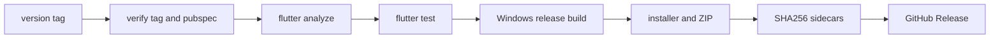

# 制約・未解決事項

<!-- Phase 3で調査結果を記載 -->
# 制約・未解決事項

本章は、保守時に変更判断を制約する実装・ビルド・運用条件と、既存章で確定できなかった事項を集約する。CH-09への直接割当Inventoryは0件であるため、新たな機能仕様ではなく、リポジトリ横断の制約を記録する。

## 技術制約

| ID | 制約 | 保守上の影響 | 状態 |
|---|---|---|---|
| C-091 | 🟢 VERIFIED Dart SDKは`^3.10.8`、Flutter依存はSDK由来である。[REF: pubspec.yaml:21-34] | 🟢 VERIFIED SDK更新時はDart制約とFlutter SDK由来パッケージを同時に評価する必要がある。[REF: pubspec.yaml:21-34] | 🟢 VERIFIED |
| C-092 | 🟢 VERIFIED デスクトップDB初期化はLinux、macOS、Windowsで`sqflite_common_ffi`を使用する。[REF: lib/main.dart:28-34] | 🟢 VERIFIED 起動経路はデスクトップOS判定とFFIデータベース初期化に依存する。[REF: lib/main.dart:28-34] | 🟢 VERIFIED |
| C-093 | 🟢 VERIFIED Qwen3-TTS共有ライブラリはmacOSとWindowsのみ名前解決し、他OSでは`UnsupportedError`となる。[REF: lib/features/tts/data/tts_native_bindings.dart:126-137] | 🟡 INFERRED Linuxではアプリ本体が起動できても、このTTSネイティブ境界は利用できない。[REF: lib/main.dart:32-34] [REF: lib/features/tts/data/tts_native_bindings.dart:133-137] | 🟡 INFERRED |
| C-094 | 🟢 VERIFIED ネイティブ依存はqwen3-tts.cpp、LAME、piper-plusの3 Git submoduleとして管理される。[REF: .gitmodules:1-9] | 🟢 VERIFIED clone/build時にsubmodule取得が必要で、リリースCIもrecursive checkoutを行う。[REF: README.md:46-55] [REF: .github/workflows/release.yml:20-22] | 🟢 VERIFIED |
| C-095 | 🟢 VERIFIED 本体はpub.dev公開を無効化したprivate packageである。[REF: pubspec.yaml:3-5] | 🟢 VERIFIED 配布経路はpub.devではなく、デスクトップ成果物とGitHub Releaseを前提とする。[REF: pubspec.yaml:3-5] [REF: .github/workflows/release.yml:162-171] | 🟢 VERIFIED |
| C-096 | 🟢 VERIFIED 汎用Web取得は静的HTMLの意味要素、既知CMS container、本文密度の順で抽出し、200文字未満を失敗扱いする。[REF: lib/features/text_download/data/sites/generic_web_site.dart:26-58] [REF: lib/features/text_download/data/sites/generic_web_site.dart:95-100] | 🟢 VERIFIED JavaScript描画ページや未知DOMに対する完全な抽出は保証されない実装形態である。[REF: lib/features/text_download/data/sites/generic_web_site.dart:26-29] [REF: lib/features/text_download/data/sites/generic_web_site.dart:147-176] | 🟢 VERIFIED |
| C-097 | 🟢 VERIFIED OpenAI互換・Ollamaクライアントは設定された`baseUrl`を直接組み立ててHTTP要求する。[REF: lib/features/llm_summary/data/openai_compatible_client.dart:7-30] [REF: lib/features/llm_summary/data/ollama_client.dart:7-22] | 🟡 INFERRED 接続可否、互換レスポンス、可用性は外部endpointに依存する。[REF: lib/features/llm_summary/data/openai_compatible_client.dart:47-68] [REF: lib/features/llm_summary/data/ollama_client.dart:74-94] | 🟡 INFERRED |

### Deep-dive candidates (refer to them by ID)

- **D-091**: C-093 — Linux上のTTS機能可否とUIでの機能抑止を実機・統合テストまで追跡する（プラットフォーム境界）。[REF: lib/features/tts/data/tts_native_bindings.dart:126-137]
- **D-092**: C-094 — submodule commit、ネイティブABI、Dart FFI typedefの互換性マトリクスを作成する（高複雑度）。[REF: .gitmodules:1-9]
- **D-093**: C-096 — 汎用Web抽出の対応/非対応サイトfixtureと品質基準を定義する（業務上重要）。[REF: lib/features/text_download/data/sites/generic_web_site.dart:95-176]

## ビルド・品質保証制約

| ID | 制約 | 検査点 | 状態 |
|---|---|---|---|
| C-098 | 🟢 VERIFIED 開発ビルドにはFVM管理Flutterが必要で、WindowsネイティブビルドにはVisual Studio 2022とVulkan SDKが前提である。[REF: README.md:37-43] | 🟢 VERIFIED READMEは各ネイティブTTS/LAME/Piperビルド後にFlutter buildを実行する手順を定義する。[REF: README.md:81-98] | 🟢 VERIFIED |
| C-099 | 🟢 VERIFIED CIテストは`windows-latest`のみでanalyze/testを実施する。[REF: .github/workflows/test.yml:12-20] [REF: .github/workflows/test.yml:31-38] | 🟢 VERIFIED ネイティブDLLはCIで構築せず、FFI統合テストはDLL不在時にself-skipする方針である。[REF: .github/workflows/test.yml:14-19] | 🟢 VERIFIED |
| C-100 | 🟢 VERIFIED lintは`flutter_lints`に加え、const/final、`avoid_print`、非同期BuildContext等の規則を有効化する。[REF: analysis_options.yaml:1-16] | 🟢 VERIFIED `memo/**`と`openspec/**`はanalyzer対象外である。[REF: analysis_options.yaml:3-7] | 🟢 VERIFIED |
| C-101 | 🟢 VERIFIED WindowsリリースCIはtagとpubspec versionを検証し、analyze/testの後にrelease buildを作る。[REF: .github/workflows/release.yml:24-26] [REF: .github/workflows/release.yml:69-79] | 🟢 VERIFIED 手動tagではなくrelease scriptを使い、tag/pubspec不一致を二段階で防ぐ運用である。[REF: README.md:128-144] | 🟢 VERIFIED |
| C-102 | 🟢 VERIFIED リリース成果物はInno Setup installerとZIPで、両方にSHA256 sidecarを生成する。[REF: .github/workflows/release.yml:117-158] | 🟢 VERIFIED runtime user dataが成果物に存在するとreleaseを失敗させる。[REF: .github/workflows/release.yml:104-113] | 🟢 VERIFIED |

このゲート順はrelease workflowのstep順序に対応する。[REF: .github/workflows/release.yml:24-26] [REF: .github/workflows/release.yml:69-79] [REF: .github/workflows/release.yml:117-169]

### Deep-dive candidates (refer to them by ID)

- **D-094**: C-099 — DLL統合テストがself-skipする範囲を列挙し、別途ネイティブ成果物付きCIを設ける必要性を評価する（品質リスク）。[REF: .github/workflows/test.yml:14-19]
- **D-095**: C-102 — installer/portable双方のupgrade、rollback、データ保持を実環境で検証する（運用上重要）。[REF: README.md:163-195]

## 配布・運用制約

| ID | 制約 | 運用上の意味 | 状態 |
|---|---|---|---|
| C-103 | 🟢 VERIFIED 自動リリースはWindows向けworkflowであり、Windows installer/ZIPをGitHub Releaseへ添付する。[REF: .github/workflows/release.yml:1-17] [REF: .github/workflows/release.yml:162-169] | 🟢 VERIFIED macOSのbuild手順はREADMEにあるが、本workflowの配布成果物には含まれない。[REF: README.md:84-97] [REF: .github/workflows/release.yml:162-169] | 🟢 VERIFIED |
| C-104 | 🟢 VERIFIED Windows installerは未署名でSmartScreen警告が出ると文書化され、コード署名は将来対応予定である。[REF: README.md:163-173] | 🟢 VERIFIED 初回実行時に利用者の手動判断を要する。[REF: README.md:169-173] | 🟢 VERIFIED |
| C-105 | 🟢 VERIFIED installerはユーザーデータを更新・削除せず、アンインストール後も残す。[REF: README.md:175-185] | 🟢 VERIFIED 完全削除には利用者がデータパスを手動削除する必要がある。[REF: README.md:175-185] | 🟢 VERIFIED |
| C-106 | 🟢 VERIFIED portable版は展開先直下にデータを保持し、フォルダコピーでデータ込み複製が可能である。[REF: README.md:187-195] | 🟢 VERIFIED install形態により実データ位置とバックアップ単位が変わる。[REF: README.md:175-195] | 🟢 VERIFIED |
| C-107 | 🟢 VERIFIED 古いPiperモデルは自動置換されず、互換性問題時はモデルとmarkerの手動削除・再取得を要求する。[REF: README.md:197-206] | 🟢 VERIFIED ネイティブ推論エンジン更新時に既存モデルの移行手順を維持する必要がある。[REF: README.md:199-206] | 🟢 VERIFIED |
| C-108 | 🟢 VERIFIED ログsinkは1MiBを既定上限として2世代へrotateし、messageは制御文字escape後にそのまま保存する。[REF: lib/shared/logging/file_log_sink.dart:9-18] [REF: lib/shared/logging/file_log_sink.dart:61-95] | 共通redactionは設けず、機密情報を含めない責任はログ呼出側が負う。[REF: lib/shared/logging/file_log_sink.dart:61-68] | 🟢 VERIFIED |

### Deep-dive candidates (refer to them by ID)

- **D-096**: C-104 — Windowsコード署名導入時の証明書管理とrelease workflow変更（セキュリティ・配布）。[REF: README.md:169-173]
- **D-097**: C-105/C-106 — installer/portable別のデータバックアップ、移行、完全削除runbook（運用）。[REF: README.md:175-195]
- **D-098**: C-107 — Piper model revision更新時の自動互換判定・再取得方針（保守性）。[REF: README.md:197-206]

## 既存の未解決事項

以下は先行章で既に起票済みであり、本章では重複する質問を生成しない。

| 質問ID | 未確定事項 | 影響 | 状態 |
|---|---|---|---|
| Q-002 | download終端状態のreset責務。[REF: lib/features/text_download/providers/text_download_providers.dart:16-65] | 回答済み。notifierが所有する。 | 🟢 VERIFIED |
| Q-003 | 必須override providerのfail-fast契約。[REF: lib/features/novel_metadata_db/providers/novel_metadata_providers.dart:6-8] | 回答済み。契約を維持する。 | 🟢 VERIFIED |
| Q-004 | `detached`時の非同期vacuum。[REF: lib/features/tts/providers/vacuum_lifecycle_provider.dart:41-76] | 回答済み。best-effort運用とする。 | 🟢 VERIFIED |
| Q-005 | ペイン幅・初期表示状態。[REF: test/home_screen_test.dart:24-114] | 回答済み。当面固定する。 | 🟢 VERIFIED |
| Q-006 | 汎用Web adapterの保証範囲。[REF: test/features/text_download/novel_site_test.dart:103-136] | 回答済み。best-effortとする。 | 🟢 VERIFIED |
| Q-007 | 旧作品別schemaの保守期間。[REF: lib/features/novel_metadata_db/data/novel_database.dart:134-163] | 回答済み。当面維持する。 | 🟢 VERIFIED |
| Q-008 | 🟢 VERIFIED ログ機密情報方針または共通redactionを要件化するか。[REF: lib/shared/logging/file_log_sink.dart:61-68] | 回答済み。ログ呼出側責任とし、共通redactionは設けない。 | 🟢 VERIFIED |
| Q-009 | ユーザー指定LLM endpointの制約。[REF: lib/features/settings/data/settings_repository.dart:122-139] | 回答済み。HTTP/HTTPSを許可しallowlistは設けない。 | 🟢 VERIFIED |

### Deep-dive candidates (refer to them by ID)

- **D-099**: Q-008 — 全logging call siteを機密値カテゴリ別に棚卸しする（critical）。[REF: lib/shared/logging/file_log_sink.dart:61-68]
- **D-100**: Q-007 — schema version履歴と旧/新DBのread/write callを追跡し、削除条件を提示する（高複雑度）。[REF: lib/features/novel_metadata_db/data/novel_database.dart:134-163]
- **D-101**: Q-004 — OS lifecycle別にvacuum完了・中断・次回復旧を検証する（運用上重要）。[REF: lib/features/tts/providers/vacuum_lifecycle_provider.dart:41-76]

## 本章で追加する未確定事項

### Q-013

- `category`: `operational_requirement`
- `body`: Linuxを正式な対応プラットフォームとしますか。それとも未サポート扱いとし、READMEの対応表や機能制限を明示しますか。
- `evidence`: `{"file":"README.md","lines":"7-11","code_excerpt":"macOS / Windows / Linux(未確認)"}`
- `related_inventory_ids`: `[]`
- `severity`: `important`
- `resolution_type`: `ask_sme`
- `status`: `answered`
- `answer`: Linuxは現状の正式サポート対象外。

Linuxは現状の正式サポート対象外である。コード上はDB初期化にLinuxを含む一方、Qwen3-TTS FFIはLinuxを拒否する。[CONFIDENCE: HIGH] [REF: README.md:7-11] [REF: lib/main.dart:32-34] [REF: lib/features/tts/data/tts_native_bindings.dart:133-137]

## Detail questions raised in this chapter

- Q-013: 回答済み。Linuxは正式サポート対象外。

## Sources Read

- `.cc-rsg/recon-report.md`
- `.cc-rsg/questions.json`
- `.cc-rsg/drafts/00-metadata.md`
- `.cc-rsg/drafts/01-overview.md`
- `.cc-rsg/drafts/02-architecture.md`
- `.cc-rsg/drafts/03-screens.md`
- `.cc-rsg/drafts/04-features.md`
- `.cc-rsg/drafts/05-data-model.md`
- `.cc-rsg/drafts/06-settings-security.md`
- `.cc-rsg/drafts/07-external-integrations.md`
- `.cc-rsg/drafts/08-operations.md`
- `README.md`
- `pubspec.yaml`
- `.gitmodules`
- `.github/workflows/test.yml`
- `.github/workflows/release.yml`
- `analysis_options.yaml`
- `lib/main.dart`
- `lib/features/tts/data/tts_native_bindings.dart`
- `lib/features/tts/data/piper_native_bindings.dart`
- `lib/features/tts/data/lame_enc_bindings.dart`
- `lib/features/llm_summary/data/ollama_client.dart`
- `lib/features/llm_summary/data/openai_compatible_client.dart`
- `lib/features/text_download/data/sites/generic_web_site.dart`
- `lib/shared/logging/file_log_sink.dart`
- `lib/features/text_download/providers/text_download_providers.dart`
- `lib/features/novel_metadata_db/providers/novel_metadata_providers.dart`
- `lib/features/tts/providers/vacuum_lifecycle_provider.dart`
- `test/home_screen_test.dart`
- `test/features/text_download/novel_site_test.dart`
- `lib/features/novel_metadata_db/data/novel_database.dart`
- `lib/features/settings/data/settings_repository.dart`
